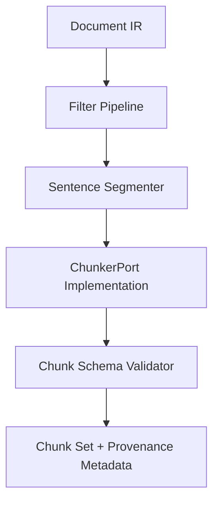

# Chunking & Parsing Runtime

The legacy bespoke chunkers have been removed in favor of a reusable runtime
that delegates to best-in-class open source libraries. This guide explains how
to work with the new system, how to select profile-specific chunkers, and how
to validate dependencies during deployment.

## Runtime Overview



1. **Filter Pipeline** – Removes boilerplate, deduplicates repeated furniture,
   and preserves uncertain tables as HTML fragments.
2. **Sentence Segmenter** – Uses a Hugging Face tokenizer configured through
   `MEDICAL_KG_SENTENCE_MODEL`. A heuristics-only fallback is available for
   development environments without the model download.
3. **ChunkerPort Implementation** – Selected via profile registry and backed by
   langchain-text-splitters or llama-index node parsers.
4. **Chunk Schema Validator** – Enforces ordered offsets, provenance metadata,
   and domain-specific section labels before returning results.

## Installing Dependencies

Use the helper script to provision a clean virtual environment with all
optional dependencies:

```bash
bash scripts/install_chunking_dependencies.sh \
  --venv .venv-chunking \
  --hf-model sentence-transformers/all-MiniLM-L6-v2
```

The installer upgrades `pip`, pins the required packages, downloads the Hugging
Face tokenizer, and finally executes
`scripts/check_chunking_dependencies.py`. When run from Python 3.12, the check
reports a warning for `unstructured==0.12.0` because that release requires
Python 3.11; production deployments should execute the installer from the
supported runtime or select a newer compatible version.

## Chunking from Code

```python
from Medical_KG_rev.services.chunking import chunk_document
from Medical_KG_rev.ir import Document

chunks = chunk_document(document, profile="pmc-imrad")
for chunk in chunks:
    print(chunk.section_label, chunk.intent_hint, chunk.char_offsets)
```

The runtime automatically registers default profiles on import. Custom profiles
can be loaded from YAML via
`Medical_KG_rev.services.chunking.profiles.loader.load_profiles` and passed to
`runtime.assemble_runtime` for advanced use cases.

## Troubleshooting

- **Missing Hugging Face model** – Run the installer with `--hf-model` or set
  `MEDICAL_KG_SENTENCE_MODEL` prior to invoking chunkers.
- **LangChain import errors** – Ensure `pydantic==2.10.6` (or later) is
  installed; earlier versions bundled with Python 3.12 trigger `ForwardRef`
  errors.
- **unstructured import errors** – Install from a Python 3.11 runtime or upgrade
  to a release that supports Python 3.12.

## Related Documentation

- [Chunking Profiles](./chunking-profiles.md)
- [MinerU Two-Phase Gate Runbook](../runbooks/mineru-two-phase-gate.md)
- [OpenSpec Change: add-parsing-chunking-normalization](../../openspec/changes/add-parsing-chunking-normalization/README.md)
