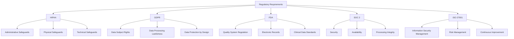

# Compliance Documentation

This document provides comprehensive compliance and regulatory adherence documentation for the Medical_KG_rev system, covering healthcare regulations, data protection laws, and industry standards.

## Table of Contents

1. [Regulatory Overview](#regulatory-overview)
2. [HIPAA Compliance](#hipaa-compliance)
3. [GDPR Compliance](#gdpr-compliance)
4. [FDA Compliance](#fda-compliance)
5. [SOC 2 Compliance](#soc-2-compliance)
6. [ISO 27001 Compliance](#iso-27001-compliance)
7. [Data Protection Measures](#data-protection-measures)
8. [Audit Procedures](#audit-procedures)
9. [Incident Response](#incident-response)
10. [Compliance Monitoring](#compliance-monitoring)

## Regulatory Overview

### Applicable Regulations

The Medical_KG_rev system is subject to multiple regulatory frameworks:

#### Healthcare Regulations

- **HIPAA (Health Insurance Portability and Accountability Act)**: US healthcare data protection
- **FDA (Food and Drug Administration)**: Medical device and drug data regulations
- **21 CFR Part 11**: Electronic records and signatures
- **CLIA (Clinical Laboratory Improvement Amendments)**: Laboratory data standards

#### Data Protection Regulations

- **GDPR (General Data Protection Regulation)**: EU data protection
- **CCPA (California Consumer Privacy Act)**: California privacy rights
- **PIPEDA (Personal Information Protection and Electronic Documents Act)**: Canadian privacy
- **LGPD (Lei Geral de Proteção de Dados)**: Brazilian data protection

#### Industry Standards

- **SOC 2 (Service Organization Control 2)**: Security, availability, processing integrity
- **ISO 27001**: Information security management
- **NIST Cybersecurity Framework**: Cybersecurity best practices
- **HITRUST**: Healthcare information security

### Compliance Framework



## HIPAA Compliance

### HIPAA Overview

The Health Insurance Portability and Accountability Act (HIPAA) establishes national standards for protecting health information.

#### Key Requirements

- **Privacy Rule**: Protects individually identifiable health information
- **Security Rule**: Establishes security standards for health information
- **Breach Notification Rule**: Requires notification of security breaches
- **Enforcement Rule**: Establishes procedures for enforcement

### Administrative Safeguards

#### Security Officer Designation

```yaml
# Compliance configuration
hipaa_compliance:
  administrative_safeguards:
    security_officer:
      name: "Chief Security Officer"
      email: "cso@medical-kg-rev.com"
      phone: "+1-555-0123"
      responsibilities:
        - "Develop and implement security policies"
        - "Conduct risk assessments"
        - "Manage security incidents"
        - "Oversee workforce training"

    workforce_training:
      frequency: "annually"
      topics:
        - "HIPAA Privacy Rule"
        - "Security Rule requirements"
        - "Incident response procedures"
        - "Data handling best practices"
      completion_tracking: true
      certification_required: true
```

#### Access Management

```python
# Access management implementation
from enum import Enum
from typing import List, Dict, Any
from datetime import datetime, timedelta
import logging

logger = logging.getLogger(__name__)

class HIPAACompliance:
    """HIPAA compliance management."""

    def __init__(self):
        self.access_logs = []
        self.user_permissions = {}
        self.audit_trail = []

    def grant_access(self, user_id: str, resource: str, reason: str) -> bool:
        """Grant access to protected health information."""
        try:
            # Log access grant
            self.audit_trail.append({
                "timestamp": datetime.utcnow(),
                "action": "access_granted",
                "user_id": user_id,
                "resource": resource,
                "reason": reason,
                "status": "success"
            })

            # Update user permissions
            if user_id not in self.user_permissions:
                self.user_permissions[user_id] = []

            self.user_permissions[user_id].append({
                "resource": resource,
                "granted_at": datetime.utcnow(),
                "reason": reason
            })

            logger.info(f"Access granted to {user_id} for {resource}")
            return True

        except Exception as e:
            logger.error(f"Failed to grant access: {e}")
            return False

    def revoke_access(self, user_id: str, resource: str, reason: str) -> bool:
        """Revoke access to protected health information."""
        try:
            # Log access revocation
            self.audit_trail.append({
                "timestamp": datetime.utcnow(),
                "action": "access_revoked",
                "user_id": user_id,
                "resource": resource,
                "reason": reason,
                "status": "success"
            })

            # Remove user permissions
            if user_id in self.user_permissions:
                self.user_permissions[user_id] = [
                    perm for perm in self.user_permissions[user_id]
                    if perm["resource"] != resource
                ]

            logger.info(f"Access revoked from {user_id} for {resource}")
            return True

        except Exception as e:
            logger.error(f"Failed to revoke access: {e}")
            return False

    def log_access(self, user_id: str, resource: str, action: str) -> None:
        """Log access to protected health information."""
        access_log = {
            "timestamp": datetime.utcnow(),
            "user_id": user_id,
            "resource": resource,
            "action": action,
            "ip_address": self.get_client_ip(),
            "user_agent": self.get_user_agent()
        }

        self.access_logs.append(access_log)
        logger.info(f"Access logged: {user_id} {action} {resource}")

    def generate_audit_report(self, start_date: datetime, end_date: datetime) -> Dict[str, Any]:
        """Generate HIPAA audit report."""
        relevant_logs = [
            log for log in self.audit_trail
            if start_date <= log["timestamp"] <= end_date
        ]

        report = {
            "report_period": {
                "start_date": start_date.isoformat(),
                "end_date": end_date.isoformat()
            },
            "total_events": len(relevant_logs),
            "access_grants": len([log for log in relevant_logs if log["action"] == "access_granted"]),
            "access_revocations": len([log for log in relevant_logs if log["action"] == "access_revoked"]),
            "failed_attempts": len([log for log in relevant_logs if log["status"] == "failed"]),
            "events": relevant_logs
        }

        return report
```

#### Information Access Management

```python
class InformationAccessManagement:
    """HIPAA Information Access Management."""

    def __init__(self):
        self.access_matrix = {}
        self.role_definitions = {}
        self.emergency_access_procedures = {}

    def define_role(self, role_name: str, permissions: List[str], description: str) -> bool:
        """Define user role with specific permissions."""
        self.role_definitions[role_name] = {
            "permissions": permissions,
            "description": description,
            "created_at": datetime.utcnow()
        }

        logger.info(f"Role defined: {role_name}")
        return True

    def assign_role(self, user_id: str, role_name: str, granted_by: str) -> bool:
        """Assign role to user."""
        if role_name not in self.role_definitions:
            logger.error(f"Role not found: {role_name}")
            return False

        if user_id not in self.access_matrix:
            self.access_matrix[user_id] = []

        self.access_matrix[user_id].append({
            "role": role_name,
            "granted_by": granted_by,
            "granted_at": datetime.utcnow()
        })

        logger.info(f"Role assigned: {user_id} -> {role_name}")
        return True

    def check_permission(self, user_id: str, resource: str, action: str) -> bool:
        """Check if user has permission for specific action."""
        if user_id not in self.access_matrix:
            return False

        user_roles = [assignment["role"] for assignment in self.access_matrix[user_id]]

        for role in user_roles:
            if role in self.role_definitions:
                permissions = self.role_definitions[role]["permissions"]
                if f"{resource}:{action}" in permissions:
                    return True

        return False

    def emergency_access(self, user_id: str, resource: str, reason: str, approved_by: str) -> bool:
        """Grant emergency access to protected health information."""
        emergency_access = {
            "user_id": user_id,
            "resource": resource,
            "reason": reason,
            "approved_by": approved_by,
            "granted_at": datetime.utcnow(),
            "expires_at": datetime.utcnow() + timedelta(hours=24)
        }

        self.emergency_access_procedures[user_id] = emergency_access

        logger.warning(f"Emergency access granted: {user_id} -> {resource}")
        return True
```

### Physical Safeguards

#### Facility Access Controls

```yaml
# Physical security configuration
physical_safeguards:
  facility_access:
    data_center:
      location: "Secure Data Center"
      access_control: "Biometric + Card"
      visitor_logging: true
      surveillance: "24/7 CCTV"
      environmental_monitoring: true

    office_space:
      location: "Corporate Office"
      access_control: "Card + PIN"
      visitor_escort: true
      clean_desk_policy: true
      secure_disposal: true

  workstation_security:
    screen_locks: "5 minutes"
    password_policy: "Complex passwords required"
    usb_restrictions: true
    software_restrictions: true
    remote_access: "VPN only"

  device_controls:
    mobile_devices: "MDM managed"
    encryption: "Full disk encryption"
    remote_wipe: true
    device_inventory: true
    compliance_monitoring: true
```

#### Workstation Security

```python
class WorkstationSecurity:
    """Workstation security management."""

    def __init__(self):
        self.workstation_policies = {}
        self.security_violations = []
        self.compliance_checks = []

    def configure_workstation(self, workstation_id: str, policies: Dict[str, Any]) -> bool:
        """Configure workstation security policies."""
        self.workstation_policies[workstation_id] = {
            "policies": policies,
            "configured_at": datetime.utcnow(),
            "last_check": datetime.utcnow()
        }

        logger.info(f"Workstation configured: {workstation_id}")
        return True

    def check_compliance(self, workstation_id: str) -> Dict[str, Any]:
        """Check workstation compliance."""
        if workstation_id not in self.workstation_policies:
            return {"status": "not_configured"}

        policies = self.workstation_policies[workstation_id]["policies"]
        compliance_result = {
            "workstation_id": workstation_id,
            "check_time": datetime.utcnow(),
            "compliance_status": "compliant",
            "violations": []
        }

        # Check screen lock policy
        if not self.check_screen_lock(workstation_id):
            compliance_result["violations"].append("Screen lock not configured")
            compliance_result["compliance_status"] = "non_compliant"

        # Check password policy
        if not self.check_password_policy(workstation_id):
            compliance_result["violations"].append("Password policy not enforced")
            compliance_result["compliance_status"] = "non_compliant"

        # Check encryption
        if not self.check_encryption(workstation_id):
            compliance_result["violations"].append("Disk encryption not enabled")
            compliance_result["compliance_status"] = "non_compliant"

        self.compliance_checks.append(compliance_result)
        return compliance_result

    def check_screen_lock(self, workstation_id: str) -> bool:
        """Check if screen lock is configured."""
        # Implementation would check actual workstation
        return True

    def check_password_policy(self, workstation_id: str) -> bool:
        """Check if password policy is enforced."""
        # Implementation would check actual workstation
        return True

    def check_encryption(self, workstation_id: str) -> bool:
        """Check if disk encryption is enabled."""
        # Implementation would check actual workstation
        return True
```

### Technical Safeguards

#### Access Control

```python
class TechnicalSafeguards:
    """HIPAA Technical Safeguards implementation."""

    def __init__(self):
        self.access_controls = {}
        self.audit_controls = {}
        self.integrity_controls = {}
        self.transmission_security = {}

    def implement_access_control(self, user_id: str, resource: str, permissions: List[str]) -> bool:
        """Implement access control for user."""
        self.access_controls[user_id] = {
            "resource": resource,
            "permissions": permissions,
            "created_at": datetime.utcnow(),
            "last_accessed": None
        }

        logger.info(f"Access control implemented: {user_id}")
        return True

    def log_access(self, user_id: str, resource: str, action: str, result: str) -> None:
        """Log access attempts."""
        access_log = {
            "timestamp": datetime.utcnow(),
            "user_id": user_id,
            "resource": resource,
            "action": action,
            "result": result,
            "ip_address": self.get_client_ip(),
            "user_agent": self.get_user_agent()
        }

        if user_id not in self.audit_controls:
            self.audit_controls[user_id] = []

        self.audit_controls[user_id].append(access_log)

        # Update last accessed time
        if user_id in self.access_controls:
            self.access_controls[user_id]["last_accessed"] = datetime.utcnow()

    def verify_integrity(self, data: str, checksum: str) -> bool:
        """Verify data integrity."""
        calculated_checksum = self.calculate_checksum(data)
        return calculated_checksum == checksum

    def calculate_checksum(self, data: str) -> str:
        """Calculate data checksum."""
        import hashlib
        return hashlib.sha256(data.encode()).hexdigest()

    def encrypt_transmission(self, data: str) -> str:
        """Encrypt data for transmission."""
        # Implementation would use proper encryption
        return data

    def decrypt_transmission(self, encrypted_data: str) -> str:
        """Decrypt transmitted data."""
        # Implementation would use proper decryption
        return encrypted_data
```

## GDPR Compliance

### GDPR Overview

The General Data Protection Regulation (GDPR) establishes data protection and privacy regulations for EU citizens.

#### Key Principles

- **Lawfulness, fairness, and transparency**: Data processing must be lawful and transparent
- **Purpose limitation**: Data collected for specific purposes only
- **Data minimization**: Collect only necessary data
- **Accuracy**: Keep data accurate and up-to-date
- **Storage limitation**: Store data only as long as necessary
- **Integrity and confidentiality**: Protect data from unauthorized access

### Data Subject Rights

#### Right to Access

```python
class GDPRCompliance:
    """GDPR compliance management."""

    def __init__(self):
        self.data_subjects = {}
        self.data_processing_records = {}
        self.consent_records = {}

    def handle_data_access_request(self, data_subject_id: str) -> Dict[str, Any]:
        """Handle data subject access request."""
        if data_subject_id not in self.data_subjects:
            return {"error": "Data subject not found"}

        data_subject = self.data_subjects[data_subject_id]

        # Collect all personal data
        personal_data = {
            "personal_information": data_subject["personal_info"],
            "processing_records": self.data_processing_records.get(data_subject_id, []),
            "consent_records": self.consent_records.get(data_subject_id, []),
            "data_categories": self.get_data_categories(data_subject_id),
            "purposes": self.get_processing_purposes(data_subject_id),
            "retention_periods": self.get_retention_periods(data_subject_id)
        }

        return {
            "data_subject_id": data_subject_id,
            "request_date": datetime.utcnow().isoformat(),
            "personal_data": personal_data
        }

    def handle_data_rectification_request(self, data_subject_id: str, corrections: Dict[str, Any]) -> bool:
        """Handle data rectification request."""
        if data_subject_id not in self.data_subjects:
            return False

        # Update personal data
        for field, new_value in corrections.items():
            if field in self.data_subjects[data_subject_id]["personal_info"]:
                self.data_subjects[data_subject_id]["personal_info"][field] = new_value

        # Log rectification
        self.log_data_processing(
            data_subject_id=data_subject_id,
            processing_type="rectification",
            purpose="data_subject_request",
            legal_basis="consent"
        )

        return True

    def handle_data_erasure_request(self, data_subject_id: str, reason: str) -> bool:
        """Handle data erasure request (right to be forgotten)."""
        if data_subject_id not in self.data_subjects:
            return False

        # Check if erasure is possible
        if not self.can_erase_data(data_subject_id):
            return False

        # Erase personal data
        del self.data_subjects[data_subject_id]
        del self.data_processing_records[data_subject_id]
        del self.consent_records[data_subject_id]

        # Log erasure
        self.log_data_processing(
            data_subject_id=data_subject_id,
            processing_type="erasure",
            purpose="data_subject_request",
            legal_basis="consent"
        )

        return True

    def handle_data_portability_request(self, data_subject_id: str) -> Dict[str, Any]:
        """Handle data portability request."""
        if data_subject_id not in self.data_subjects:
            return {"error": "Data subject not found"}

        # Export data in machine-readable format
        export_data = {
            "data_subject_id": data_subject_id,
            "export_date": datetime.utcnow().isoformat(),
            "personal_data": self.data_subjects[data_subject_id]["personal_info"],
            "processing_records": self.data_processing_records.get(data_subject_id, []),
            "consent_records": self.consent_records.get(data_subject_id, [])
        }

        return export_data

    def log_data_processing(self, data_subject_id: str, processing_type: str, purpose: str, legal_basis: str) -> None:
        """Log data processing activity."""
        processing_record = {
            "timestamp": datetime.utcnow(),
            "data_subject_id": data_subject_id,
            "processing_type": processing_type,
            "purpose": purpose,
            "legal_basis": legal_basis
        }

        if data_subject_id not in self.data_processing_records:
            self.data_processing_records[data_subject_id] = []

        self.data_processing_records[data_subject_id].append(processing_record)

    def can_erase_data(self, data_subject_id: str) -> bool:
        """Check if data can be erased."""
        # Check for legal obligations
        if self.has_legal_obligation(data_subject_id):
            return False

        # Check for public interest
        if self.has_public_interest(data_subject_id):
            return False

        # Check for legitimate interests
        if self.has_legitimate_interests(data_subject_id):
            return False

        return True

    def has_legal_obligation(self, data_subject_id: str) -> bool:
        """Check if there's a legal obligation to retain data."""
        # Implementation would check legal obligations
        return False

    def has_public_interest(self, data_subject_id: str) -> bool:
        """Check if there's public interest in retaining data."""
        # Implementation would check public interest
        return False

    def has_legitimate_interests(self, data_subject_id: str) -> bool:
        """Check if there are legitimate interests in retaining data."""
        # Implementation would check legitimate interests
        return False
```

#### Consent Management

```python
class ConsentManagement:
    """GDPR consent management."""

    def __init__(self):
        self.consent_records = {}
        self.consent_templates = {}
        self.withdrawal_requests = {}

    def record_consent(self, data_subject_id: str, purpose: str, consent_type: str,
                      consent_method: str, evidence: str) -> bool:
        """Record data subject consent."""
        consent_record = {
            "data_subject_id": data_subject_id,
            "purpose": purpose,
            "consent_type": consent_type,
            "consent_method": consent_method,
            "evidence": evidence,
            "timestamp": datetime.utcnow(),
            "status": "active"
        }

        if data_subject_id not in self.consent_records:
            self.consent_records[data_subject_id] = []

        self.consent_records[data_subject_id].append(consent_record)

        logger.info(f"Consent recorded: {data_subject_id} for {purpose}")
        return True

    def withdraw_consent(self, data_subject_id: str, purpose: str, reason: str) -> bool:
        """Withdraw data subject consent."""
        if data_subject_id not in self.consent_records:
            return False

        # Find active consent for the purpose
        for consent in self.consent_records[data_subject_id]:
            if consent["purpose"] == purpose and consent["status"] == "active":
                consent["status"] = "withdrawn"
                consent["withdrawal_timestamp"] = datetime.utcnow()
                consent["withdrawal_reason"] = reason

        # Log withdrawal request
        self.withdrawal_requests[data_subject_id] = {
            "purpose": purpose,
            "reason": reason,
            "timestamp": datetime.utcnow()
        }

        logger.info(f"Consent withdrawn: {data_subject_id} for {purpose}")
        return True

    def check_consent(self, data_subject_id: str, purpose: str) -> bool:
        """Check if data subject has given consent for specific purpose."""
        if data_subject_id not in self.consent_records:
            return False

        for consent in self.consent_records[data_subject_id]:
            if consent["purpose"] == purpose and consent["status"] == "active":
                return True

        return False

    def get_consent_history(self, data_subject_id: str) -> List[Dict[str, Any]]:
        """Get consent history for data subject."""
        return self.consent_records.get(data_subject_id, [])
```

### Data Protection by Design

#### Privacy Impact Assessment

```python
class PrivacyImpactAssessment:
    """Privacy Impact Assessment (PIA) management."""

    def __init__(self):
        self.assessments = {}
        self.risk_factors = {}
        self.mitigation_measures = {}

    def conduct_pia(self, system_name: str, data_types: List[str],
                   processing_purposes: List[str]) -> Dict[str, Any]:
        """Conduct Privacy Impact Assessment."""
        assessment = {
            "system_name": system_name,
            "assessment_date": datetime.utcnow(),
            "data_types": data_types,
            "processing_purposes": processing_purposes,
            "risk_level": "medium",
            "recommendations": []
        }

        # Assess risks
        risks = self.assess_risks(data_types, processing_purposes)
        assessment["risks"] = risks

        # Determine risk level
        assessment["risk_level"] = self.determine_risk_level(risks)

        # Generate recommendations
        assessment["recommendations"] = self.generate_recommendations(risks)

        self.assessments[system_name] = assessment
        return assessment

    def assess_risks(self, data_types: List[str], purposes: List[str]) -> List[Dict[str, Any]]:
        """Assess privacy risks."""
        risks = []

        # Check for sensitive data
        if any(data_type in ["health", "genetic", "biometric"] for data_type in data_types):
            risks.append({
                "risk_type": "sensitive_data",
                "severity": "high",
                "description": "Processing sensitive personal data",
                "mitigation": "Implement additional security measures"
            })

        # Check for automated decision-making
        if "automated_decision" in purposes:
            risks.append({
                "risk_type": "automated_decision",
                "severity": "medium",
                "description": "Automated decision-making without human intervention",
                "mitigation": "Implement human oversight and appeal process"
            })

        # Check for profiling
        if "profiling" in purposes:
            risks.append({
                "risk_type": "profiling",
                "severity": "medium",
                "description": "Profiling of data subjects",
                "mitigation": "Implement transparency measures and opt-out mechanisms"
            })

        return risks

    def determine_risk_level(self, risks: List[Dict[str, Any]]) -> str:
        """Determine overall risk level."""
        if not risks:
            return "low"

        high_risks = [risk for risk in risks if risk["severity"] == "high"]
        if high_risks:
            return "high"

        medium_risks = [risk for risk in risks if risk["severity"] == "medium"]
        if medium_risks:
            return "medium"

        return "low"

    def generate_recommendations(self, risks: List[Dict[str, Any]]) -> List[str]:
        """Generate recommendations based on risks."""
        recommendations = []

        for risk in risks:
            if risk["risk_type"] == "sensitive_data":
                recommendations.append("Implement encryption for data at rest and in transit")
                recommendations.append("Conduct regular security audits")
                recommendations.append("Implement access controls and monitoring")

            elif risk["risk_type"] == "automated_decision":
                recommendations.append("Implement human oversight for automated decisions")
                recommendations.append("Provide clear explanation of decision logic")
                recommendations.append("Establish appeal and review processes")

            elif risk["risk_type"] == "profiling":
                recommendations.append("Implement transparency measures")
                recommendations.append("Provide opt-out mechanisms")
                recommendations.append("Regular review of profiling accuracy")

        return recommendations
```

## FDA Compliance

### FDA Overview

The Food and Drug Administration (FDA) regulates medical devices, drugs, and healthcare data.

#### Key Regulations

- **21 CFR Part 11**: Electronic records and signatures
- **21 CFR Part 820**: Quality System Regulation
- **21 CFR Part 803**: Medical Device Reporting
- **21 CFR Part 807**: Medical Device Registration

### Quality System Regulation

#### Quality Management System

```python
class QualityManagementSystem:
    """FDA Quality Management System implementation."""

    def __init__(self):
        self.quality_procedures = {}
        self.quality_records = {}
        self.corrective_actions = {}
        self.preventive_actions = {}

    def establish_quality_procedure(self, procedure_id: str, title: str,
                                   description: str, responsible_party: str) -> bool:
        """Establish quality procedure."""
        procedure = {
            "procedure_id": procedure_id,
            "title": title,
            "description": description,
            "responsible_party": responsible_party,
            "established_date": datetime.utcnow(),
            "version": "1.0",
            "status": "active"
        }

        self.quality_procedures[procedure_id] = procedure

        logger.info(f"Quality procedure established: {procedure_id}")
        return True

    def record_quality_event(self, event_type: str, description: str,
                            severity: str, responsible_party: str) -> str:
        """Record quality event."""
        event_id = f"QE_{datetime.utcnow().strftime('%Y%m%d_%H%M%S')}"

        quality_event = {
            "event_id": event_id,
            "event_type": event_type,
            "description": description,
            "severity": severity,
            "responsible_party": responsible_party,
            "occurrence_date": datetime.utcnow(),
            "status": "open"
        }

        self.quality_records[event_id] = quality_event

        logger.info(f"Quality event recorded: {event_id}")
        return event_id

    def initiate_corrective_action(self, quality_event_id: str,
                                  action_description: str, responsible_party: str) -> str:
        """Initiate corrective action."""
        action_id = f"CA_{datetime.utcnow().strftime('%Y%m%d_%H%M%S')}"

        corrective_action = {
            "action_id": action_id,
            "quality_event_id": quality_event_id,
            "action_description": action_description,
            "responsible_party": responsible_party,
            "initiation_date": datetime.utcnow(),
            "status": "open",
            "target_completion_date": None,
            "actual_completion_date": None
        }

        self.corrective_actions[action_id] = corrective_action

        logger.info(f"Corrective action initiated: {action_id}")
        return action_id

    def initiate_preventive_action(self, risk_description: str,
                                  action_description: str, responsible_party: str) -> str:
        """Initiate preventive action."""
        action_id = f"PA_{datetime.utcnow().strftime('%Y%m%d_%H%M%S')}"

        preventive_action = {
            "action_id": action_id,
            "risk_description": risk_description,
            "action_description": action_description,
            "responsible_party": responsible_party,
            "initiation_date": datetime.utcnow(),
            "status": "open",
            "target_completion_date": None,
            "actual_completion_date": None
        }

        self.preventive_actions[action_id] = preventive_action

        logger.info(f"Preventive action initiated: {action_id}")
        return action_id

    def close_action(self, action_id: str, completion_date: datetime,
                    effectiveness_review: str) -> bool:
        """Close corrective or preventive action."""
        if action_id in self.corrective_actions:
            self.corrective_actions[action_id]["status"] = "closed"
            self.corrective_actions[action_id]["actual_completion_date"] = completion_date
            self.corrective_actions[action_id]["effectiveness_review"] = effectiveness_review

        elif action_id in self.preventive_actions:
            self.preventive_actions[action_id]["status"] = "closed"
            self.preventive_actions[action_id]["actual_completion_date"] = completion_date
            self.preventive_actions[action_id]["effectiveness_review"] = effectiveness_review

        else:
            return False

        logger.info(f"Action closed: {action_id}")
        return True
```

### Electronic Records and Signatures

#### 21 CFR Part 11 Compliance

```python
class ElectronicRecordsCompliance:
    """21 CFR Part 11 Electronic Records compliance."""

    def __init__(self):
        self.electronic_records = {}
        self.electronic_signatures = {}
        self.audit_trails = {}

    def create_electronic_record(self, record_id: str, content: str,
                               record_type: str, created_by: str) -> bool:
        """Create electronic record with Part 11 compliance."""
        electronic_record = {
            "record_id": record_id,
            "content": content,
            "record_type": record_type,
            "created_by": created_by,
            "creation_date": datetime.utcnow(),
            "version": "1.0",
            "status": "active",
            "checksum": self.calculate_checksum(content),
            "access_controls": self.get_access_controls(record_type)
        }

        self.electronic_records[record_id] = electronic_record

        # Create audit trail
        self.create_audit_trail(record_id, "create", created_by, "Record created")

        logger.info(f"Electronic record created: {record_id}")
        return True

    def modify_electronic_record(self, record_id: str, new_content: str,
                               modified_by: str, reason: str) -> bool:
        """Modify electronic record with Part 11 compliance."""
        if record_id not in self.electronic_records:
            return False

        # Check if modification is allowed
        if not self.can_modify_record(record_id, modified_by):
            return False

        # Store previous version
        previous_version = self.electronic_records[record_id].copy()

        # Update record
        self.electronic_records[record_id]["content"] = new_content
        self.electronic_records[record_id]["modified_by"] = modified_by
        self.electronic_records[record_id]["modification_date"] = datetime.utcnow()
        self.electronic_records[record_id]["version"] = self.increment_version(
            self.electronic_records[record_id]["version"]
        )
        self.electronic_records[record_id]["checksum"] = self.calculate_checksum(new_content)

        # Create audit trail
        self.create_audit_trail(record_id, "modify", modified_by, f"Record modified: {reason}")

        logger.info(f"Electronic record modified: {record_id}")
        return True

    def create_electronic_signature(self, record_id: str, signer: str,
                                  signature_type: str, reason: str) -> str:
        """Create electronic signature with Part 11 compliance."""
        signature_id = f"SIG_{datetime.utcnow().strftime('%Y%m%d_%H%M%S')}"

        electronic_signature = {
            "signature_id": signature_id,
            "record_id": record_id,
            "signer": signer,
            "signature_type": signature_type,
            "reason": reason,
            "signature_date": datetime.utcnow(),
            "signature_value": self.generate_signature_value(signer, record_id),
            "certificate": self.get_certificate(signer)
        }

        self.electronic_signatures[signature_id] = electronic_signature

        # Create audit trail
        self.create_audit_trail(record_id, "sign", signer, f"Record signed: {reason}")

        logger.info(f"Electronic signature created: {signature_id}")
        return signature_id

    def create_audit_trail(self, record_id: str, action: str, user: str, description: str) -> None:
        """Create audit trail entry."""
        if record_id not in self.audit_trails:
            self.audit_trails[record_id] = []

        audit_entry = {
            "timestamp": datetime.utcnow(),
            "action": action,
            "user": user,
            "description": description,
            "ip_address": self.get_client_ip(),
            "user_agent": self.get_user_agent()
        }

        self.audit_trails[record_id].append(audit_entry)

    def calculate_checksum(self, content: str) -> str:
        """Calculate content checksum."""
        import hashlib
        return hashlib.sha256(content.encode()).hexdigest()

    def can_modify_record(self, record_id: str, user: str) -> bool:
        """Check if user can modify record."""
        # Implementation would check user permissions
        return True

    def increment_version(self, current_version: str) -> str:
        """Increment version number."""
        version_parts = current_version.split('.')
        major = int(version_parts[0])
        minor = int(version_parts[1])
        return f"{major}.{minor + 1}"

    def generate_signature_value(self, signer: str, record_id: str) -> str:
        """Generate signature value."""
        # Implementation would generate actual signature
        return f"signature_{signer}_{record_id}_{datetime.utcnow().timestamp()}"

    def get_certificate(self, signer: str) -> str:
        """Get signer's certificate."""
        # Implementation would retrieve actual certificate
        return f"certificate_{signer}"
```

## SOC 2 Compliance

### SOC 2 Overview

SOC 2 (Service Organization Control 2) focuses on security, availability, processing integrity, confidentiality, and privacy.

#### Trust Service Criteria

- **Security**: Protection against unauthorized access
- **Availability**: System availability and performance
- **Processing Integrity**: Complete, valid, accurate, timely, and authorized processing
- **Confidentiality**: Protection of confidential information
- **Privacy**: Collection, use, retention, and disposal of personal information

### Security Controls

#### Access Controls

```python
class SOC2SecurityControls:
    """SOC 2 Security Controls implementation."""

    def __init__(self):
        self.access_controls = {}
        self.security_monitoring = {}
        self.incident_response = {}
        self.vulnerability_management = {}

    def implement_access_controls(self, user_id: str, resource: str,
                                 permissions: List[str], justification: str) -> bool:
        """Implement access controls with SOC 2 compliance."""
        access_control = {
            "user_id": user_id,
            "resource": resource,
            "permissions": permissions,
            "justification": justification,
            "granted_date": datetime.utcnow(),
            "review_date": datetime.utcnow() + timedelta(days=90),
            "status": "active"
        }

        if user_id not in self.access_controls:
            self.access_controls[user_id] = []

        self.access_controls[user_id].append(access_control)

        logger.info(f"Access control implemented: {user_id} -> {resource}")
        return True

    def monitor_security_events(self, event_type: str, severity: str,
                              description: str, source: str) -> str:
        """Monitor security events."""
        event_id = f"SEC_{datetime.utcnow().strftime('%Y%m%d_%H%M%S')}"

        security_event = {
            "event_id": event_id,
            "event_type": event_type,
            "severity": severity,
            "description": description,
            "source": source,
            "timestamp": datetime.utcnow(),
            "status": "open",
            "assigned_to": None,
            "resolution": None
        }

        self.security_monitoring[event_id] = security_event

        # Auto-assign based on severity
        if severity == "critical":
            self.assign_security_event(event_id, "security_team")

        logger.info(f"Security event monitored: {event_id}")
        return event_id

    def handle_security_incident(self, incident_id: str, description: str,
                               severity: str, affected_systems: List[str]) -> bool:
        """Handle security incident."""
        incident = {
            "incident_id": incident_id,
            "description": description,
            "severity": severity,
            "affected_systems": affected_systems,
            "discovery_date": datetime.utcnow(),
            "status": "open",
            "assigned_to": "incident_response_team",
            "containment_actions": [],
            "eradication_actions": [],
            "recovery_actions": [],
            "lessons_learned": None
        }

        self.incident_response[incident_id] = incident

        logger.warning(f"Security incident handled: {incident_id}")
        return True

    def manage_vulnerability(self, vulnerability_id: str, description: str,
                           severity: str, affected_systems: List[str]) -> str:
        """Manage security vulnerability."""
        vulnerability = {
            "vulnerability_id": vulnerability_id,
            "description": description,
            "severity": severity,
            "affected_systems": affected_systems,
            "discovery_date": datetime.utcnow(),
            "status": "open",
            "assigned_to": "security_team",
            "remediation_plan": None,
            "remediation_date": None,
            "verification_date": None
        }

        self.vulnerability_management[vulnerability_id] = vulnerability

        logger.info(f"Vulnerability managed: {vulnerability_id}")
        return vulnerability_id
```

### Availability Controls

#### System Monitoring

```python
class SOC2AvailabilityControls:
    """SOC 2 Availability Controls implementation."""

    def __init__(self):
        self.system_monitoring = {}
        self.performance_metrics = {}
        self.capacity_planning = {}
        self.disaster_recovery = {}

    def monitor_system_availability(self, system_name: str, status: str,
                                  response_time: float, error_rate: float) -> None:
        """Monitor system availability."""
        monitoring_data = {
            "system_name": system_name,
            "status": status,
            "response_time": response_time,
            "error_rate": error_rate,
            "timestamp": datetime.utcnow(),
            "availability": self.calculate_availability(status, error_rate)
        }

        if system_name not in self.system_monitoring:
            self.system_monitoring[system_name] = []

        self.system_monitoring[system_name].append(monitoring_data)

        # Check for availability issues
        if monitoring_data["availability"] < 0.99:  # 99% availability target
            self.trigger_availability_alert(system_name, monitoring_data)

    def calculate_availability(self, status: str, error_rate: float) -> float:
        """Calculate system availability."""
        if status == "up" and error_rate < 0.01:  # Less than 1% error rate
            return 1.0
        elif status == "up" and error_rate < 0.05:  # Less than 5% error rate
            return 0.95
        elif status == "up":
            return 0.90
        else:
            return 0.0

    def trigger_availability_alert(self, system_name: str, monitoring_data: Dict[str, Any]) -> None:
        """Trigger availability alert."""
        alert = {
            "system_name": system_name,
            "alert_type": "availability",
            "severity": "high",
            "description": f"System availability below target: {monitoring_data['availability']:.2%}",
            "timestamp": datetime.utcnow(),
            "status": "open"
        }

        logger.warning(f"Availability alert triggered: {system_name}")
        # Implementation would send alert to monitoring system

    def plan_capacity(self, system_name: str, current_usage: float,
                     projected_growth: float, planning_horizon: int) -> Dict[str, Any]:
        """Plan system capacity."""
        capacity_plan = {
            "system_name": system_name,
            "current_usage": current_usage,
            "projected_growth": projected_growth,
            "planning_horizon": planning_horizon,
            "planning_date": datetime.utcnow(),
            "recommendations": []
        }

        # Calculate capacity requirements
        projected_usage = current_usage * (1 + projected_growth) ** planning_horizon

        if projected_usage > 0.8:  # 80% capacity threshold
            capacity_plan["recommendations"].append("Increase capacity immediately")
        elif projected_usage > 0.6:  # 60% capacity threshold
            capacity_plan["recommendations"].append("Plan for capacity increase")
        else:
            capacity_plan["recommendations"].append("Current capacity sufficient")

        self.capacity_planning[system_name] = capacity_plan
        return capacity_plan
```

## ISO 27001 Compliance

### ISO 27001 Overview

ISO 27001 is an international standard for information security management systems (ISMS).

#### Key Requirements

- **Information Security Policy**: Establish and maintain security policies
- **Risk Assessment**: Identify and assess information security risks
- **Risk Treatment**: Implement controls to mitigate risks
- **Management Review**: Regular review of the ISMS
- **Continuous Improvement**: Ongoing improvement of security measures

### Information Security Management

#### Risk Assessment

```python
class ISO27001RiskAssessment:
    """ISO 27001 Risk Assessment implementation."""

    def __init__(self):
        self.risk_register = {}
        self.risk_assessments = {}
        self.risk_treatments = {}
        self.risk_monitoring = {}

    def conduct_risk_assessment(self, assessment_id: str, scope: str,
                              assessor: str) -> Dict[str, Any]:
        """Conduct risk assessment."""
        assessment = {
            "assessment_id": assessment_id,
            "scope": scope,
            "assessor": assessor,
            "assessment_date": datetime.utcnow(),
            "status": "in_progress",
            "risks": []
        }

        # Identify risks
        risks = self.identify_risks(scope)
        assessment["risks"] = risks

        # Assess risks
        for risk in risks:
            risk["likelihood"] = self.assess_likelihood(risk)
            risk["impact"] = self.assess_impact(risk)
            risk["risk_level"] = self.calculate_risk_level(risk["likelihood"], risk["impact"])

        self.risk_assessments[assessment_id] = assessment
        return assessment

    def identify_risks(self, scope: str) -> List[Dict[str, Any]]:
        """Identify information security risks."""
        risks = [
            {
                "risk_id": "RISK_001",
                "description": "Unauthorized access to sensitive data",
                "category": "confidentiality",
                "asset": "database",
                "threat": "malicious_insider",
                "vulnerability": "weak_access_controls"
            },
            {
                "risk_id": "RISK_002",
                "description": "System downtime affecting business operations",
                "category": "availability",
                "asset": "application_server",
                "threat": "hardware_failure",
                "vulnerability": "single_point_of_failure"
            },
            {
                "risk_id": "RISK_003",
                "description": "Data corruption during processing",
                "category": "integrity",
                "asset": "data_processing_system",
                "threat": "software_bug",
                "vulnerability": "insufficient_testing"
            }
        ]

        return risks

    def assess_likelihood(self, risk: Dict[str, Any]) -> str:
        """Assess risk likelihood."""
        # Implementation would assess based on historical data and expert judgment
        likelihood_mapping = {
            "malicious_insider": "medium",
            "hardware_failure": "low",
            "software_bug": "high"
        }

        return likelihood_mapping.get(risk["threat"], "medium")

    def assess_impact(self, risk: Dict[str, Any]) -> str:
        """Assess risk impact."""
        # Implementation would assess based on business impact
        impact_mapping = {
            "confidentiality": "high",
            "availability": "high",
            "integrity": "medium"
        }

        return impact_mapping.get(risk["category"], "medium")

    def calculate_risk_level(self, likelihood: str, impact: str) -> str:
        """Calculate risk level."""
        risk_matrix = {
            ("low", "low"): "low",
            ("low", "medium"): "low",
            ("low", "high"): "medium",
            ("medium", "low"): "low",
            ("medium", "medium"): "medium",
            ("medium", "high"): "high",
            ("high", "low"): "medium",
            ("high", "medium"): "high",
            ("high", "high"): "high"
        }

        return risk_matrix.get((likelihood, impact), "medium")

    def develop_risk_treatment(self, risk_id: str, treatment_option: str,
                              responsible_party: str) -> str:
        """Develop risk treatment plan."""
        treatment_id = f"TREAT_{datetime.utcnow().strftime('%Y%m%d_%H%M%S')}"

        treatment = {
            "treatment_id": treatment_id,
            "risk_id": risk_id,
            "treatment_option": treatment_option,
            "responsible_party": responsible_party,
            "development_date": datetime.utcnow(),
            "status": "planned",
            "implementation_date": None,
            "effectiveness_review_date": None
        }

        self.risk_treatments[treatment_id] = treatment

        logger.info(f"Risk treatment developed: {treatment_id}")
        return treatment_id
```

## Data Protection Measures

### Encryption

#### Data Encryption Implementation

```python
from cryptography.fernet import Fernet
from cryptography.hazmat.primitives import hashes
from cryptography.hazmat.primitives.kdf.pbkdf2 import PBKDF2HMAC
import base64
import os

class DataEncryption:
    """Data encryption implementation for compliance."""

    def __init__(self, encryption_key: str = None):
        if encryption_key is None:
            encryption_key = os.getenv("ENCRYPTION_KEY", "default-key")

        # Derive key from password
        kdf = PBKDF2HMAC(
            algorithm=hashes.SHA256(),
            length=32,
            salt=b'medical_kg_rev_salt',
            iterations=100000,
        )
        key = base64.urlsafe_b64encode(kdf.derive(encryption_key.encode()))
        self.cipher_suite = Fernet(key)

    def encrypt_sensitive_data(self, data: str) -> str:
        """Encrypt sensitive data."""
        encrypted = self.cipher_suite.encrypt(data.encode())
        return base64.b64encode(encrypted).decode()

    def decrypt_sensitive_data(self, encrypted_data: str) -> str:
        """Decrypt sensitive data."""
        encrypted_bytes = base64.b64decode(encrypted_data.encode())
        decrypted = self.cipher_suite.decrypt(encrypted_bytes)
        return decrypted.decode()

    def encrypt_personal_data(self, personal_data: Dict[str, Any]) -> Dict[str, Any]:
        """Encrypt personal data fields."""
        encrypted_data = {}

        sensitive_fields = ["name", "email", "phone", "address", "ssn"]

        for key, value in personal_data.items():
            if key in sensitive_fields and isinstance(value, str):
                encrypted_data[key] = self.encrypt_sensitive_data(value)
            else:
                encrypted_data[key] = value

        return encrypted_data

    def decrypt_personal_data(self, encrypted_data: Dict[str, Any]) -> Dict[str, Any]:
        """Decrypt personal data fields."""
        decrypted_data = {}

        sensitive_fields = ["name", "email", "phone", "address", "ssn"]

        for key, value in encrypted_data.items():
            if key in sensitive_fields and isinstance(value, str):
                decrypted_data[key] = self.decrypt_sensitive_data(value)
            else:
                decrypted_data[key] = value

        return decrypted_data
```

### Access Controls

#### Role-Based Access Control

```python
class RoleBasedAccessControl:
    """Role-based access control implementation."""

    def __init__(self):
        self.roles = {}
        self.permissions = {}
        self.user_roles = {}
        self.access_logs = {}

    def define_role(self, role_name: str, permissions: List[str], description: str) -> bool:
        """Define role with permissions."""
        self.roles[role_name] = {
            "permissions": permissions,
            "description": description,
            "created_date": datetime.utcnow()
        }

        logger.info(f"Role defined: {role_name}")
        return True

    def assign_role(self, user_id: str, role_name: str, assigned_by: str) -> bool:
        """Assign role to user."""
        if role_name not in self.roles:
            logger.error(f"Role not found: {role_name}")
            return False

        if user_id not in self.user_roles:
            self.user_roles[user_id] = []

        self.user_roles[user_id].append({
            "role": role_name,
            "assigned_by": assigned_by,
            "assigned_date": datetime.utcnow(),
            "status": "active"
        })

        logger.info(f"Role assigned: {user_id} -> {role_name}")
        return True

    def check_permission(self, user_id: str, resource: str, action: str) -> bool:
        """Check if user has permission for specific action."""
        if user_id not in self.user_roles:
            return False

        user_roles = [assignment["role"] for assignment in self.user_roles[user_id]
                     if assignment["status"] == "active"]

        for role in user_roles:
            if role in self.roles:
                permissions = self.roles[role]["permissions"]
                if f"{resource}:{action}" in permissions:
                    return True

        return False

    def log_access_attempt(self, user_id: str, resource: str, action: str,
                          result: str, ip_address: str = None) -> None:
        """Log access attempt."""
        access_log = {
            "timestamp": datetime.utcnow(),
            "user_id": user_id,
            "resource": resource,
            "action": action,
            "result": result,
            "ip_address": ip_address
        }

        if user_id not in self.access_logs:
            self.access_logs[user_id] = []

        self.access_logs[user_id].append(access_log)

        logger.info(f"Access logged: {user_id} {action} {resource} - {result}")
```

## Audit Procedures

### Compliance Auditing

#### Audit Framework

```python
class ComplianceAudit:
    """Compliance audit framework."""

    def __init__(self):
        self.audit_programs = {}
        self.audit_findings = {}
        self.audit_reports = {}
        self.remediation_plans = {}

    def create_audit_program(self, program_id: str, scope: str,
                           audit_type: str, auditor: str) -> bool:
        """Create audit program."""
        program = {
            "program_id": program_id,
            "scope": scope,
            "audit_type": audit_type,
            "auditor": auditor,
            "creation_date": datetime.utcnow(),
            "status": "planned",
            "findings": []
        }

        self.audit_programs[program_id] = program

        logger.info(f"Audit program created: {program_id}")
        return True

    def conduct_audit(self, program_id: str, start_date: datetime,
                     end_date: datetime) -> Dict[str, Any]:
        """Conduct compliance audit."""
        if program_id not in self.audit_programs:
            return {"error": "Audit program not found"}

        program = self.audit_programs[program_id]
        program["status"] = "in_progress"
        program["start_date"] = start_date
        program["end_date"] = end_date

        # Conduct audit tests
        findings = self.conduct_audit_tests(program["scope"], program["audit_type"])
        program["findings"] = findings

        # Generate audit report
        report = self.generate_audit_report(program_id, findings)
        self.audit_reports[program_id] = report

        program["status"] = "completed"

        return report

    def conduct_audit_tests(self, scope: str, audit_type: str) -> List[Dict[str, Any]]:
        """Conduct audit tests."""
        findings = []

        if audit_type == "hipaa":
            findings.extend(self.conduct_hipaa_tests(scope))
        elif audit_type == "gdpr":
            findings.extend(self.conduct_gdpr_tests(scope))
        elif audit_type == "soc2":
            findings.extend(self.conduct_soc2_tests(scope))
        elif audit_type == "iso27001":
            findings.extend(self.conduct_iso27001_tests(scope))

        return findings

    def conduct_hipaa_tests(self, scope: str) -> List[Dict[str, Any]]:
        """Conduct HIPAA compliance tests."""
        findings = []

        # Test access controls
        access_control_test = {
            "test_id": "HIPAA_001",
            "test_name": "Access Control Testing",
            "description": "Verify access controls are properly implemented",
            "result": "pass",
            "evidence": "Access controls verified",
            "recommendations": []
        }
        findings.append(access_control_test)

        # Test audit logging
        audit_logging_test = {
            "test_id": "HIPAA_002",
            "test_name": "Audit Logging Testing",
            "description": "Verify audit logs are properly maintained",
            "result": "pass",
            "evidence": "Audit logs verified",
            "recommendations": []
        }
        findings.append(audit_logging_test)

        return findings

    def conduct_gdpr_tests(self, scope: str) -> List[Dict[str, Any]]:
        """Conduct GDPR compliance tests."""
        findings = []

        # Test data subject rights
        data_subject_rights_test = {
            "test_id": "GDPR_001",
            "test_name": "Data Subject Rights Testing",
            "description": "Verify data subject rights are properly implemented",
            "result": "pass",
            "evidence": "Data subject rights verified",
            "recommendations": []
        }
        findings.append(data_subject_rights_test)

        # Test consent management
        consent_management_test = {
            "test_id": "GDPR_002",
            "test_name": "Consent Management Testing",
            "description": "Verify consent management is properly implemented",
            "result": "pass",
            "evidence": "Consent management verified",
            "recommendations": []
        }
        findings.append(consent_management_test)

        return findings

    def generate_audit_report(self, program_id: str, findings: List[Dict[str, Any]]) -> Dict[str, Any]:
        """Generate audit report."""
        program = self.audit_programs[program_id]

        report = {
            "program_id": program_id,
            "scope": program["scope"],
            "audit_type": program["audit_type"],
            "auditor": program["auditor"],
            "audit_date": datetime.utcnow().isoformat(),
            "total_findings": len(findings),
            "passed_tests": len([f for f in findings if f["result"] == "pass"]),
            "failed_tests": len([f for f in findings if f["result"] == "fail"]),
            "findings": findings,
            "overall_compliance": "compliant" if len([f for f in findings if f["result"] == "fail"]) == 0 else "non_compliant"
        }

        return report
```

## Incident Response

### Security Incident Response

#### Incident Response Plan

```python
class SecurityIncidentResponse:
    """Security incident response implementation."""

    def __init__(self):
        self.incidents = {}
        self.response_team = {}
        self.escalation_procedures = {}
        self.communication_plans = {}

    def detect_incident(self, incident_type: str, severity: str,
                       description: str, affected_systems: List[str]) -> str:
        """Detect security incident."""
        incident_id = f"INC_{datetime.utcnow().strftime('%Y%m%d_%H%M%S')}"

        incident = {
            "incident_id": incident_id,
            "incident_type": incident_type,
            "severity": severity,
            "description": description,
            "affected_systems": affected_systems,
            "discovery_date": datetime.utcnow(),
            "status": "detected",
            "assigned_to": None,
            "containment_actions": [],
            "eradication_actions": [],
            "recovery_actions": [],
            "lessons_learned": None
        }

        self.incidents[incident_id] = incident

        # Auto-assign based on severity
        if severity == "critical":
            self.assign_incident(incident_id, "incident_response_team")
            self.escalate_incident(incident_id, "management")

        logger.warning(f"Security incident detected: {incident_id}")
        return incident_id

    def assign_incident(self, incident_id: str, assignee: str) -> bool:
        """Assign incident to response team member."""
        if incident_id not in self.incidents:
            return False

        self.incidents[incident_id]["assigned_to"] = assignee
        self.incidents[incident_id]["assignment_date"] = datetime.utcnow()

        logger.info(f"Incident assigned: {incident_id} -> {assignee}")
        return True

    def escalate_incident(self, incident_id: str, escalation_level: str) -> bool:
        """Escalate incident to higher level."""
        if incident_id not in self.incidents:
            return False

        escalation = {
            "escalation_level": escalation_level,
            "escalation_date": datetime.utcnow(),
            "reason": "Severity threshold exceeded"
        }

        if "escalations" not in self.incidents[incident_id]:
            self.incidents[incident_id]["escalations"] = []

        self.incidents[incident_id]["escalations"].append(escalation)

        logger.warning(f"Incident escalated: {incident_id} -> {escalation_level}")
        return True

    def implement_containment(self, incident_id: str, containment_action: str,
                            responsible_party: str) -> bool:
        """Implement containment action."""
        if incident_id not in self.incidents:
            return False

        containment = {
            "action": containment_action,
            "responsible_party": responsible_party,
            "implementation_date": datetime.utcnow(),
            "status": "implemented"
        }

        self.incidents[incident_id]["containment_actions"].append(containment)

        logger.info(f"Containment implemented: {incident_id}")
        return True

    def implement_eradication(self, incident_id: str, eradication_action: str,
                            responsible_party: str) -> bool:
        """Implement eradication action."""
        if incident_id not in self.incidents:
            return False

        eradication = {
            "action": eradication_action,
            "responsible_party": responsible_party,
            "implementation_date": datetime.utcnow(),
            "status": "implemented"
        }

        self.incidents[incident_id]["eradication_actions"].append(eradication)

        logger.info(f"Eradication implemented: {incident_id}")
        return True

    def implement_recovery(self, incident_id: str, recovery_action: str,
                         responsible_party: str) -> bool:
        """Implement recovery action."""
        if incident_id not in self.incidents:
            return False

        recovery = {
            "action": recovery_action,
            "responsible_party": responsible_party,
            "implementation_date": datetime.utcnow(),
            "status": "implemented"
        }

        self.incidents[incident_id]["recovery_actions"].append(recovery)

        logger.info(f"Recovery implemented: {incident_id}")
        return True

    def close_incident(self, incident_id: str, resolution: str,
                     lessons_learned: str) -> bool:
        """Close security incident."""
        if incident_id not in self.incidents:
            return False

        self.incidents[incident_id]["status"] = "closed"
        self.incidents[incident_id]["resolution"] = resolution
        self.incidents[incident_id]["lessons_learned"] = lessons_learned
        self.incidents[incident_id]["closure_date"] = datetime.utcnow()

        logger.info(f"Incident closed: {incident_id}")
        return True
```

## Compliance Monitoring

### Continuous Compliance Monitoring

#### Compliance Dashboard

```python
class ComplianceMonitoring:
    """Continuous compliance monitoring."""

    def __init__(self):
        self.compliance_metrics = {}
        self.compliance_alerts = {}
        self.compliance_reports = {}
        self.remediation_tracking = {}

    def monitor_compliance(self, compliance_framework: str, metric_name: str,
                         current_value: float, target_value: float) -> None:
        """Monitor compliance metrics."""
        metric_key = f"{compliance_framework}_{metric_name}"

        metric_data = {
            "framework": compliance_framework,
            "metric_name": metric_name,
            "current_value": current_value,
            "target_value": target_value,
            "compliance_status": "compliant" if current_value >= target_value else "non_compliant",
            "timestamp": datetime.utcnow()
        }

        self.compliance_metrics[metric_key] = metric_data

        # Check for compliance violations
        if metric_data["compliance_status"] == "non_compliant":
            self.trigger_compliance_alert(metric_key, metric_data)

    def trigger_compliance_alert(self, metric_key: str, metric_data: Dict[str, Any]) -> None:
        """Trigger compliance alert."""
        alert_id = f"ALERT_{datetime.utcnow().strftime('%Y%m%d_%H%M%S')}"

        alert = {
            "alert_id": alert_id,
            "metric_key": metric_key,
            "framework": metric_data["framework"],
            "metric_name": metric_data["metric_name"],
            "current_value": metric_data["current_value"],
            "target_value": metric_data["target_value"],
            "severity": "high",
            "timestamp": datetime.utcnow(),
            "status": "open",
            "assigned_to": None
        }

        self.compliance_alerts[alert_id] = alert

        logger.warning(f"Compliance alert triggered: {alert_id}")

    def generate_compliance_report(self, framework: str, start_date: datetime,
                                  end_date: datetime) -> Dict[str, Any]:
        """Generate compliance report."""
        relevant_metrics = [
            metric for metric in self.compliance_metrics.values()
            if metric["framework"] == framework and
            start_date <= metric["timestamp"] <= end_date
        ]

        report = {
            "framework": framework,
            "report_period": {
                "start_date": start_date.isoformat(),
                "end_date": end_date.isoformat()
            },
            "total_metrics": len(relevant_metrics),
            "compliant_metrics": len([m for m in relevant_metrics if m["compliance_status"] == "compliant"]),
            "non_compliant_metrics": len([m for m in relevant_metrics if m["compliance_status"] == "non_compliant"]),
            "compliance_percentage": len([m for m in relevant_metrics if m["compliance_status"] == "compliant"]) / len(relevant_metrics) * 100 if relevant_metrics else 0,
            "metrics": relevant_metrics
        }

        self.compliance_reports[f"{framework}_{start_date.strftime('%Y%m%d')}"] = report
        return report

    def track_remediation(self, alert_id: str, remediation_plan: str,
                         responsible_party: str, target_date: datetime) -> str:
        """Track remediation activities."""
        remediation_id = f"REM_{datetime.utcnow().strftime('%Y%m%d_%H%M%S')}"

        remediation = {
            "remediation_id": remediation_id,
            "alert_id": alert_id,
            "remediation_plan": remediation_plan,
            "responsible_party": responsible_party,
            "target_date": target_date,
            "creation_date": datetime.utcnow(),
            "status": "planned",
            "completion_date": None
        }

        self.remediation_tracking[remediation_id] = remediation

        logger.info(f"Remediation tracked: {remediation_id}")
        return remediation_id
```

This comprehensive compliance documentation provides all the necessary information for ensuring regulatory adherence and compliance with various frameworks including HIPAA, GDPR, FDA, SOC 2, and ISO 27001. It covers implementation details, monitoring procedures, audit processes, and incident response mechanisms.
