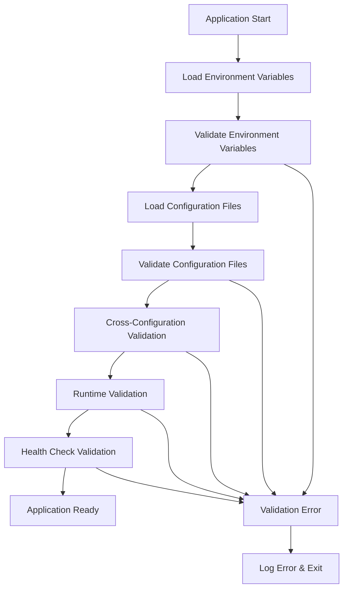

# Configuration Validation Guide

This document provides comprehensive guidance on configuration validation, error handling, and troubleshooting for the Medical_KG_rev system.

## Overview

Configuration validation ensures that all system settings are correct, secure, and compatible before the application starts. The validation system follows a fail-fast approach, preventing the application from starting with invalid configurations.

## Validation Architecture

### Validation Layers

1. **Environment Variable Validation** - Validate system environment variables
2. **Configuration File Validation** - Validate YAML configuration files
3. **Cross-Configuration Validation** - Validate relationships between configurations
4. **Runtime Validation** - Validate configurations during application startup
5. **Health Check Validation** - Validate configurations during health checks

### Validation Flow



## Environment Variable Validation

### Required Variables

The system validates that all required environment variables are present and non-empty:

```python
# Example: Required environment variables validation
REQUIRED_ENV_VARS = [
    'DATABASE_URL',
    'NEO4J_URI',
    'NEO4J_PASSWORD',
    'REDIS_URL',
    'JWT_SECRET_KEY',
    'OAUTH_CLIENT_SECRET',
]

def validate_required_env_vars() -> None:
    """Validate required environment variables."""
    missing_vars = []

    for var in REQUIRED_ENV_VARS:
        value = os.getenv(var)
        if not value or value.strip() == "":
            missing_vars.append(var)

    if missing_vars:
        raise ConfigurationError(
            f"Missing required environment variables: {', '.join(missing_vars)}"
        )
```

### Type Validation

Environment variables are validated for correct types:

```python
# Example: Type validation for environment variables
def validate_env_var_types() -> None:
    """Validate environment variable types."""
    # Numeric validation
    numeric_vars = {
        'GATEWAY_PORT': (1, 65535),
        'DATABASE_POOL_SIZE': (1, 100),
        'DATABASE_MAX_OVERFLOW': (0, 100),
        'DATABASE_TIMEOUT': (1, 300),
        'JWT_EXPIRATION': (60, 86400),
    }

    for var, (min_val, max_val) in numeric_vars.items():
        value = os.getenv(var)
        if value is None:
            continue

        try:
            num_val = int(value)
            if not (min_val <= num_val <= max_val):
                raise ConfigurationError(
                    f"{var} must be between {min_val} and {max_val}, got {num_val}"
                )
        except ValueError:
            raise ConfigurationError(f"{var} must be a valid integer, got '{value}'")

    # Boolean validation
    boolean_vars = [
        'GPU_ENABLED',
        'PROMETHEUS_ENABLED',
        'JAEGER_ENABLED',
        'RATE_LIMIT_ENABLED',
    ]

    for var in boolean_vars:
        value = os.getenv(var)
        if value is None:
            continue

        if value.lower() not in ('true', 'false', '1', '0', 'yes', 'no'):
            raise ConfigurationError(
                f"{var} must be a boolean value (true/false), got '{value}'"
            )
```

### Format Validation

Environment variables are validated for correct formats:

```python
# Example: Format validation for environment variables
def validate_env_var_formats() -> None:
    """Validate environment variable formats."""
    # URL validation
    url_vars = {
        'DATABASE_URL': ['postgresql://', 'postgres://'],
        'NEO4J_URI': ['bolt://', 'neo4j://'],
        'REDIS_URL': ['redis://', 'rediss://'],
        'VECTOR_STORE_URL': ['http://', 'https://'],
    }

    for var, prefixes in url_vars.items():
        value = os.getenv(var)
        if not value:
            continue

        if not any(value.startswith(prefix) for prefix in prefixes):
            raise ConfigurationError(
                f"{var} must start with one of: {', '.join(prefixes)}, got '{value}'"
            )

    # JWT secret validation
    jwt_secret = os.getenv('JWT_SECRET_KEY')
    if jwt_secret and len(jwt_secret) < 32:
        raise ConfigurationError(
            f"JWT_SECRET_KEY must be at least 32 characters long, got {len(jwt_secret)}"
        )

    # Log level validation
    log_level = os.getenv('LOG_LEVEL', 'INFO')
    valid_levels = ['DEBUG', 'INFO', 'WARNING', 'ERROR', 'CRITICAL']
    if log_level.upper() not in valid_levels:
        raise ConfigurationError(
            f"LOG_LEVEL must be one of: {', '.join(valid_levels)}, got '{log_level}'"
        )
```

## Configuration File Validation

### YAML Syntax Validation

Configuration files are validated for correct YAML syntax:

```python
# Example: YAML syntax validation
def validate_yaml_syntax(config_path: str) -> None:
    """Validate YAML syntax."""
    try:
        with open(config_path, 'r') as f:
            yaml.safe_load(f)
    except yaml.YAMLError as e:
        raise ConfigurationError(f"Invalid YAML syntax in {config_path}: {e}")
    except FileNotFoundError:
        raise ConfigurationError(f"Configuration file not found: {config_path}")
```

### Schema Validation

Configuration files are validated against predefined schemas:

```python
# Example: Schema validation for database configuration
DATABASE_SCHEMA = {
    'type': 'object',
    'required': ['url', 'pool_size', 'max_overflow', 'timeout'],
    'properties': {
        'url': {
            'type': 'string',
            'pattern': r'^postgresql://.*'
        },
        'pool_size': {
            'type': 'integer',
            'minimum': 1,
            'maximum': 100
        },
        'max_overflow': {
            'type': 'integer',
            'minimum': 0,
            'maximum': 100
        },
        'timeout': {
            'type': 'integer',
            'minimum': 1,
            'maximum': 300
        },
        'echo': {
            'type': 'boolean'
        }
    }
}

def validate_database_config(config: dict) -> None:
    """Validate database configuration."""
    try:
        jsonschema.validate(config, DATABASE_SCHEMA)
    except jsonschema.ValidationError as e:
        raise ConfigurationError(f"Invalid database configuration: {e.message}")
```

### Cross-Configuration Validation

Configurations are validated for consistency across different components:

```python
# Example: Cross-configuration validation
def validate_cross_configuration(config: dict) -> None:
    """Validate cross-configuration consistency."""
    # Validate database pool size vs max overflow
    db_config = config.get('database', {})
    pool_size = db_config.get('pool_size', 20)
    max_overflow = db_config.get('max_overflow', 30)

    if pool_size + max_overflow > 100:
        raise ConfigurationError(
            f"Database pool_size ({pool_size}) + max_overflow ({max_overflow}) "
            f"exceeds maximum (100)"
        )

    # Validate vector store dimension vs embedding model
    vector_config = config.get('vector_store', {})
    embedding_config = config.get('embeddings', {})

    vector_dim = vector_config.get('dimension', 768)
    embedding_model = embedding_config.get('model', '')

    # Check if embedding model dimension matches vector store dimension
    if 'all-MiniLM-L6-v2' in embedding_model and vector_dim != 384:
        raise ConfigurationError(
            f"Embedding model 'all-MiniLM-L6-v2' requires dimension 384, "
            f"but vector store is configured for {vector_dim}"
        )

    # Validate GPU configuration vs GPU-enabled services
    gpu_config = config.get('gpu', {})
    gpu_enabled = gpu_config.get('enabled', False)

    if gpu_enabled:
        cuda_devices = os.getenv('CUDA_VISIBLE_DEVICES', '0')
        if not cuda_devices or cuda_devices.strip() == '':
            raise ConfigurationError(
                "GPU is enabled but CUDA_VISIBLE_DEVICES is not set"
            )

        # Check if CUDA is available
        try:
            import torch
            if not torch.cuda.is_available():
                raise ConfigurationError(
                    "GPU is enabled but CUDA is not available"
                )
        except ImportError:
            raise ConfigurationError(
                "GPU is enabled but PyTorch is not installed"
            )
```

## Runtime Validation

### Service Connectivity Validation

The system validates connectivity to external services:

```python
# Example: Service connectivity validation
def validate_service_connectivity(config: dict) -> None:
    """Validate connectivity to external services."""
    # Database connectivity
    db_url = config.get('database', {}).get('url')
    if db_url:
        try:
            from sqlalchemy import create_engine
            engine = create_engine(db_url)
            with engine.connect() as conn:
                conn.execute("SELECT 1")
        except Exception as e:
            raise ConfigurationError(f"Cannot connect to database: {e}")

    # Neo4j connectivity
    neo4j_uri = config.get('neo4j', {}).get('uri')
    if neo4j_uri:
        try:
            from neo4j import GraphDatabase
            driver = GraphDatabase.driver(neo4j_uri)
            with driver.session() as session:
                session.run("RETURN 1")
        except Exception as e:
            raise ConfigurationError(f"Cannot connect to Neo4j: {e}")

    # Redis connectivity
    redis_url = config.get('redis', {}).get('url')
    if redis_url:
        try:
            import redis
            r = redis.from_url(redis_url)
            r.ping()
        except Exception as e:
            raise ConfigurationError(f"Cannot connect to Redis: {e}")

    # Vector store connectivity
    vector_url = config.get('vector_store', {}).get('url')
    if vector_url:
        try:
            import requests
            response = requests.get(f"{vector_url}/health", timeout=5)
            response.raise_for_status()
        except Exception as e:
            raise ConfigurationError(f"Cannot connect to vector store: {e}")
```

### Resource Availability Validation

The system validates that required resources are available:

```python
# Example: Resource availability validation
def validate_resource_availability(config: dict) -> None:
    """Validate resource availability."""
    # GPU availability
    gpu_config = config.get('gpu', {})
    if gpu_config.get('enabled', False):
        try:
            import torch
            if not torch.cuda.is_available():
                raise ConfigurationError("GPU is enabled but CUDA is not available")

            # Check GPU memory
            gpu_memory = torch.cuda.get_device_properties(0).total_memory
            required_memory = gpu_config.get('memory_fraction', 0.8) * gpu_memory

            if gpu_memory < required_memory:
                raise ConfigurationError(
                    f"GPU memory ({gpu_memory} bytes) is insufficient "
                    f"for required fraction ({gpu_config.get('memory_fraction', 0.8)})"
                )
        except ImportError:
            raise ConfigurationError("GPU is enabled but PyTorch is not installed")

    # Disk space validation
    import shutil
    disk_usage = shutil.disk_usage('/')
    free_space_gb = disk_usage.free / (1024**3)

    if free_space_gb < 10:  # Require at least 10GB free space
        raise ConfigurationError(
            f"Insufficient disk space: {free_space_gb:.1f}GB free, "
            f"minimum 10GB required"
        )

    # Memory validation
    import psutil
    memory = psutil.virtual_memory()
    available_memory_gb = memory.available / (1024**3)

    if available_memory_gb < 4:  # Require at least 4GB available memory
        raise ConfigurationError(
            f"Insufficient memory: {available_memory_gb:.1f}GB available, "
            f"minimum 4GB required"
        )
```

## Health Check Validation

### Configuration Health Checks

The system performs health checks to validate configurations:

```python
# Example: Configuration health checks
def perform_configuration_health_checks(config: dict) -> dict:
    """Perform configuration health checks."""
    health_status = {
        'status': 'healthy',
        'checks': {},
        'timestamp': datetime.utcnow().isoformat()
    }

    # Database health check
    try:
        db_url = config.get('database', {}).get('url')
        if db_url:
            from sqlalchemy import create_engine
            engine = create_engine(db_url)
            with engine.connect() as conn:
                conn.execute("SELECT 1")
            health_status['checks']['database'] = 'healthy'
        else:
            health_status['checks']['database'] = 'not_configured'
    except Exception as e:
        health_status['checks']['database'] = f'unhealthy: {e}'
        health_status['status'] = 'unhealthy'

    # Neo4j health check
    try:
        neo4j_uri = config.get('neo4j', {}).get('uri')
        if neo4j_uri:
            from neo4j import GraphDatabase
            driver = GraphDatabase.driver(neo4j_uri)
            with driver.session() as session:
                session.run("RETURN 1")
            health_status['checks']['neo4j'] = 'healthy'
        else:
            health_status['checks']['neo4j'] = 'not_configured'
    except Exception as e:
        health_status['checks']['neo4j'] = f'unhealthy: {e}'
        health_status['status'] = 'unhealthy'

    # Redis health check
    try:
        redis_url = config.get('redis', {}).get('url')
        if redis_url:
            import redis
            r = redis.from_url(redis_url)
            r.ping()
            health_status['checks']['redis'] = 'healthy'
        else:
            health_status['checks']['redis'] = 'not_configured'
    except Exception as e:
        health_status['checks']['redis'] = f'unhealthy: {e}'
        health_status['status'] = 'unhealthy'

    # Vector store health check
    try:
        vector_url = config.get('vector_store', {}).get('url')
        if vector_url:
            import requests
            response = requests.get(f"{vector_url}/health", timeout=5)
            response.raise_for_status()
            health_status['checks']['vector_store'] = 'healthy'
        else:
            health_status['checks']['vector_store'] = 'not_configured'
    except Exception as e:
        health_status['checks']['vector_store'] = f'unhealthy: {e}'
        health_status['status'] = 'unhealthy'

    return health_status
```

## Error Handling

### Configuration Error Types

The system defines specific error types for different validation failures:

```python
# Example: Configuration error types
class ConfigurationError(Exception):
    """Base configuration error."""
    pass

class EnvironmentVariableError(ConfigurationError):
    """Environment variable validation error."""
    pass

class ConfigurationFileError(ConfigurationError):
    """Configuration file validation error."""
    pass

class CrossConfigurationError(ConfigurationError):
    """Cross-configuration validation error."""
    pass

class ServiceConnectivityError(ConfigurationError):
    """Service connectivity validation error."""
    pass

class ResourceAvailabilityError(ConfigurationError):
    """Resource availability validation error."""
    pass
```

### Error Handling Strategy

The system implements a comprehensive error handling strategy:

```python
# Example: Error handling strategy
def handle_configuration_error(error: Exception) -> None:
    """Handle configuration errors."""
    if isinstance(error, EnvironmentVariableError):
        logger.error(f"Environment variable error: {error}")
        logger.error("Please check your environment variables and .env file")

    elif isinstance(error, ConfigurationFileError):
        logger.error(f"Configuration file error: {error}")
        logger.error("Please check your configuration files for syntax errors")

    elif isinstance(error, CrossConfigurationError):
        logger.error(f"Cross-configuration error: {error}")
        logger.error("Please check configuration consistency across components")

    elif isinstance(error, ServiceConnectivityError):
        logger.error(f"Service connectivity error: {error}")
        logger.error("Please check network connectivity and service availability")

    elif isinstance(error, ResourceAvailabilityError):
        logger.error(f"Resource availability error: {error}")
        logger.error("Please check system resources (GPU, memory, disk space)")

    else:
        logger.error(f"Unknown configuration error: {error}")

    # Exit with error code
    sys.exit(1)
```

### Error Recovery

The system provides error recovery mechanisms:

```python
# Example: Error recovery mechanisms
def recover_from_configuration_error(error: Exception) -> bool:
    """Attempt to recover from configuration errors."""
    if isinstance(error, ServiceConnectivityError):
        # Wait and retry for connectivity errors
        logger.info("Waiting 30 seconds before retrying...")
        time.sleep(30)
        return True

    elif isinstance(error, ResourceAvailabilityError):
        # Try to free up resources
        logger.info("Attempting to free up resources...")
        try:
            import gc
            gc.collect()
            return True
        except Exception:
            return False

    return False
```

## Validation Tools

### Configuration Validator Script

Create a standalone validation script:

```python
#!/usr/bin/env python3
"""Configuration validation script."""

import os
import sys
import yaml
import json
import argparse
from typing import Dict, List, Optional
from pathlib import Path

class ConfigurationValidator:
    """Configuration validator."""

    def __init__(self, config_dir: str = "config"):
        self.config_dir = Path(config_dir)
        self.errors = []
        self.warnings = []

    def validate_environment_variables(self) -> None:
        """Validate environment variables."""
        required_vars = [
            'DATABASE_URL',
            'NEO4J_URI',
            'NEO4J_PASSWORD',
            'REDIS_URL',
            'JWT_SECRET_KEY',
        ]

        for var in required_vars:
            value = os.getenv(var)
            if not value or value.strip() == "":
                self.errors.append(f"Missing required environment variable: {var}")

    def validate_configuration_files(self) -> None:
        """Validate configuration files."""
        config_files = [
            'gateway.yaml',
            'database.yaml',
            'vector_store.yaml',
            'embeddings.yaml',
            'chunking.yaml',
            'orchestration/pipelines.yaml',
            'monitoring.yaml',
        ]

        for config_file in config_files:
            config_path = self.config_dir / config_file
            if not config_path.exists():
                self.warnings.append(f"Configuration file not found: {config_file}")
                continue

            try:
                with open(config_path, 'r') as f:
                    yaml.safe_load(f)
            except yaml.YAMLError as e:
                self.errors.append(f"Invalid YAML syntax in {config_file}: {e}")
            except Exception as e:
                self.errors.append(f"Error reading {config_file}: {e}")

    def validate_cross_configuration(self) -> None:
        """Validate cross-configuration consistency."""
        # Load all configuration files
        configs = {}
        for config_file in self.config_dir.glob("**/*.yaml"):
            try:
                with open(config_file, 'r') as f:
                    configs[config_file.name] = yaml.safe_load(f)
            except Exception:
                continue

        # Validate database configuration
        if 'database.yaml' in configs:
            db_config = configs['database.yaml']
            pool_size = db_config.get('database', {}).get('pool_size', 20)
            max_overflow = db_config.get('database', {}).get('max_overflow', 30)

            if pool_size + max_overflow > 100:
                self.errors.append(
                    f"Database pool_size ({pool_size}) + max_overflow ({max_overflow}) "
                    f"exceeds maximum (100)"
                )

    def run_validation(self) -> bool:
        """Run all validation checks."""
        print("Running configuration validation...")

        self.validate_environment_variables()
        self.validate_configuration_files()
        self.validate_cross_configuration()

        # Print results
        if self.errors:
            print("\n❌ Configuration Errors:")
            for error in self.errors:
                print(f"  • {error}")

        if self.warnings:
            print("\n⚠️  Configuration Warnings:")
            for warning in self.warnings:
                print(f"  • {warning}")

        if not self.errors and not self.warnings:
            print("\n✅ Configuration validation passed!")
            return True

        return len(self.errors) == 0

def main():
    """Main function."""
    parser = argparse.ArgumentParser(description="Validate Medical_KG_rev configuration")
    parser.add_argument("--config-dir", default="config", help="Configuration directory")
    parser.add_argument("--format", choices=["text", "json"], default="text", help="Output format")

    args = parser.parse_args()

    validator = ConfigurationValidator(args.config_dir)
    success = validator.run_validation()

    if args.format == "json":
        output = {
            "success": success,
            "errors": validator.errors,
            "warnings": validator.warnings
        }
        print(json.dumps(output, indent=2))

    sys.exit(0 if success else 1)

if __name__ == "__main__":
    main()
```

### Pre-commit Hook

Add configuration validation to pre-commit hooks:

```yaml
# .pre-commit-config.yaml
repos:
  - repo: local
    hooks:
      - id: config-validation
        name: Configuration Validation
        entry: python scripts/validate_config.py
        language: system
        files: ^config/.*\.yaml$
        pass_filenames: false
```

## Troubleshooting

### Common Validation Errors

1. **Missing Environment Variables**
   - Error: `Missing required environment variable: DATABASE_URL`
   - Solution: Set the environment variable or add it to `.env` file

2. **Invalid YAML Syntax**
   - Error: `Invalid YAML syntax in database.yaml: while parsing a block mapping`
   - Solution: Check YAML indentation and syntax

3. **Type Mismatches**
   - Error: `GATEWAY_PORT must be between 1 and 65535, got 80000`
   - Solution: Use a valid port number

4. **Service Connectivity Issues**
   - Error: `Cannot connect to database: connection refused`
   - Solution: Check if the database service is running

5. **Resource Availability Issues**
   - Error: `GPU is enabled but CUDA is not available`
   - Solution: Install CUDA drivers or disable GPU

### Debug Commands

```bash
# Validate configuration
python scripts/validate_config.py

# Check environment variables
env | grep -E "(DATABASE|REDIS|NEO4J|JWT|OAUTH)"

# Test database connectivity
python -c "from Medical_KG_rev.storage.database import DatabaseManager; db = DatabaseManager(); print(db.test_connection())"

# Test Neo4j connectivity
python -c "from Medical_KG_rev.storage.neo4j import Neo4jManager; neo4j = Neo4jManager(); print(neo4j.test_connection())"

# Test Redis connectivity
python -c "from Medical_KG_rev.storage.redis import RedisManager; redis = RedisManager(); print(redis.test_connection())"

# Check GPU availability
python -c "import torch; print('CUDA available:', torch.cuda.is_available())"

# Check system resources
python -c "import psutil; print('Memory:', psutil.virtual_memory().available / (1024**3), 'GB')"
```

## Best Practices

1. **Validate Early**: Check configurations at startup
2. **Fail Fast**: Exit immediately on validation errors
3. **Clear Error Messages**: Provide actionable error messages
4. **Comprehensive Coverage**: Validate all configuration aspects
5. **Automated Validation**: Use CI/CD for configuration validation
6. **Documentation**: Keep validation rules documented
7. **Testing**: Test validation with various configurations
8. **Monitoring**: Monitor configuration health in production

## Related Documentation

- [Configuration Reference](configuration_reference.md)
- [Environment Variables](environment_variables.md)
- [Deployment Guide](deployment.md)
- [Troubleshooting Guide](troubleshooting.md)
- [Security Configuration](security.md)
