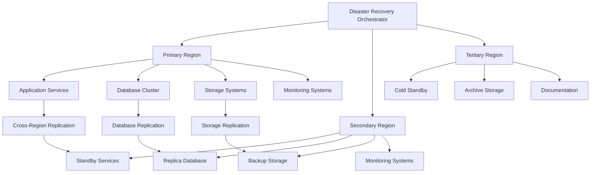

# Disaster Recovery Plan

This document provides a comprehensive disaster recovery plan for the Medical_KG_rev system, including procedures for restoring services in case of deployment failures, infrastructure outages, data corruption, or other catastrophic events.

## Overview

Disaster recovery is critical for healthcare applications that handle sensitive medical data. This plan covers multiple disaster scenarios, recovery procedures, RTO/RPO objectives, and comprehensive testing strategies to ensure business continuity.

## Disaster Recovery Architecture

### Recovery Architecture



### Recovery Components

1. **Primary Region**: Active production environment
2. **Secondary Region**: Hot standby with data replication
3. **Tertiary Region**: Cold standby for long-term recovery
4. **Disaster Recovery Orchestrator**: Automated failover system
5. **Backup Systems**: Point-in-time recovery capabilities
6. **Monitoring Systems**: Real-time health monitoring

## Recovery Objectives

### Recovery Time Objectives (RTO)

| Service Component | RTO Target | Criticality |
|-------------------|------------|--------------|
| API Gateway | 5 minutes | Critical |
| Authentication Service | 5 minutes | Critical |
| Document Processing | 15 minutes | High |
| Search Service | 10 minutes | High |
| Knowledge Graph | 30 minutes | Medium |
| Analytics Service | 60 minutes | Medium |
| Monitoring Systems | 10 minutes | High |
| Database Services | 15 minutes | Critical |

### Recovery Point Objectives (RPO)

| Data Type | RPO Target | Backup Frequency |
|-----------|------------|------------------|
| User Data | 15 minutes | Continuous |
| Document Data | 30 minutes | Every 15 minutes |
| Search Index | 1 hour | Every 30 minutes |
| Knowledge Graph | 2 hours | Every hour |
| Analytics Data | 4 hours | Every 2 hours |
| Configuration Data | 1 hour | Every 30 minutes |
| Audit Logs | 5 minutes | Continuous |

## Disaster Scenarios

### Scenario 1: Application Service Failure

#### Detection

```python
# src/Medical_KG_rev/disaster_recovery/detection.py
import asyncio
import aiohttp
from typing import List, Dict, Any
from datetime import datetime
import logging

class ServiceHealthChecker:
    """Service health monitoring for disaster detection."""

    def __init__(self, services: List[Dict[str, Any]]):
        self.services = services
        self.logger = logging.getLogger(__name__)

    async def check_service_health(self, service: Dict[str, Any]) -> Dict[str, Any]:
        """Check health of a single service."""
        try:
            async with aiohttp.ClientSession() as session:
                async with session.get(
                    f"{service['url']}/health",
                    timeout=aiohttp.ClientTimeout(total=5)
                ) as response:
                    if response.status == 200:
                        return {
                            "service": service["name"],
                            "status": "healthy",
                            "response_time": response.headers.get("X-Response-Time", "unknown"),
                            "timestamp": datetime.utcnow().isoformat()
                        }
                    else:
                        return {
                            "service": service["name"],
                            "status": "unhealthy",
                            "status_code": response.status,
                            "timestamp": datetime.utcnow().isoformat()
                        }
        except Exception as e:
            return {
                "service": service["name"],
                "status": "failed",
                "error": str(e),
                "timestamp": datetime.utcnow().isoformat()
            }

    async def check_all_services(self) -> List[Dict[str, Any]]:
        """Check health of all services."""
        tasks = [self.check_service_health(service) for service in self.services]
        results = await asyncio.gather(*tasks, return_exceptions=True)

        # Filter out exceptions and log them
        health_results = []
        for result in results:
            if isinstance(result, Exception):
                self.logger.error(f"Health check failed: {result}")
            else:
                health_results.append(result)

        return health_results

    def detect_service_failure(self, health_results: List[Dict[str, Any]]) -> List[str]:
        """Detect failed services."""
        failed_services = []
        for result in health_results:
            if result["status"] in ["unhealthy", "failed"]:
                failed_services.append(result["service"])
        return failed_services

# Service configuration
services = [
    {"name": "api-gateway", "url": "http://api-gateway:8000"},
    {"name": "auth-service", "url": "http://auth-service:8001"},
    {"name": "document-service", "url": "http://document-service:8002"},
    {"name": "search-service", "url": "http://search-service:8003"},
    {"name": "kg-service", "url": "http://kg-service:8004"},
    {"name": "analytics-service", "url": "http://analytics-service:8005"}
]

health_checker = ServiceHealthChecker(services)
```

#### Recovery Procedure

```bash
#!/bin/bash
# scripts/disaster_recovery/service_failure_recovery.sh

set -e

# Configuration
NAMESPACE="production"
BACKUP_NAMESPACE="disaster-recovery"
LOG_FILE="/var/log/disaster-recovery.log"

# Logging function
log() {
    echo "$(date '+%Y-%m-%d %H:%M:%S') - $1" | tee -a "$LOG_FILE"
}

# Check if service is running
check_service() {
    local service_name=$1
    local namespace=$2

    kubectl get pods -n "$namespace" -l app="$service_name" --no-headers | grep -q "Running"
}

# Restart failed service
restart_service() {
    local service_name=$1
    local namespace=$2

    log "Restarting service: $service_name in namespace: $namespace"

    # Scale down
    kubectl scale deployment "$service_name" --replicas=0 -n "$namespace"

    # Wait for pods to terminate
    kubectl wait --for=delete pod -l app="$service_name" -n "$namespace" --timeout=60s

    # Scale up
    kubectl scale deployment "$service_name" --replicas=2 -n "$namespace"

    # Wait for pods to be ready
    kubectl wait --for=condition=ready pod -l app="$service_name" -n "$namespace" --timeout=300s

    log "Service $service_name restarted successfully"
}

# Deploy from backup
deploy_from_backup() {
    local service_name=$1

    log "Deploying $service_name from backup"

    # Check if backup exists
    if ! kubectl get deployment "$service_name" -n "$BACKUP_NAMESPACE" >/dev/null 2>&1; then
        log "ERROR: Backup deployment for $service_name not found"
        exit 1
    fi

    # Copy deployment from backup namespace
    kubectl get deployment "$service_name" -n "$BACKUP_NAMESPACE" -o yaml | \
        sed "s/namespace: $BACKUP_NAMESPACE/namespace: $NAMESPACE/" | \
        kubectl apply -f -

    # Wait for deployment to be ready
    kubectl wait --for=condition=available deployment "$service_name" -n "$NAMESPACE" --timeout=300s

    log "Service $service_name deployed from backup successfully"
}

# Main recovery function
recover_service_failure() {
    local failed_service=$1

    log "Starting recovery for service: $failed_service"

    # Check if service is running
    if check_service "$failed_service" "$NAMESPACE"; then
        log "Service $failed_service is already running"
        return 0
    fi

    # Try to restart the service
    if kubectl get deployment "$failed_service" -n "$NAMESPACE" >/dev/null 2>&1; then
        restart_service "$failed_service" "$NAMESPACE"
    else
        # Deploy from backup
        deploy_from_backup "$failed_service"
    fi

    # Verify recovery
    if check_service "$failed_service" "$NAMESPACE"; then
        log "Service $failed_service recovered successfully"
        return 0
    else
        log "ERROR: Failed to recover service $failed_service"
        return 1
    fi
}

# Execute recovery
if [ $# -eq 0 ]; then
    echo "Usage: $0 <service_name>"
    exit 1
fi

recover_service_failure "$1"
```

### Scenario 2: Database Failure

#### Detection

```python
# src/Medical_KG_rev/disaster_recovery/database_monitoring.py
import asyncio
import asyncpg
import redis
from neo4j import GraphDatabase
from typing import Dict, Any, List
import logging

class DatabaseHealthChecker:
    """Database health monitoring."""

    def __init__(self, config: Dict[str, Any]):
        self.config = config
        self.logger = logging.getLogger(__name__)

    async def check_postgresql(self) -> Dict[str, Any]:
        """Check PostgreSQL health."""
        try:
            conn = await asyncpg.connect(
                host=self.config["postgresql"]["host"],
                port=self.config["postgresql"]["port"],
                user=self.config["postgresql"]["user"],
                password=self.config["postgresql"]["password"],
                database=self.config["postgresql"]["database"]
            )

            # Check connection
            result = await conn.fetchval("SELECT 1")

            # Check replication status
            replication_status = await conn.fetchrow(
                "SELECT pg_is_in_recovery(), pg_last_wal_receive_lsn(), pg_last_wal_replay_lsn()"
            )

            await conn.close()

            return {
                "database": "postgresql",
                "status": "healthy",
                "connection": "ok",
                "replication": {
                    "in_recovery": replication_status[0],
                    "last_receive_lsn": str(replication_status[1]),
                    "last_replay_lsn": str(replication_status[2])
                },
                "timestamp": datetime.utcnow().isoformat()
            }

        except Exception as e:
            return {
                "database": "postgresql",
                "status": "failed",
                "error": str(e),
                "timestamp": datetime.utcnow().isoformat()
            }

    def check_redis(self) -> Dict[str, Any]:
        """Check Redis health."""
        try:
            r = redis.Redis(
                host=self.config["redis"]["host"],
                port=self.config["redis"]["port"],
                password=self.config["redis"]["password"],
                decode_responses=True
            )

            # Check connection
            r.ping()

            # Check memory usage
            info = r.info()

            return {
                "database": "redis",
                "status": "healthy",
                "connection": "ok",
                "memory_usage": info["used_memory_human"],
                "connected_clients": info["connected_clients"],
                "timestamp": datetime.utcnow().isoformat()
            }

        except Exception as e:
            return {
                "database": "redis",
                "status": "failed",
                "error": str(e),
                "timestamp": datetime.utcnow().isoformat()
            }

    def check_neo4j(self) -> Dict[str, Any]:
        """Check Neo4j health."""
        try:
            driver = GraphDatabase.driver(
                self.config["neo4j"]["uri"],
                auth=(self.config["neo4j"]["user"], self.config["neo4j"]["password"])
            )

            with driver.session() as session:
                # Check connection
                result = session.run("RETURN 1 as test")
                test_value = result.single()["test"]

                # Check cluster status
                cluster_info = session.run("CALL dbms.cluster.overview()")
                cluster_nodes = [record.data() for record in cluster_info]

            driver.close()

            return {
                "database": "neo4j",
                "status": "healthy",
                "connection": "ok",
                "cluster_nodes": len(cluster_nodes),
                "timestamp": datetime.utcnow().isoformat()
            }

        except Exception as e:
            return {
                "database": "neo4j",
                "status": "failed",
                "error": str(e),
                "timestamp": datetime.utcnow().isoformat()
            }

    async def check_all_databases(self) -> List[Dict[str, Any]]:
        """Check health of all databases."""
        results = []

        # Check PostgreSQL
        postgresql_result = await self.check_postgresql()
        results.append(postgresql_result)

        # Check Redis
        redis_result = self.check_redis()
        results.append(redis_result)

        # Check Neo4j
        neo4j_result = self.check_neo4j()
        results.append(neo4j_result)

        return results

# Database configuration
db_config = {
    "postgresql": {
        "host": "postgresql-primary",
        "port": 5432,
        "user": "postgres",
        "password": "password",
        "database": "medical_kg_rev"
    },
    "redis": {
        "host": "redis-primary",
        "port": 6379,
        "password": "password"
    },
    "neo4j": {
        "uri": "bolt://neo4j-primary:7687",
        "user": "neo4j",
        "password": "password"
    }
}

db_health_checker = DatabaseHealthChecker(db_config)
```

#### Recovery Procedure

```bash
#!/bin/bash
# scripts/disaster_recovery/database_failure_recovery.sh

set -e

# Configuration
NAMESPACE="production"
BACKUP_NAMESPACE="disaster-recovery"
LOG_FILE="/var/log/disaster-recovery.log"

# Logging function
log() {
    echo "$(date '+%Y-%m-%d %H:%M:%S') - $1" | tee -a "$LOG_FILE"
}

# Check database status
check_database() {
    local db_type=$1
    local namespace=$2

    case $db_type in
        "postgresql")
            kubectl get pods -n "$namespace" -l app=postgresql --no-headers | grep -q "Running"
            ;;
        "redis")
            kubectl get pods -n "$namespace" -l app=redis --no-headers | grep -q "Running"
            ;;
        "neo4j")
            kubectl get pods -n "$namespace" -l app=neo4j --no-headers | grep -q "Running"
            ;;
        *)
            log "ERROR: Unknown database type: $db_type"
            return 1
            ;;
    esac
}

# Restart database
restart_database() {
    local db_type=$1
    local namespace=$2

    log "Restarting database: $db_type in namespace: $namespace"

    case $db_type in
        "postgresql")
            kubectl scale statefulset postgresql-primary --replicas=0 -n "$namespace"
            kubectl wait --for=delete pod -l app=postgresql -n "$namespace" --timeout=60s
            kubectl scale statefulset postgresql-primary --replicas=1 -n "$namespace"
            kubectl wait --for=condition=ready pod -l app=postgresql -n "$namespace" --timeout=300s
            ;;
        "redis")
            kubectl scale deployment redis-primary --replicas=0 -n "$namespace"
            kubectl wait --for=delete pod -l app=redis -n "$namespace" --timeout=60s
            kubectl scale deployment redis-primary --replicas=1 -n "$namespace"
            kubectl wait --for=condition=ready pod -l app=redis -n "$namespace" --timeout=300s
            ;;
        "neo4j")
            kubectl scale statefulset neo4j-primary --replicas=0 -n "$namespace"
            kubectl wait --for=delete pod -l app=neo4j -n "$namespace" --timeout=60s
            kubectl scale statefulset neo4j-primary --replicas=1 -n "$namespace"
            kubectl wait --for=condition=ready pod -l app=neo4j -n "$namespace" --timeout=300s
            ;;
    esac

    log "Database $db_type restarted successfully"
}

# Restore from backup
restore_from_backup() {
    local db_type=$1

    log "Restoring $db_type from backup"

    case $db_type in
        "postgresql")
            # Get latest backup
            LATEST_BACKUP=$(kubectl get backup -n "$BACKUP_NAMESPACE" -l app=postgresql --sort-by=.metadata.creationTimestamp -o jsonpath='{.items[-1].metadata.name}')

            if [ -z "$LATEST_BACKUP" ]; then
                log "ERROR: No backup found for PostgreSQL"
                return 1
            fi

            # Restore from backup
            kubectl apply -f - <<EOF
apiVersion: v1
kind: Pod
metadata:
  name: postgresql-restore
  namespace: $NAMESPACE
spec:
  containers:
  - name: postgresql-restore
    image: postgres:14
    command:
    - /bin/bash
    - -c
    - |
      pg_restore -h postgresql-primary -U postgres -d medical_kg_rev /backup/$LATEST_BACKUP
    volumeMounts:
    - name: backup-volume
      mountPath: /backup
  volumes:
  - name: backup-volume
    persistentVolumeClaim:
      claimName: postgresql-backup-pvc
  restartPolicy: Never
EOF

            # Wait for restore to complete
            kubectl wait --for=condition=ready pod postgresql-restore -n "$NAMESPACE" --timeout=600s

            # Clean up restore pod
            kubectl delete pod postgresql-restore -n "$NAMESPACE"
            ;;
        "redis")
            # Get latest backup
            LATEST_BACKUP=$(kubectl get backup -n "$BACKUP_NAMESPACE" -l app=redis --sort-by=.metadata.creationTimestamp -o jsonpath='{.items[-1].metadata.name}')

            if [ -z "$LATEST_BACKUP" ]; then
                log "ERROR: No backup found for Redis"
                return 1
            fi

            # Restore from backup
            kubectl exec -n "$NAMESPACE" deployment/redis-primary -- redis-cli --rdb /backup/$LATEST_BACKUP
            ;;
        "neo4j")
            # Get latest backup
            LATEST_BACKUP=$(kubectl get backup -n "$BACKUP_NAMESPACE" -l app=neo4j --sort-by=.metadata.creationTimestamp -o jsonpath='{.items[-1].metadata.name}')

            if [ -z "$LATEST_BACKUP" ]; then
                log "ERROR: No backup found for Neo4j"
                return 1
            fi

            # Restore from backup
            kubectl exec -n "$NAMESPACE" statefulset/neo4j-primary -- neo4j-admin restore --from=/backup/$LATEST_BACKUP --database=neo4j --force
            ;;
    esac

    log "Database $db_type restored from backup successfully"
}

# Main recovery function
recover_database_failure() {
    local failed_database=$1

    log "Starting recovery for database: $failed_database"

    # Check if database is running
    if check_database "$failed_database" "$NAMESPACE"; then
        log "Database $failed_database is already running"
        return 0
    fi

    # Try to restart the database
    if kubectl get statefulset "$failed_database-primary" -n "$NAMESPACE" >/dev/null 2>&1 || \
       kubectl get deployment "$failed_database-primary" -n "$NAMESPACE" >/dev/null 2>&1; then
        restart_database "$failed_database" "$NAMESPACE"
    else
        # Restore from backup
        restore_from_backup "$failed_database"
    fi

    # Verify recovery
    if check_database "$failed_database" "$NAMESPACE"; then
        log "Database $failed_database recovered successfully"
        return 0
    else
        log "ERROR: Failed to recover database $failed_database"
        return 1
    fi
}

# Execute recovery
if [ $# -eq 0 ]; then
    echo "Usage: $0 <database_type>"
    echo "Database types: postgresql, redis, neo4j"
    exit 1
fi

recover_database_failure "$1"
```

### Scenario 3: Infrastructure Failure

#### Detection

```python
# src/Medical_KG_rev/disaster_recovery/infrastructure_monitoring.py
import asyncio
import aiohttp
from typing import Dict, Any, List
import logging
from datetime import datetime

class InfrastructureHealthChecker:
    """Infrastructure health monitoring."""

    def __init__(self, config: Dict[str, Any]):
        self.config = config
        self.logger = logging.getLogger(__name__)

    async def check_kubernetes_cluster(self) -> Dict[str, Any]:
        """Check Kubernetes cluster health."""
        try:
            # Check cluster nodes
            nodes = await self._get_cluster_nodes()

            # Check system pods
            system_pods = await self._get_system_pods()

            # Check cluster resources
            resources = await self._get_cluster_resources()

            return {
                "component": "kubernetes-cluster",
                "status": "healthy",
                "nodes": len(nodes),
                "system_pods": len(system_pods),
                "resources": resources,
                "timestamp": datetime.utcnow().isoformat()
            }

        except Exception as e:
            return {
                "component": "kubernetes-cluster",
                "status": "failed",
                "error": str(e),
                "timestamp": datetime.utcnow().isoformat()
            }

    async def check_load_balancer(self) -> Dict[str, Any]:
        """Check load balancer health."""
        try:
            async with aiohttp.ClientSession() as session:
                async with session.get(
                    f"{self.config['load_balancer']['url']}/health",
                    timeout=aiohttp.ClientTimeout(total=5)
                ) as response:
                    if response.status == 200:
                        return {
                            "component": "load-balancer",
                            "status": "healthy",
                            "response_time": response.headers.get("X-Response-Time", "unknown"),
                            "timestamp": datetime.utcnow().isoformat()
                        }
                    else:
                        return {
                            "component": "load-balancer",
                            "status": "unhealthy",
                            "status_code": response.status,
                            "timestamp": datetime.utcnow().isoformat()
                        }
        except Exception as e:
            return {
                "component": "load-balancer",
                "status": "failed",
                "error": str(e),
                "timestamp": datetime.utcnow().isoformat()
            }

    async def check_storage_systems(self) -> Dict[str, Any]:
        """Check storage systems health."""
        try:
            # Check persistent volumes
            pvs = await self._get_persistent_volumes()

            # Check storage classes
            storage_classes = await self._get_storage_classes()

            return {
                "component": "storage-systems",
                "status": "healthy",
                "persistent_volumes": len(pvs),
                "storage_classes": len(storage_classes),
                "timestamp": datetime.utcnow().isoformat()
            }

        except Exception as e:
            return {
                "component": "storage-systems",
                "status": "failed",
                "error": str(e),
                "timestamp": datetime.utcnow().isoformat()
            }

    async def check_network_connectivity(self) -> Dict[str, Any]:
        """Check network connectivity."""
        try:
            # Check DNS resolution
            dns_status = await self._check_dns_resolution()

            # Check internal network
            internal_network = await self._check_internal_network()

            # Check external connectivity
            external_connectivity = await self._check_external_connectivity()

            return {
                "component": "network-connectivity",
                "status": "healthy",
                "dns_resolution": dns_status,
                "internal_network": internal_network,
                "external_connectivity": external_connectivity,
                "timestamp": datetime.utcnow().isoformat()
            }

        except Exception as e:
            return {
                "component": "network-connectivity",
                "status": "failed",
                "error": str(e),
                "timestamp": datetime.utcnow().isoformat()
            }

    async def check_all_infrastructure(self) -> List[Dict[str, Any]]:
        """Check health of all infrastructure components."""
        results = []

        # Check Kubernetes cluster
        cluster_result = await self.check_kubernetes_cluster()
        results.append(cluster_result)

        # Check load balancer
        lb_result = await self.check_load_balancer()
        results.append(lb_result)

        # Check storage systems
        storage_result = await self.check_storage_systems()
        results.append(storage_result)

        # Check network connectivity
        network_result = await self.check_network_connectivity()
        results.append(network_result)

        return results

    async def _get_cluster_nodes(self) -> List[Dict[str, Any]]:
        """Get cluster nodes."""
        # Implementation would use Kubernetes API
        return []

    async def _get_system_pods(self) -> List[Dict[str, Any]]:
        """Get system pods."""
        # Implementation would use Kubernetes API
        return []

    async def _get_cluster_resources(self) -> Dict[str, Any]:
        """Get cluster resources."""
        # Implementation would use Kubernetes API
        return {}

    async def _get_persistent_volumes(self) -> List[Dict[str, Any]]:
        """Get persistent volumes."""
        # Implementation would use Kubernetes API
        return []

    async def _get_storage_classes(self) -> List[Dict[str, Any]]:
        """Get storage classes."""
        # Implementation would use Kubernetes API
        return []

    async def _check_dns_resolution(self) -> bool:
        """Check DNS resolution."""
        # Implementation would test DNS resolution
        return True

    async def _check_internal_network(self) -> bool:
        """Check internal network."""
        # Implementation would test internal network
        return True

    async def _check_external_connectivity(self) -> bool:
        """Check external connectivity."""
        # Implementation would test external connectivity
        return True

# Infrastructure configuration
infrastructure_config = {
    "load_balancer": {
        "url": "http://load-balancer:80"
    }
}

infrastructure_health_checker = InfrastructureHealthChecker(infrastructure_config)
```

#### Recovery Procedure

```bash
#!/bin/bash
# scripts/disaster_recovery/infrastructure_failure_recovery.sh

set -e

# Configuration
NAMESPACE="production"
BACKUP_NAMESPACE="disaster-recovery"
LOG_FILE="/var/log/disaster-recovery.log"

# Logging function
log() {
    echo "$(date '+%Y-%m-%d %H:%M:%S') - $1" | tee -a "$LOG_FILE"
}

# Check infrastructure component
check_infrastructure() {
    local component=$1
    local namespace=$2

    case $component in
        "kubernetes-cluster")
            kubectl get nodes --no-headers | grep -q "Ready"
            ;;
        "load-balancer")
            kubectl get pods -n "$namespace" -l app=load-balancer --no-headers | grep -q "Running"
            ;;
        "storage-systems")
            kubectl get pv --no-headers | grep -q "Bound"
            ;;
        "network-connectivity")
            kubectl get pods -n "$namespace" -l app=network-test --no-headers | grep -q "Running"
            ;;
        *)
            log "ERROR: Unknown infrastructure component: $component"
            return 1
            ;;
    esac
}

# Restart infrastructure component
restart_infrastructure() {
    local component=$1
    local namespace=$2

    log "Restarting infrastructure component: $component in namespace: $namespace"

    case $component in
        "kubernetes-cluster")
            # Restart cluster components
            kubectl rollout restart deployment/coredns -n kube-system
            kubectl rollout restart deployment/kube-proxy -n kube-system
            kubectl rollout restart deployment/kube-scheduler -n kube-system
            kubectl rollout restart deployment/kube-controller-manager -n kube-system
            kubectl rollout restart deployment/kube-apiserver -n kube-system
            ;;
        "load-balancer")
            kubectl rollout restart deployment/load-balancer -n "$namespace"
            kubectl wait --for=condition=available deployment/load-balancer -n "$namespace" --timeout=300s
            ;;
        "storage-systems")
            # Restart storage controller
            kubectl rollout restart deployment/storage-controller -n kube-system
            kubectl wait --for=condition=available deployment/storage-controller -n kube-system --timeout=300s
            ;;
        "network-connectivity")
            # Restart network components
            kubectl rollout restart daemonset/kube-proxy -n kube-system
            kubectl rollout restart daemonset/cni-plugin -n kube-system
            ;;
    esac

    log "Infrastructure component $component restarted successfully"
}

# Deploy from backup
deploy_infrastructure_from_backup() {
    local component=$1

    log "Deploying infrastructure component $component from backup"

    case $component in
        "kubernetes-cluster")
            # Deploy cluster components from backup
            kubectl apply -f /backup/cluster-components.yaml
            ;;
        "load-balancer")
            # Deploy load balancer from backup
            kubectl apply -f /backup/load-balancer.yaml
            ;;
        "storage-systems")
            # Deploy storage systems from backup
            kubectl apply -f /backup/storage-systems.yaml
            ;;
        "network-connectivity")
            # Deploy network components from backup
            kubectl apply -f /backup/network-components.yaml
            ;;
    esac

    log "Infrastructure component $component deployed from backup successfully"
}

# Main recovery function
recover_infrastructure_failure() {
    local failed_component=$1

    log "Starting recovery for infrastructure component: $failed_component"

    # Check if component is running
    if check_infrastructure "$failed_component" "$NAMESPACE"; then
        log "Infrastructure component $failed_component is already running"
        return 0
    fi

    # Try to restart the component
    if kubectl get deployment "$failed_component" -n "$NAMESPACE" >/dev/null 2>&1 || \
       kubectl get daemonset "$failed_component" -n "$NAMESPACE" >/dev/null 2>&1; then
        restart_infrastructure "$failed_component" "$NAMESPACE"
    else
        # Deploy from backup
        deploy_infrastructure_from_backup "$failed_component"
    fi

    # Verify recovery
    if check_infrastructure "$failed_component" "$NAMESPACE"; then
        log "Infrastructure component $failed_component recovered successfully"
        return 0
    else
        log "ERROR: Failed to recover infrastructure component $failed_component"
        return 1
    fi
}

# Execute recovery
if [ $# -eq 0 ]; then
    echo "Usage: $0 <infrastructure_component>"
    echo "Infrastructure components: kubernetes-cluster, load-balancer, storage-systems, network-connectivity"
    exit 1
fi

recover_infrastructure_failure "$1"
```

## Cross-Region Failover

### Automated Failover System

#### Failover Orchestrator

```python
# src/Medical_KG_rev/disaster_recovery/failover_orchestrator.py
import asyncio
import aiohttp
from typing import Dict, Any, List
from datetime import datetime
import logging
from enum import Enum

class FailoverStatus(Enum):
    """Failover status."""
    NORMAL = "normal"
    DEGRADED = "degraded"
    FAILED = "failed"
    RECOVERING = "recovering"

class FailoverOrchestrator:
    """Automated failover orchestrator."""

    def __init__(self, config: Dict[str, Any]):
        self.config = config
        self.logger = logging.getLogger(__name__)
        self.current_region = config["primary_region"]
        self.status = FailoverStatus.NORMAL
        self.health_checkers = {}
        self.failover_threshold = config.get("failover_threshold", 3)
        self.failure_count = 0

    async def monitor_health(self):
        """Monitor health of all regions."""
        while True:
            try:
                # Check primary region health
                primary_health = await self._check_region_health(self.config["primary_region"])

                # Check secondary region health
                secondary_health = await self._check_region_health(self.config["secondary_region"])

                # Evaluate failover conditions
                await self._evaluate_failover_conditions(primary_health, secondary_health)

                # Wait before next check
                await asyncio.sleep(self.config.get("health_check_interval", 30))

            except Exception as e:
                self.logger.error(f"Health monitoring error: {e}")
                await asyncio.sleep(60)  # Wait longer on error

    async def _check_region_health(self, region: str) -> Dict[str, Any]:
        """Check health of a specific region."""
        try:
            async with aiohttp.ClientSession() as session:
                async with session.get(
                    f"{self.config['regions'][region]['health_endpoint']}/health",
                    timeout=aiohttp.ClientTimeout(total=10)
                ) as response:
                    if response.status == 200:
                        return {
                            "region": region,
                            "status": "healthy",
                            "response_time": response.headers.get("X-Response-Time", "unknown"),
                            "timestamp": datetime.utcnow().isoformat()
                        }
                    else:
                        return {
                            "region": region,
                            "status": "unhealthy",
                            "status_code": response.status,
                            "timestamp": datetime.utcnow().isoformat()
                        }
        except Exception as e:
            return {
                "region": region,
                "status": "failed",
                "error": str(e),
                "timestamp": datetime.utcnow().isoformat()
            }

    async def _evaluate_failover_conditions(self, primary_health: Dict[str, Any],
                                          secondary_health: Dict[str, Any]):
        """Evaluate failover conditions."""
        if primary_health["status"] != "healthy":
            self.failure_count += 1
            self.logger.warning(f"Primary region failure count: {self.failure_count}")

            if self.failure_count >= self.failover_threshold:
                if secondary_health["status"] == "healthy":
                    await self._initiate_failover()
                else:
                    self.logger.error("Both primary and secondary regions are unhealthy")
                    self.status = FailoverStatus.FAILED
        else:
            self.failure_count = 0
            if self.status == FailoverStatus.RECOVERING:
                await self._initiate_failback()

    async def _initiate_failover(self):
        """Initiate failover to secondary region."""
        self.logger.info("Initiating failover to secondary region")
        self.status = FailoverStatus.RECOVERING

        try:
            # Update DNS records
            await self._update_dns_records(self.config["secondary_region"])

            # Update load balancer configuration
            await self._update_load_balancer_config(self.config["secondary_region"])

            # Notify monitoring systems
            await self._notify_monitoring_systems("failover_initiated")

            # Update current region
            self.current_region = self.config["secondary_region"]
            self.status = FailoverStatus.NORMAL

            self.logger.info("Failover completed successfully")

        except Exception as e:
            self.logger.error(f"Failover failed: {e}")
            self.status = FailoverStatus.FAILED

    async def _initiate_failback(self):
        """Initiate failback to primary region."""
        self.logger.info("Initiating failback to primary region")
        self.status = FailoverStatus.RECOVERING

        try:
            # Update DNS records
            await self._update_dns_records(self.config["primary_region"])

            # Update load balancer configuration
            await self._update_load_balancer_config(self.config["primary_region"])

            # Notify monitoring systems
            await self._notify_monitoring_systems("failback_initiated")

            # Update current region
            self.current_region = self.config["primary_region"]
            self.status = FailoverStatus.NORMAL

            self.logger.info("Failback completed successfully")

        except Exception as e:
            self.logger.error(f"Failback failed: {e}")
            self.status = FailoverStatus.FAILED

    async def _update_dns_records(self, region: str):
        """Update DNS records for failover."""
        # Implementation would update DNS records
        pass

    async def _update_load_balancer_config(self, region: str):
        """Update load balancer configuration for failover."""
        # Implementation would update load balancer configuration
        pass

    async def _notify_monitoring_systems(self, event: str):
        """Notify monitoring systems of failover event."""
        # Implementation would notify monitoring systems
        pass

# Failover configuration
failover_config = {
    "primary_region": "us-east-1",
    "secondary_region": "us-west-2",
    "health_check_interval": 30,
    "failover_threshold": 3,
    "regions": {
        "us-east-1": {
            "health_endpoint": "https://api-east.medical-kg-rev.com"
        },
        "us-west-2": {
            "health_endpoint": "https://api-west.medical-kg-rev.com"
        }
    }
}

failover_orchestrator = FailoverOrchestrator(failover_config)
```

### Manual Failover Procedures

#### DNS Failover

```bash
#!/bin/bash
# scripts/disaster_recovery/dns_failover.sh

set -e

# Configuration
PRIMARY_DNS="api.medical-kg-rev.com"
SECONDARY_DNS="api-backup.medical-kg-rev.com"
DNS_ZONE_ID="Z1234567890"
LOG_FILE="/var/log/disaster-recovery.log"

# Logging function
log() {
    echo "$(date '+%Y-%m-%d %H:%M:%S') - $1" | tee -a "$LOG_FILE"
}

# Update DNS records
update_dns_records() {
    local target_region=$1

    log "Updating DNS records for region: $target_region"

    case $target_region in
        "primary")
            # Update A record to point to primary region
            aws route53 change-resource-record-sets \
                --hosted-zone-id "$DNS_ZONE_ID" \
                --change-batch '{
                    "Changes": [{
                        "Action": "UPSERT",
                        "ResourceRecordSet": {
                            "Name": "'"$PRIMARY_DNS"'",
                            "Type": "A",
                            "TTL": 60,
                            "ResourceRecords": [{"Value": "1.2.3.4"}]
                        }
                    }]
                }'
            ;;
        "secondary")
            # Update A record to point to secondary region
            aws route53 change-resource-record-sets \
                --hosted-zone-id "$DNS_ZONE_ID" \
                --change-batch '{
                    "Changes": [{
                        "Action": "UPSERT",
                        "ResourceRecordSet": {
                            "Name": "'"$PRIMARY_DNS"'",
                            "Type": "A",
                            "TTL": 60,
                            "ResourceRecords": [{"Value": "5.6.7.8"}]
                        }
                    }]
                }'
            ;;
        *)
            log "ERROR: Unknown target region: $target_region"
            return 1
            ;;
    esac

    log "DNS records updated successfully"
}

# Verify DNS propagation
verify_dns_propagation() {
    local target_dns=$1
    local max_attempts=30
    local attempt=1

    log "Verifying DNS propagation for: $target_dns"

    while [ $attempt -le $max_attempts ]; do
        if nslookup "$target_dns" >/dev/null 2>&1; then
            log "DNS propagation verified after $attempt attempts"
            return 0
        fi

        log "DNS propagation attempt $attempt/$max_attempts failed, waiting 10 seconds..."
        sleep 10
        ((attempt++))
    done

    log "ERROR: DNS propagation verification failed after $max_attempts attempts"
    return 1
}

# Main failover function
dns_failover() {
    local target_region=$1

    log "Starting DNS failover to region: $target_region"

    # Update DNS records
    update_dns_records "$target_region"

    # Verify DNS propagation
    verify_dns_propagation "$PRIMARY_DNS"

    log "DNS failover completed successfully"
}

# Execute failover
if [ $# -eq 0 ]; then
    echo "Usage: $0 <target_region>"
    echo "Target regions: primary, secondary"
    exit 1
fi

dns_failover "$1"
```

## Backup and Recovery

### Backup Strategy

#### Automated Backup System

```python
# src/Medical_KG_rev/disaster_recovery/backup_system.py
import asyncio
import asyncpg
import redis
from neo4j import GraphDatabase
from typing import Dict, Any, List
from datetime import datetime, timedelta
import logging
import os
import shutil
from pathlib import Path

class BackupSystem:
    """Automated backup system."""

    def __init__(self, config: Dict[str, Any]):
        self.config = config
        self.logger = logging.getLogger(__name__)
        self.backup_dir = Path(config["backup_directory"])
        self.backup_dir.mkdir(parents=True, exist_ok=True)

    async def create_postgresql_backup(self) -> str:
        """Create PostgreSQL backup."""
        timestamp = datetime.utcnow().strftime("%Y%m%d_%H%M%S")
        backup_file = self.backup_dir / f"postgresql_backup_{timestamp}.sql"

        try:
            # Create backup using pg_dump
            import subprocess
            result = subprocess.run([
                "pg_dump",
                "-h", self.config["postgresql"]["host"],
                "-p", str(self.config["postgresql"]["port"]),
                "-U", self.config["postgresql"]["user"],
                "-d", self.config["postgresql"]["database"],
                "-f", str(backup_file)
            ], capture_output=True, text=True, check=True)

            self.logger.info(f"PostgreSQL backup created: {backup_file}")
            return str(backup_file)

        except subprocess.CalledProcessError as e:
            self.logger.error(f"PostgreSQL backup failed: {e}")
            raise

    async def create_redis_backup(self) -> str:
        """Create Redis backup."""
        timestamp = datetime.utcnow().strftime("%Y%m%d_%H%M%S")
        backup_file = self.backup_dir / f"redis_backup_{timestamp}.rdb"

        try:
            # Connect to Redis
            r = redis.Redis(
                host=self.config["redis"]["host"],
                port=self.config["redis"]["port"],
                password=self.config["redis"]["password"]
            )

            # Trigger background save
            r.bgsave()

            # Wait for save to complete
            while r.lastsave() == r.lastsave():
                await asyncio.sleep(1)

            # Copy RDB file
            rdb_path = Path(self.config["redis"]["rdb_path"])
            shutil.copy2(rdb_path, backup_file)

            self.logger.info(f"Redis backup created: {backup_file}")
            return str(backup_file)

        except Exception as e:
            self.logger.error(f"Redis backup failed: {e}")
            raise

    async def create_neo4j_backup(self) -> str:
        """Create Neo4j backup."""
        timestamp = datetime.utcnow().strftime("%Y%m%d_%H%M%S")
        backup_file = self.backup_dir / f"neo4j_backup_{timestamp}.dump"

        try:
            # Connect to Neo4j
            driver = GraphDatabase.driver(
                self.config["neo4j"]["uri"],
                auth=(self.config["neo4j"]["user"], self.config["neo4j"]["password"])
            )

            # Create backup using neo4j-admin
            import subprocess
            result = subprocess.run([
                "neo4j-admin",
                "dump",
                "--database", "neo4j",
                "--to", str(backup_file)
            ], capture_output=True, text=True, check=True)

            driver.close()

            self.logger.info(f"Neo4j backup created: {backup_file}")
            return str(backup_file)

        except subprocess.CalledProcessError as e:
            self.logger.error(f"Neo4j backup failed: {e}")
            raise

    async def create_application_backup(self) -> str:
        """Create application configuration backup."""
        timestamp = datetime.utcnow().strftime("%Y%m%d_%H%M%S")
        backup_file = self.backup_dir / f"application_backup_{timestamp}.tar.gz"

        try:
            # Create tar archive of application files
            import subprocess
            result = subprocess.run([
                "tar",
                "-czf",
                str(backup_file),
                "-C", self.config["application"]["config_dir"],
                "."
            ], capture_output=True, text=True, check=True)

            self.logger.info(f"Application backup created: {backup_file}")
            return str(backup_file)

        except subprocess.CalledProcessError as e:
            self.logger.error(f"Application backup failed: {e}")
            raise

    async def create_full_backup(self) -> Dict[str, str]:
        """Create full system backup."""
        self.logger.info("Starting full system backup")

        backup_files = {}

        try:
            # Create database backups
            backup_files["postgresql"] = await self.create_postgresql_backup()
            backup_files["redis"] = await self.create_redis_backup()
            backup_files["neo4j"] = await self.create_neo4j_backup()
            backup_files["application"] = await self.create_application_backup()

            # Create backup manifest
            manifest = {
                "timestamp": datetime.utcnow().isoformat(),
                "backup_type": "full",
                "files": backup_files,
                "size": sum(os.path.getsize(f) for f in backup_files.values())
            }

            manifest_file = self.backup_dir / f"backup_manifest_{datetime.utcnow().strftime('%Y%m%d_%H%M%S')}.json"
            with open(manifest_file, 'w') as f:
                import json
                json.dump(manifest, f, indent=2)

            self.logger.info("Full system backup completed successfully")
            return backup_files

        except Exception as e:
            self.logger.error(f"Full system backup failed: {e}")
            raise

    async def cleanup_old_backups(self, retention_days: int = 30):
        """Clean up old backups."""
        cutoff_date = datetime.utcnow() - timedelta(days=retention_days)

        for backup_file in self.backup_dir.glob("*"):
            if backup_file.is_file():
                file_time = datetime.fromtimestamp(backup_file.stat().st_mtime)
                if file_time < cutoff_date:
                    backup_file.unlink()
                    self.logger.info(f"Deleted old backup: {backup_file}")

# Backup configuration
backup_config = {
    "backup_directory": "/backups",
    "postgresql": {
        "host": "postgresql-primary",
        "port": 5432,
        "user": "postgres",
        "password": "password",
        "database": "medical_kg_rev"
    },
    "redis": {
        "host": "redis-primary",
        "port": 6379,
        "password": "password",
        "rdb_path": "/var/lib/redis/dump.rdb"
    },
    "neo4j": {
        "uri": "bolt://neo4j-primary:7687",
        "user": "neo4j",
        "password": "password"
    },
    "application": {
        "config_dir": "/app/config"
    }
}

backup_system = BackupSystem(backup_config)
```

### Recovery Procedures

#### Point-in-Time Recovery

```bash
#!/bin/bash
# scripts/disaster_recovery/point_in_time_recovery.sh

set -e

# Configuration
NAMESPACE="production"
BACKUP_NAMESPACE="disaster-recovery"
LOG_FILE="/var/log/disaster-recovery.log"
BACKUP_DIR="/backups"

# Logging function
log() {
    echo "$(date '+%Y-%m-%d %H:%M:%S') - $1" | tee -a "$LOG_FILE"
}

# Find backup by timestamp
find_backup_by_timestamp() {
    local target_timestamp=$1
    local backup_type=$2

    # Find backup file closest to target timestamp
    local closest_backup=""
    local min_diff=9999999999

    for backup_file in "$BACKUP_DIR"/*${backup_type}*; do
        if [ -f "$backup_file" ]; then
            # Extract timestamp from filename
            local file_timestamp=$(basename "$backup_file" | grep -o '[0-9]\{8\}_[0-9]\{6\}')
            if [ -n "$file_timestamp" ]; then
                # Convert to epoch for comparison
                local file_epoch=$(date -d "${file_timestamp:0:8} ${file_timestamp:9:2}:${file_timestamp:11:2}:${file_timestamp:13:2}" +%s)
                local target_epoch=$(date -d "$target_timestamp" +%s)
                local diff=$((target_epoch - file_epoch))

                if [ $diff -ge 0 ] && [ $diff -lt $min_diff ]; then
                    min_diff=$diff
                    closest_backup="$backup_file"
                fi
            fi
        fi
    done

    echo "$closest_backup"
}

# Restore PostgreSQL from backup
restore_postgresql() {
    local backup_file=$1

    log "Restoring PostgreSQL from backup: $backup_file"

    # Create restore pod
    kubectl apply -f - <<EOF
apiVersion: v1
kind: Pod
metadata:
  name: postgresql-restore
  namespace: $NAMESPACE
spec:
  containers:
  - name: postgresql-restore
    image: postgres:14
    command:
    - /bin/bash
    - -c
    - |
      # Wait for PostgreSQL to be ready
      until pg_isready -h postgresql-primary -p 5432; do
        echo "Waiting for PostgreSQL..."
        sleep 2
      done

      # Drop existing database
      dropdb -h postgresql-primary -U postgres medical_kg_rev || true

      # Create new database
      createdb -h postgresql-primary -U postgres medical_kg_rev

      # Restore from backup
      psql -h postgresql-primary -U postgres -d medical_kg_rev < /backup/$(basename "$backup_file")

      echo "PostgreSQL restore completed"
    volumeMounts:
    - name: backup-volume
      mountPath: /backup
  volumes:
  - name: backup-volume
    persistentVolumeClaim:
      claimName: postgresql-backup-pvc
  restartPolicy: Never
EOF

    # Wait for restore to complete
    kubectl wait --for=condition=ready pod postgresql-restore -n "$NAMESPACE" --timeout=600s

    # Clean up restore pod
    kubectl delete pod postgresql-restore -n "$NAMESPACE"

    log "PostgreSQL restore completed successfully"
}

# Restore Redis from backup
restore_redis() {
    local backup_file=$1

    log "Restoring Redis from backup: $backup_file"

    # Scale down Redis
    kubectl scale deployment redis-primary --replicas=0 -n "$NAMESPACE"

    # Wait for pods to terminate
    kubectl wait --for=delete pod -l app=redis -n "$NAMESPACE" --timeout=60s

    # Copy backup file to Redis volume
    kubectl apply -f - <<EOF
apiVersion: v1
kind: Pod
metadata:
  name: redis-restore
  namespace: $NAMESPACE
spec:
  containers:
  - name: redis-restore
    image: redis:7
    command:
    - /bin/bash
    - -c
    - |
      # Copy backup file to Redis data directory
      cp /backup/$(basename "$backup_file") /data/dump.rdb

      # Set correct permissions
      chown redis:redis /data/dump.rdb
      chmod 644 /data/dump.rdb

      echo "Redis restore completed"
    volumeMounts:
    - name: redis-data
      mountPath: /data
    - name: backup-volume
      mountPath: /backup
  volumes:
  - name: redis-data
    persistentVolumeClaim:
      claimName: redis-data-pvc
  - name: backup-volume
    persistentVolumeClaim:
      claimName: redis-backup-pvc
  restartPolicy: Never
EOF

    # Wait for restore to complete
    kubectl wait --for=condition=ready pod redis-restore -n "$NAMESPACE" --timeout=300s

    # Clean up restore pod
    kubectl delete pod redis-restore -n "$NAMESPACE"

    # Scale up Redis
    kubectl scale deployment redis-primary --replicas=1 -n "$NAMESPACE"

    # Wait for Redis to be ready
    kubectl wait --for=condition=ready pod -l app=redis -n "$NAMESPACE" --timeout=300s

    log "Redis restore completed successfully"
}

# Restore Neo4j from backup
restore_neo4j() {
    local backup_file=$1

    log "Restoring Neo4j from backup: $backup_file"

    # Scale down Neo4j
    kubectl scale statefulset neo4j-primary --replicas=0 -n "$NAMESPACE"

    # Wait for pods to terminate
    kubectl wait --for=delete pod -l app=neo4j -n "$NAMESPACE" --timeout=60s

    # Restore from backup
    kubectl apply -f - <<EOF
apiVersion: v1
kind: Pod
metadata:
  name: neo4j-restore
  namespace: $NAMESPACE
spec:
  containers:
  - name: neo4j-restore
    image: neo4j:5
    command:
    - /bin/bash
    - -c
    - |
      # Restore from backup
      neo4j-admin restore --from=/backup/$(basename "$backup_file") --database=neo4j --force

      echo "Neo4j restore completed"
    volumeMounts:
    - name: neo4j-data
      mountPath: /data
    - name: backup-volume
      mountPath: /backup
  volumes:
  - name: neo4j-data
    persistentVolumeClaim:
      claimName: neo4j-data-pvc
  - name: backup-volume
    persistentVolumeClaim:
      claimName: neo4j-backup-pvc
  restartPolicy: Never
EOF

    # Wait for restore to complete
    kubectl wait --for=condition=ready pod neo4j-restore -n "$NAMESPACE" --timeout=600s

    # Clean up restore pod
    kubectl delete pod neo4j-restore -n "$NAMESPACE"

    # Scale up Neo4j
    kubectl scale statefulset neo4j-primary --replicas=1 -n "$NAMESPACE"

    # Wait for Neo4j to be ready
    kubectl wait --for=condition=ready pod -l app=neo4j -n "$NAMESPACE" --timeout=300s

    log "Neo4j restore completed successfully"
}

# Main recovery function
point_in_time_recovery() {
    local target_timestamp=$1

    log "Starting point-in-time recovery to timestamp: $target_timestamp"

    # Find backups closest to target timestamp
    local postgresql_backup=$(find_backup_by_timestamp "$target_timestamp" "postgresql")
    local redis_backup=$(find_backup_by_timestamp "$target_timestamp" "redis")
    local neo4j_backup=$(find_backup_by_timestamp "$target_timestamp" "neo4j")

    if [ -z "$postgresql_backup" ] || [ -z "$redis_backup" ] || [ -z "$neo4j_backup" ]; then
        log "ERROR: Could not find backups for target timestamp: $target_timestamp"
        return 1
    fi

    log "Found backups:"
    log "  PostgreSQL: $postgresql_backup"
    log "  Redis: $redis_backup"
    log "  Neo4j: $neo4j_backup"

    # Restore databases
    restore_postgresql "$postgresql_backup"
    restore_redis "$redis_backup"
    restore_neo4j "$neo4j_backup"

    log "Point-in-time recovery completed successfully"
}

# Execute recovery
if [ $# -eq 0 ]; then
    echo "Usage: $0 <target_timestamp>"
    echo "Example: $0 '2024-01-15 14:30:00'"
    exit 1
fi

point_in_time_recovery "$1"
```

## Testing and Validation

### Disaster Recovery Testing

#### Test Scenarios

```python
# tests/disaster_recovery/test_disaster_recovery.py
import pytest
import asyncio
import aiohttp
from typing import Dict, Any, List
import time
from datetime import datetime

class DisasterRecoveryTester:
    """Disaster recovery testing utilities."""

    def __init__(self, config: Dict[str, Any]):
        self.config = config
        self.test_results = []

    async def test_service_failure_recovery(self):
        """Test service failure recovery."""
        test_name = "service_failure_recovery"
        start_time = datetime.utcnow()

        try:
            # Simulate service failure
            await self._simulate_service_failure("api-gateway")

            # Wait for recovery
            await self._wait_for_service_recovery("api-gateway", timeout=300)

            # Verify service is healthy
            health_status = await self._check_service_health("api-gateway")

            if health_status["status"] == "healthy":
                self.test_results.append({
                    "test": test_name,
                    "status": "passed",
                    "duration": (datetime.utcnow() - start_time).total_seconds(),
                    "details": "Service failure recovery successful"
                })
            else:
                self.test_results.append({
                    "test": test_name,
                    "status": "failed",
                    "duration": (datetime.utcnow() - start_time).total_seconds(),
                    "details": f"Service recovery failed: {health_status}"
                })

        except Exception as e:
            self.test_results.append({
                "test": test_name,
                "status": "failed",
                "duration": (datetime.utcnow() - start_time).total_seconds(),
                "details": f"Test failed with exception: {e}"
            })

    async def test_database_failure_recovery(self):
        """Test database failure recovery."""
        test_name = "database_failure_recovery"
        start_time = datetime.utcnow()

        try:
            # Simulate database failure
            await self._simulate_database_failure("postgresql")

            # Wait for recovery
            await self._wait_for_database_recovery("postgresql", timeout=600)

            # Verify database is healthy
            db_status = await self._check_database_health("postgresql")

            if db_status["status"] == "healthy":
                self.test_results.append({
                    "test": test_name,
                    "status": "passed",
                    "duration": (datetime.utcnow() - start_time).total_seconds(),
                    "details": "Database failure recovery successful"
                })
            else:
                self.test_results.append({
                    "test": test_name,
                    "status": "failed",
                    "duration": (datetime.utcnow() - start_time).total_seconds(),
                    "details": f"Database recovery failed: {db_status}"
                })

        except Exception as e:
            self.test_results.append({
                "test": test_name,
                "status": "failed",
                "duration": (datetime.utcnow() - start_time).total_seconds(),
                "details": f"Test failed with exception: {e}"
            })

    async def test_cross_region_failover(self):
        """Test cross-region failover."""
        test_name = "cross_region_failover"
        start_time = datetime.utcnow()

        try:
            # Simulate primary region failure
            await self._simulate_region_failure("primary")

            # Wait for failover
            await self._wait_for_failover("secondary", timeout=300)

            # Verify secondary region is active
            region_status = await self._check_region_status("secondary")

            if region_status["status"] == "active":
                self.test_results.append({
                    "test": test_name,
                    "status": "passed",
                    "duration": (datetime.utcnow() - start_time).total_seconds(),
                    "details": "Cross-region failover successful"
                })
            else:
                self.test_results.append({
                    "test": test_name,
                    "status": "failed",
                    "duration": (datetime.utcnow() - start_time).total_seconds(),
                    "details": f"Cross-region failover failed: {region_status}"
                })

        except Exception as e:
            self.test_results.append({
                "test": test_name,
                "status": "failed",
                "duration": (datetime.utcnow() - start_time).total_seconds(),
                "details": f"Test failed with exception: {e}"
            })

    async def test_backup_restore(self):
        """Test backup and restore procedures."""
        test_name = "backup_restore"
        start_time = datetime.utcnow()

        try:
            # Create test backup
            backup_id = await self._create_test_backup()

            # Simulate data corruption
            await self._simulate_data_corruption()

            # Restore from backup
            await self._restore_from_backup(backup_id)

            # Verify data integrity
            data_integrity = await self._verify_data_integrity()

            if data_integrity["status"] == "valid":
                self.test_results.append({
                    "test": test_name,
                    "status": "passed",
                    "duration": (datetime.utcnow() - start_time).total_seconds(),
                    "details": "Backup and restore successful"
                })
            else:
                self.test_results.append({
                    "test": test_name,
                    "status": "failed",
                    "duration": (datetime.utcnow() - start_time).total_seconds(),
                    "details": f"Backup and restore failed: {data_integrity}"
                })

        except Exception as e:
            self.test_results.append({
                "test": test_name,
                "status": "failed",
                "duration": (datetime.utcnow() - start_time).total_seconds(),
                "details": f"Test failed with exception: {e}"
            })

    async def run_all_tests(self) -> List[Dict[str, Any]]:
        """Run all disaster recovery tests."""
        self.test_results = []

        # Run tests in sequence
        await self.test_service_failure_recovery()
        await self.test_database_failure_recovery()
        await self.test_cross_region_failover()
        await self.test_backup_restore()

        return self.test_results

    async def _simulate_service_failure(self, service_name: str):
        """Simulate service failure."""
        # Implementation would simulate service failure
        pass

    async def _simulate_database_failure(self, database_name: str):
        """Simulate database failure."""
        # Implementation would simulate database failure
        pass

    async def _simulate_region_failure(self, region_name: str):
        """Simulate region failure."""
        # Implementation would simulate region failure
        pass

    async def _simulate_data_corruption(self):
        """Simulate data corruption."""
        # Implementation would simulate data corruption
        pass

    async def _wait_for_service_recovery(self, service_name: str, timeout: int = 300):
        """Wait for service recovery."""
        # Implementation would wait for service recovery
        pass

    async def _wait_for_database_recovery(self, database_name: str, timeout: int = 600):
        """Wait for database recovery."""
        # Implementation would wait for database recovery
        pass

    async def _wait_for_failover(self, region_name: str, timeout: int = 300):
        """Wait for failover to complete."""
        # Implementation would wait for failover
        pass

    async def _check_service_health(self, service_name: str) -> Dict[str, Any]:
        """Check service health."""
        # Implementation would check service health
        return {"status": "healthy"}

    async def _check_database_health(self, database_name: str) -> Dict[str, Any]:
        """Check database health."""
        # Implementation would check database health
        return {"status": "healthy"}

    async def _check_region_status(self, region_name: str) -> Dict[str, Any]:
        """Check region status."""
        # Implementation would check region status
        return {"status": "active"}

    async def _create_test_backup(self) -> str:
        """Create test backup."""
        # Implementation would create test backup
        return "test-backup-id"

    async def _restore_from_backup(self, backup_id: str):
        """Restore from backup."""
        # Implementation would restore from backup
        pass

    async def _verify_data_integrity(self) -> Dict[str, Any]:
        """Verify data integrity."""
        # Implementation would verify data integrity
        return {"status": "valid"}

# Test configuration
test_config = {
    "primary_region": "us-east-1",
    "secondary_region": "us-west-2",
    "services": ["api-gateway", "auth-service", "document-service"],
    "databases": ["postgresql", "redis", "neo4j"]
}

@pytest.fixture
def disaster_recovery_tester():
    """Disaster recovery tester fixture."""
    return DisasterRecoveryTester(test_config)

@pytest.mark.asyncio
async def test_disaster_recovery_scenarios(disaster_recovery_tester):
    """Test all disaster recovery scenarios."""
    results = await disaster_recovery_tester.run_all_tests()

    # Check if all tests passed
    failed_tests = [r for r in results if r["status"] == "failed"]

    if failed_tests:
        pytest.fail(f"Disaster recovery tests failed: {failed_tests}")

    # Verify all tests passed
    assert all(r["status"] == "passed" for r in results)
```

### Recovery Validation

#### Validation Procedures

```bash
#!/bin/bash
# scripts/disaster_recovery/validate_recovery.sh

set -e

# Configuration
NAMESPACE="production"
LOG_FILE="/var/log/disaster-recovery.log"

# Logging function
log() {
    echo "$(date '+%Y-%m-%d %H:%M:%S') - $1" | tee -a "$LOG_FILE"
}

# Validate service health
validate_service_health() {
    local service_name=$1

    log "Validating service health: $service_name"

    # Check if service is running
    if ! kubectl get pods -n "$NAMESPACE" -l app="$service_name" --no-headers | grep -q "Running"; then
        log "ERROR: Service $service_name is not running"
        return 1
    fi

    # Check service health endpoint
    local service_url=$(kubectl get service "$service_name" -n "$NAMESPACE" -o jsonpath='{.status.loadBalancer.ingress[0].ip}')
    if [ -z "$service_url" ]; then
        service_url="localhost"
    fi

    local health_response=$(curl -s -o /dev/null -w "%{http_code}" "http://$service_url:8000/health")
    if [ "$health_response" != "200" ]; then
        log "ERROR: Service $service_name health check failed (HTTP $health_response)"
        return 1
    fi

    log "Service $service_name health validation passed"
    return 0
}

# Validate database connectivity
validate_database_connectivity() {
    local database_name=$1

    log "Validating database connectivity: $database_name"

    case $database_name in
        "postgresql")
            # Test PostgreSQL connection
            kubectl exec -n "$NAMESPACE" deployment/postgresql-client -- psql -h postgresql-primary -U postgres -d medical_kg_rev -c "SELECT 1;" >/dev/null 2>&1
            ;;
        "redis")
            # Test Redis connection
            kubectl exec -n "$NAMESPACE" deployment/redis-client -- redis-cli -h redis-primary ping >/dev/null 2>&1
            ;;
        "neo4j")
            # Test Neo4j connection
            kubectl exec -n "$NAMESPACE" deployment/neo4j-client -- cypher-shell -u neo4j -p password -a bolt://neo4j-primary:7687 "RETURN 1;" >/dev/null 2>&1
            ;;
        *)
            log "ERROR: Unknown database: $database_name"
            return 1
            ;;
    esac

    log "Database $database_name connectivity validation passed"
    return 0
}

# Validate data integrity
validate_data_integrity() {
    log "Validating data integrity"

    # Check PostgreSQL data
    local postgresql_count=$(kubectl exec -n "$NAMESPACE" deployment/postgresql-client -- psql -h postgresql-primary -U postgres -d medical_kg_rev -t -c "SELECT COUNT(*) FROM documents;" 2>/dev/null | tr -d ' ')

    if [ -z "$postgresql_count" ] || [ "$postgresql_count" -eq 0 ]; then
        log "ERROR: PostgreSQL data integrity check failed"
        return 1
    fi

    # Check Redis data
    local redis_keys=$(kubectl exec -n "$NAMESPACE" deployment/redis-client -- redis-cli -h redis-primary dbsize 2>/dev/null | tr -d ' ')

    if [ -z "$redis_keys" ]; then
        log "ERROR: Redis data integrity check failed"
        return 1
    fi

    # Check Neo4j data
    local neo4j_count=$(kubectl exec -n "$NAMESPACE" deployment/neo4j-client -- cypher-shell -u neo4j -p password -a bolt://neo4j-primary:7687 "MATCH (n) RETURN COUNT(n);" 2>/dev/null | tr -d ' ')

    if [ -z "$neo4j_count" ] || [ "$neo4j_count" -eq 0 ]; then
        log "ERROR: Neo4j data integrity check failed"
        return 1
    fi

    log "Data integrity validation passed"
    return 0
}

# Validate application functionality
validate_application_functionality() {
    log "Validating application functionality"

    # Test API endpoints
    local api_url=$(kubectl get service api-gateway -n "$NAMESPACE" -o jsonpath='{.status.loadBalancer.ingress[0].ip}')
    if [ -z "$api_url" ]; then
        api_url="localhost"
    fi

    # Test health endpoint
    local health_response=$(curl -s -o /dev/null -w "%{http_code}" "http://$api_url:8000/health")
    if [ "$health_response" != "200" ]; then
        log "ERROR: API health check failed (HTTP $health_response)"
        return 1
    fi

    # Test search endpoint
    local search_response=$(curl -s -o /dev/null -w "%{http_code}" "http://$api_url:8000/api/search?query=test")
    if [ "$search_response" != "200" ]; then
        log "ERROR: API search check failed (HTTP $search_response)"
        return 1
    fi

    log "Application functionality validation passed"
    return 0
}

# Main validation function
validate_recovery() {
    log "Starting recovery validation"

    local validation_failed=0

    # Validate services
    for service in api-gateway auth-service document-service search-service kg-service analytics-service; do
        if ! validate_service_health "$service"; then
            validation_failed=1
        fi
    done

    # Validate databases
    for database in postgresql redis neo4j; do
        if ! validate_database_connectivity "$database"; then
            validation_failed=1
        fi
    done

    # Validate data integrity
    if ! validate_data_integrity; then
        validation_failed=1
    fi

    # Validate application functionality
    if ! validate_application_functionality; then
        validation_failed=1
    fi

    if [ $validation_failed -eq 0 ]; then
        log "Recovery validation completed successfully"
        return 0
    else
        log "ERROR: Recovery validation failed"
        return 1
    fi
}

# Execute validation
validate_recovery
```

## Communication and Escalation

### Incident Communication Plan

#### Communication Templates

```yaml
# disaster_recovery/communication_templates.yaml
incident_communication:
  severity_levels:
    critical:
      description: "Complete system outage or data loss"
      response_time: "15 minutes"
      escalation: "Immediate"
      stakeholders: ["CTO", "VP Engineering", "On-call Engineer"]

    high:
      description: "Significant service degradation"
      response_time: "30 minutes"
      escalation: "Within 1 hour"
      stakeholders: ["Engineering Manager", "On-call Engineer"]

    medium:
      description: "Minor service issues"
      response_time: "2 hours"
      escalation: "Within 4 hours"
      stakeholders: ["On-call Engineer"]

    low:
      description: "Non-critical issues"
      response_time: "Next business day"
      escalation: "Within 24 hours"
      stakeholders: ["On-call Engineer"]

  communication_channels:
    slack:
      channels:
        - "#incidents-critical"
        - "#incidents-general"
        - "#engineering-alerts"

    email:
      distribution_lists:
        - "incidents@medical-kg-rev.com"
        - "engineering@medical-kg-rev.com"
        - "leadership@medical-kg-rev.com"

    pagerduty:
      escalation_policies:
        - "Critical Incidents"
        - "High Priority Incidents"
        - "General Incidents"

  notification_templates:
    initial_incident:
      subject: "INCIDENT: {severity} - {service_name} - {incident_id}"
      body: |
        **Incident Details:**
        - Incident ID: {incident_id}
        - Severity: {severity}
        - Service: {service_name}
        - Description: {description}
        - Time: {timestamp}
        - Status: {status}

        **Impact:**
        - Affected Users: {affected_users}
        - Business Impact: {business_impact}

        **Response:**
        - On-call Engineer: {on_call_engineer}
        - ETA: {eta}

        **Updates:**
        - Follow updates in #{slack_channel}
        - Incident page: {incident_page_url}

    status_update:
      subject: "UPDATE: {incident_id} - {status}"
      body: |
        **Incident Update:**
        - Incident ID: {incident_id}
        - Status: {status}
        - Time: {timestamp}

        **Progress:**
        {progress_update}

        **Next Steps:**
        {next_steps}

        **ETA:**
        {eta}

    resolution:
      subject: "RESOLVED: {incident_id} - {service_name}"
      body: |
        **Incident Resolved:**
        - Incident ID: {incident_id}
        - Service: {service_name}
        - Resolution Time: {resolution_time}
        - Downtime: {downtime}

        **Root Cause:**
        {root_cause}

        **Resolution:**
        {resolution}

        **Prevention:**
        {prevention_measures}

        **Post-Incident:**
        - Post-mortem scheduled: {post_mortem_time}
        - Action items: {action_items}
```

## Related Documentation

- [Deployment Overview](deployment_overview.md)
- [Infrastructure Requirements](infrastructure_requirements.md)
- [Deployment Procedures](deployment_procedures.md)
- [Rollback Procedures](rollback_procedures.md)
- [Monitoring and Logging](monitoring_logging.md)
- [Security Considerations](security_considerations.md)
