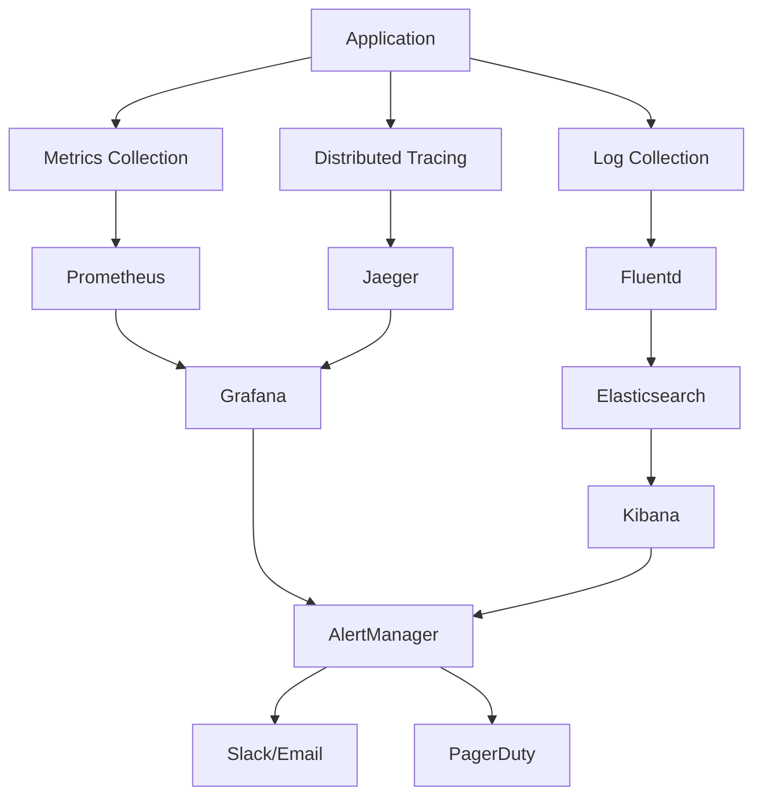

# Monitoring and Logging

This document provides comprehensive guidance on monitoring and logging for the Medical_KG_rev system, including tools, methods, configurations, and best practices for application performance monitoring and error logging.

## Overview

Effective monitoring and logging are essential for maintaining system reliability, performance, and security. This guide covers the complete monitoring and logging stack for the Medical_KG_rev system, including metrics collection, log aggregation, alerting, and observability tools.

## Monitoring Architecture

### Monitoring Stack



### Monitoring Components

1. **Metrics Collection**: Prometheus for metrics collection and storage
2. **Log Aggregation**: ELK Stack (Elasticsearch, Logstash, Kibana)
3. **Distributed Tracing**: Jaeger for request tracing
4. **Visualization**: Grafana for dashboards and visualization
5. **Alerting**: AlertManager for alert management
6. **Notification**: Slack, Email, PagerDuty for notifications

## Metrics Collection

### Prometheus Configuration

#### Prometheus Server Configuration

```yaml
# prometheus/prometheus.yml
global:
  scrape_interval: 15s
  evaluation_interval: 15s
  external_labels:
    cluster: 'medical-kg-rev'
    environment: 'production'

rule_files:
  - "rules/*.yml"

alerting:
  alertmanagers:
    - static_configs:
        - targets:
          - alertmanager:9093

scrape_configs:
  - job_name: 'prometheus'
    static_configs:
      - targets: ['localhost:9090']

  - job_name: 'kubernetes-pods'
    kubernetes_sd_configs:
      - role: pod
    relabel_configs:
      - source_labels: [__meta_kubernetes_pod_annotation_prometheus_io_scrape]
        action: keep
        regex: true
      - source_labels: [__meta_kubernetes_pod_annotation_prometheus_io_path]
        action: replace
        target_label: __metrics_path__
        regex: (.+)
      - source_labels: [__address__, __meta_kubernetes_pod_annotation_prometheus_io_port]
        action: replace
        regex: ([^:]+)(?::\d+)?;(\d+)
        replacement: $1:$2
        target_label: __address__
      - action: labelmap
        regex: __meta_kubernetes_pod_label_(.+)
      - source_labels: [__meta_kubernetes_namespace]
        action: replace
        target_label: kubernetes_namespace
      - source_labels: [__meta_kubernetes_pod_name]
        action: replace
        target_label: kubernetes_pod_name

  - job_name: 'kubernetes-nodes'
    kubernetes_sd_configs:
      - role: node
    relabel_configs:
      - action: labelmap
        regex: __meta_kubernetes_node_label_(.+)
      - target_label: __address__
        replacement: kubernetes.default.svc:443
      - source_labels: [__meta_kubernetes_node_name]
        regex: (.+)
        target_label: __metrics_path__
        replacement: /api/v1/nodes/${1}/proxy/metrics

  - job_name: 'kubernetes-cadvisor'
    kubernetes_sd_configs:
      - role: node
    scheme: https
    tls_config:
      ca_file: /var/run/secrets/kubernetes.io/serviceaccount/ca.crt
    bearer_token_file: /var/run/secrets/kubernetes.io/serviceaccount/token
    relabel_configs:
      - action: labelmap
        regex: __meta_kubernetes_node_label_(.+)
      - target_label: __address__
        replacement: kubernetes.default.svc:443
      - source_labels: [__meta_kubernetes_node_name]
        regex: (.+)
        target_label: __metrics_path__
        replacement: /api/v1/nodes/${1}/proxy/metrics/cadvisor

  - job_name: 'kubernetes-service-endpoints'
    kubernetes_sd_configs:
      - role: endpoints
    relabel_configs:
      - source_labels: [__meta_kubernetes_service_annotation_prometheus_io_scrape]
        action: keep
        regex: true
      - source_labels: [__meta_kubernetes_service_annotation_prometheus_io_scheme]
        action: replace
        target_label: __scheme__
        regex: (https?)
      - source_labels: [__meta_kubernetes_service_annotation_prometheus_io_path]
        action: replace
        target_label: __metrics_path__
        regex: (.+)
      - source_labels: [__address__, __meta_kubernetes_service_annotation_prometheus_io_port]
        action: replace
        regex: ([^:]+)(?::\d+)?;(\d+)
        replacement: $1:$2
        target_label: __address__
      - action: labelmap
        regex: __meta_kubernetes_service_label_(.+)
      - source_labels: [__meta_kubernetes_namespace]
        action: replace
        target_label: kubernetes_namespace
      - source_labels: [__meta_kubernetes_service_name]
        action: replace
        target_label: kubernetes_name
```

#### Application Metrics Configuration

```python
# src/Medical_KG_rev/observability/metrics.py
from prometheus_client import Counter, Histogram, Gauge, Info, start_http_server
import time
from functools import wraps
from typing import Callable, Any

# Application metrics
REQUEST_COUNT = Counter(
    'http_requests_total',
    'Total HTTP requests',
    ['method', 'endpoint', 'status', 'tenant']
)

REQUEST_DURATION = Histogram(
    'http_request_duration_seconds',
    'HTTP request duration',
    ['method', 'endpoint', 'tenant']
)

ACTIVE_CONNECTIONS = Gauge(
    'active_connections',
    'Active database connections'
)

MEMORY_USAGE = Gauge(
    'memory_usage_bytes',
    'Memory usage in bytes'
)

CPU_USAGE = Gauge(
    'cpu_usage_percent',
    'CPU usage percentage'
)

# Business metrics
DOCUMENTS_PROCESSED = Counter(
    'documents_processed_total',
    'Total documents processed',
    ['source', 'status', 'tenant']
)

EMBEDDINGS_GENERATED = Counter(
    'embeddings_generated_total',
    'Total embeddings generated',
    ['model', 'tenant']
)

SEARCH_QUERIES = Counter(
    'search_queries_total',
    'Total search queries',
    ['query_type', 'tenant']
)

# GPU metrics
GPU_UTILIZATION = Gauge(
    'gpu_utilization_percent',
    'GPU utilization percentage',
    ['gpu_id']
)

GPU_MEMORY_USAGE = Gauge(
    'gpu_memory_usage_bytes',
    'GPU memory usage in bytes',
    ['gpu_id']
)

# Database metrics
DATABASE_CONNECTIONS = Gauge(
    'database_connections',
    'Database connections',
    ['database', 'state']
)

DATABASE_QUERY_DURATION = Histogram(
    'database_query_duration_seconds',
    'Database query duration',
    ['database', 'query_type']
)

# Cache metrics
CACHE_HITS = Counter(
    'cache_hits_total',
    'Cache hits',
    ['cache_type', 'tenant']
)

CACHE_MISSES = Counter(
    'cache_misses_total',
    'Cache misses',
    ['cache_type', 'tenant']
)

def track_request_metrics(func: Callable) -> Callable:
    """Decorator to track request metrics."""
    @wraps(func)
    async def wrapper(*args, **kwargs):
        start_time = time.time()

        try:
            result = await func(*args, **kwargs)
            status = 'success'
        except Exception as e:
            status = 'error'
            raise
        finally:
            duration = time.time() - start_time

            # Extract metrics labels
            method = getattr(args[0], 'method', 'unknown')
            endpoint = getattr(args[0], 'path', 'unknown')
            tenant = getattr(args[0].state, 'tenant_id', 'unknown')

            # Record metrics
            REQUEST_COUNT.labels(
                method=method,
                endpoint=endpoint,
                status=status,
                tenant=tenant
            ).inc()

            REQUEST_DURATION.labels(
                method=method,
                endpoint=endpoint,
                tenant=tenant
            ).observe(duration)

        return result

    return wrapper

def track_database_metrics(func: Callable) -> Callable:
    """Decorator to track database metrics."""
    @wraps(func)
    async def wrapper(*args, **kwargs):
        start_time = time.time()

        try:
            result = await func(*args, **kwargs)
            query_type = 'select'  # Determine query type from function name
        except Exception as e:
            query_type = 'error'
            raise
        finally:
            duration = time.time() - start_time

            DATABASE_QUERY_DURATION.labels(
                database='postgresql',
                query_type=query_type
            ).observe(duration)

        return result

    return wrapper

def track_gpu_metrics(func: Callable) -> Callable:
    """Decorator to track GPU metrics."""
    @wraps(func)
    async def wrapper(*args, **kwargs):
        try:
            result = await func(*args, **kwargs)
        except Exception as e:
            raise
        finally:
            # Update GPU metrics
            import torch
            if torch.cuda.is_available():
                for i in range(torch.cuda.device_count()):
                    GPU_UTILIZATION.labels(gpu_id=str(i)).set(
                        torch.cuda.utilization(i)
                    )
                    GPU_MEMORY_USAGE.labels(gpu_id=str(i)).set(
                        torch.cuda.memory_allocated(i)
                    )

        return result

    return wrapper

def start_metrics_server(port: int = 8000):
    """Start Prometheus metrics server."""
    start_http_server(port)
    print(f"Metrics server started on port {port}")

# Example usage
if __name__ == "__main__":
    start_metrics_server()
```

### Custom Metrics

#### Application-Specific Metrics

```python
# src/Medical_KG_rev/observability/custom_metrics.py
from prometheus_client import Counter, Histogram, Gauge, Summary
from typing import Dict, Any
import time

# Document processing metrics
DOCUMENT_INGESTION_DURATION = Histogram(
    'document_ingestion_duration_seconds',
    'Document ingestion duration',
    ['source', 'document_type', 'tenant']
)

DOCUMENT_PROCESSING_STAGES = Counter(
    'document_processing_stages_total',
    'Document processing stages',
    ['stage', 'status', 'tenant']
)

# Embedding generation metrics
EMBEDDING_GENERATION_DURATION = Histogram(
    'embedding_generation_duration_seconds',
    'Embedding generation duration',
    ['model', 'batch_size', 'tenant']
)

EMBEDDING_QUEUE_SIZE = Gauge(
    'embedding_queue_size',
    'Embedding generation queue size',
    ['tenant']
)

# Search and retrieval metrics
SEARCH_LATENCY = Histogram(
    'search_latency_seconds',
    'Search latency',
    ['search_type', 'tenant']
)

RETRIEVAL_ACCURACY = Gauge(
    'retrieval_accuracy',
    'Retrieval accuracy',
    ['search_type', 'tenant']
)

# Knowledge graph metrics
KG_NODE_COUNT = Gauge(
    'kg_node_count',
    'Knowledge graph node count',
    ['node_type', 'tenant']
)

KG_EDGE_COUNT = Gauge(
    'kg_edge_count',
    'Knowledge graph edge count',
    ['edge_type', 'tenant']
)

# Adapter metrics
ADAPTER_REQUESTS = Counter(
    'adapter_requests_total',
    'Adapter requests',
    ['adapter', 'status', 'tenant']
)

ADAPTER_RESPONSE_TIME = Histogram(
    'adapter_response_time_seconds',
    'Adapter response time',
    ['adapter', 'tenant']
)

# Orchestration metrics
PIPELINE_EXECUTION_TIME = Histogram(
    'pipeline_execution_time_seconds',
    'Pipeline execution time',
    ['pipeline_type', 'tenant']
)

PIPELINE_SUCCESS_RATE = Gauge(
    'pipeline_success_rate',
    'Pipeline success rate',
    ['pipeline_type', 'tenant']
)

# User activity metrics
USER_SESSIONS = Counter(
    'user_sessions_total',
    'User sessions',
    ['tenant']
)

USER_ACTIVITY = Counter(
    'user_activity_total',
    'User activity',
    ['activity_type', 'tenant']
)

# System health metrics
SYSTEM_HEALTH = Gauge(
    'system_health_score',
    'System health score',
    ['component', 'tenant']
)

DEPENDENCY_HEALTH = Gauge(
    'dependency_health',
    'Dependency health',
    ['dependency', 'tenant']
)

class MetricsCollector:
    """Metrics collector for application metrics."""

    def __init__(self):
        self.metrics = {}

    def record_document_processing(self, source: str, document_type: str,
                                 duration: float, tenant: str):
        """Record document processing metrics."""
        DOCUMENT_INGESTION_DURATION.labels(
            source=source,
            document_type=document_type,
            tenant=tenant
        ).observe(duration)

    def record_embedding_generation(self, model: str, batch_size: int,
                                  duration: float, tenant: str):
        """Record embedding generation metrics."""
        EMBEDDING_GENERATION_DURATION.labels(
            model=model,
            batch_size=str(batch_size),
            tenant=tenant
        ).observe(duration)

    def record_search_query(self, search_type: str, latency: float, tenant: str):
        """Record search query metrics."""
        SEARCH_LATENCY.labels(
            search_type=search_type,
            tenant=tenant
        ).observe(latency)

    def update_kg_metrics(self, node_count: int, edge_count: int,
                         node_type: str, edge_type: str, tenant: str):
        """Update knowledge graph metrics."""
        KG_NODE_COUNT.labels(
            node_type=node_type,
            tenant=tenant
        ).set(node_count)

        KG_EDGE_COUNT.labels(
            edge_type=edge_type,
            tenant=tenant
        ).set(edge_count)

    def record_adapter_request(self, adapter: str, status: str,
                              response_time: float, tenant: str):
        """Record adapter request metrics."""
        ADAPTER_REQUESTS.labels(
            adapter=adapter,
            status=status,
            tenant=tenant
        ).inc()

        ADAPTER_RESPONSE_TIME.labels(
            adapter=adapter,
            tenant=tenant
        ).observe(response_time)

    def update_system_health(self, component: str, health_score: float, tenant: str):
        """Update system health metrics."""
        SYSTEM_HEALTH.labels(
            component=component,
            tenant=tenant
        ).set(health_score)

    def update_dependency_health(self, dependency: str, health: float, tenant: str):
        """Update dependency health metrics."""
        DEPENDENCY_HEALTH.labels(
            dependency=dependency,
            tenant=tenant
        ).set(health)

# Global metrics collector instance
metrics_collector = MetricsCollector()
```

## Logging Configuration

### Structured Logging

#### Application Logging Setup

```python
# src/Medical_KG_rev/observability/logging.py
import structlog
import logging
import sys
from typing import Dict, Any, Optional
import json
from datetime import datetime
import traceback

# Configure structlog
structlog.configure(
    processors=[
        structlog.stdlib.filter_by_level,
        structlog.stdlib.add_logger_name,
        structlog.stdlib.add_log_level,
        structlog.stdlib.PositionalArgumentsFormatter(),
        structlog.processors.TimeStamper(fmt="iso"),
        structlog.processors.StackInfoRenderer(),
        structlog.processors.format_exc_info,
        structlog.processors.UnicodeDecoder(),
        structlog.processors.JSONRenderer()
    ],
    context_class=dict,
    logger_factory=structlog.stdlib.LoggerFactory(),
    wrapper_class=structlog.stdlib.BoundLogger,
    cache_logger_on_first_use=True,
)

# Configure standard library logging
logging.basicConfig(
    format="%(message)s",
    stream=sys.stdout,
    level=logging.INFO,
)

class ApplicationLogger:
    """Application logger with structured logging."""

    def __init__(self, name: str):
        self.logger = structlog.get_logger(name)

    def info(self, message: str, **kwargs):
        """Log info message."""
        self.logger.info(message, **kwargs)

    def warning(self, message: str, **kwargs):
        """Log warning message."""
        self.logger.warning(message, **kwargs)

    def error(self, message: str, **kwargs):
        """Log error message."""
        self.logger.error(message, **kwargs)

    def critical(self, message: str, **kwargs):
        """Log critical message."""
        self.logger.critical(message, **kwargs)

    def debug(self, message: str, **kwargs):
        """Log debug message."""
        self.logger.debug(message, **kwargs)

    def log_request(self, method: str, path: str, status_code: int,
                   duration: float, user_id: Optional[str] = None,
                   tenant_id: Optional[str] = None, **kwargs):
        """Log HTTP request."""
        self.logger.info(
            "request_processed",
            method=method,
            path=path,
            status_code=status_code,
            duration=duration,
            user_id=user_id,
            tenant_id=tenant_id,
            **kwargs
        )

    def log_database_query(self, query: str, duration: float,
                          rows_affected: int, **kwargs):
        """Log database query."""
        self.logger.info(
            "database_query",
            query=query,
            duration=duration,
            rows_affected=rows_affected,
            **kwargs
        )

    def log_document_processing(self, document_id: str, source: str,
                               status: str, duration: float, **kwargs):
        """Log document processing."""
        self.logger.info(
            "document_processed",
            document_id=document_id,
            source=source,
            status=status,
            duration=duration,
            **kwargs
        )

    def log_embedding_generation(self, model: str, batch_size: int,
                               duration: float, **kwargs):
        """Log embedding generation."""
        self.logger.info(
            "embedding_generated",
            model=model,
            batch_size=batch_size,
            duration=duration,
            **kwargs
        )

    def log_search_query(self, query: str, search_type: str, result_count: int,
                        duration: float, **kwargs):
        """Log search query."""
        self.logger.info(
            "search_query",
            query=query,
            search_type=search_type,
            result_count=result_count,
            duration=duration,
            **kwargs
        )

    def log_error(self, error: Exception, context: Dict[str, Any] = None):
        """Log error with context."""
        self.logger.error(
            "error_occurred",
            error_type=type(error).__name__,
            error_message=str(error),
            traceback=traceback.format_exc(),
            context=context or {}
        )

    def log_security_event(self, event_type: str, user_id: Optional[str] = None,
                          ip_address: Optional[str] = None, **kwargs):
        """Log security event."""
        self.logger.warning(
            "security_event",
            event_type=event_type,
            user_id=user_id,
            ip_address=ip_address,
            **kwargs
        )

# Global logger instances
app_logger = ApplicationLogger("medical-kg-rev")
gateway_logger = ApplicationLogger("gateway")
services_logger = ApplicationLogger("services")
adapters_logger = ApplicationLogger("adapters")
orchestration_logger = ApplicationLogger("orchestration")
kg_logger = ApplicationLogger("knowledge-graph")
storage_logger = ApplicationLogger("storage")
```

#### FastAPI Logging Middleware

```python
# src/Medical_KG_rev/gateway/middleware/logging.py
import time
import uuid
from fastapi import Request, Response
from starlette.middleware.base import BaseHTTPMiddleware
from typing import Callable
from Medical_KG_rev.observability.logging import app_logger

class LoggingMiddleware(BaseHTTPMiddleware):
    """Logging middleware for FastAPI."""

    async def dispatch(self, request: Request, call_next: Callable) -> Response:
        # Generate correlation ID
        correlation_id = str(uuid.uuid4())
        request.state.correlation_id = correlation_id

        # Extract request information
        method = request.method
        path = request.url.path
        user_id = getattr(request.state, 'user_id', None)
        tenant_id = getattr(request.state, 'tenant_id', None)

        # Start timing
        start_time = time.time()

        # Process request
        response = await call_next(request)

        # Calculate duration
        duration = time.time() - start_time

        # Log request
        app_logger.log_request(
            method=method,
            path=path,
            status_code=response.status_code,
            duration=duration,
            user_id=user_id,
            tenant_id=tenant_id,
            correlation_id=correlation_id
        )

        # Add correlation ID to response headers
        response.headers["X-Correlation-ID"] = correlation_id

        return response
```

### Log Aggregation

#### Fluentd Configuration

```yaml
# fluentd/fluentd.conf
<source>
  @type tail
  @id input_tail
  path /var/log/containers/*medical-kg-rev*.log
  pos_file /var/log/fluentd-containers.log.pos
  tag kubernetes.*
  format json
  time_key time
  time_format %Y-%m-%dT%H:%M:%S.%NZ
</source>

<filter kubernetes.**>
  @type kubernetes_metadata
  @id filter_kube_metadata
  kubernetes_url "#{ENV['KUBERNETES_SERVICE_HOST']}:#{ENV['KUBERNETES_SERVICE_PORT']}"
  verify_ssl "#{ENV['KUBERNETES_VERIFY_SSL'] || true}"
  ca_file "#{ENV['KUBERNETES_CA_FILE']}"
</filter>

<filter kubernetes.**>
  @type parser
  @id filter_parser
  key_name log
  reserve_data true
  <parse>
    @type json
  </parse>
</filter>

<match kubernetes.**>
  @type elasticsearch
  @id out_es
  @log_level info
  include_tag_key true
  host "#{ENV['FLUENT_ELASTICSEARCH_HOST'] || 'elasticsearch'}"
  port "#{ENV['FLUENT_ELASTICSEARCH_PORT'] || '9200'}"
  path "#{ENV['FLUENT_ELASTICSEARCH_PATH'] || ''}"
  scheme "#{ENV['FLUENT_ELASTICSEARCH_SCHEME'] || 'http'}"
  ssl_verify "#{ENV['FLUENT_ELASTICSEARCH_SSL_VERIFY'] || 'true'}"
  user "#{ENV['FLUENT_ELASTICSEARCH_USER'] || ''}"
  password "#{ENV['FLUENT_ELASTICSEARCH_PASSWORD'] || ''}"
  reload_connections "#{ENV['FLUENT_ELASTICSEARCH_RELOAD_CONNECTIONS'] || 'true'}"
  reconnect_on_error "#{ENV['FLUENT_ELASTICSEARCH_RECONNECT_ON_ERROR'] || 'true'}"
  reload_on_failure "#{ENV['FLUENT_ELASTICSEARCH_RELOAD_ON_FAILURE'] || 'true'}"
  log_es_400_reason "#{ENV['FLUENT_ELASTICSEARCH_LOG_ES_400_REASON'] || 'false'}"
  <buffer>
    @type file
    path /var/log/fluentd-buffers/kubernetes.system.buffer
    flush_mode interval
    retry_type exponential_backoff
    flush_thread_count 2
    flush_interval 5s
    retry_forever
    retry_max_interval 30
    chunk_limit_size 2M
    queue_limit_length 8
    overflow_action block
  </buffer>
</match>
```

#### Elasticsearch Configuration

```yaml
# elasticsearch/elasticsearch.yml
cluster.name: medical-kg-rev
node.name: elasticsearch-node
network.host: 0.0.0.0
http.port: 9200
transport.port: 9300

# Memory settings
bootstrap.memory_lock: true
ES_JAVA_OPTS: "-Xms2g -Xmx2g"

# Index settings
action.auto_create_index: true
action.destructive_requires_name: true

# Security settings
xpack.security.enabled: true
xpack.security.transport.ssl.enabled: true
xpack.security.transport.ssl.verification_mode: certificate
xpack.security.transport.ssl.key: /usr/share/elasticsearch/config/certs/elasticsearch.key
xpack.security.transport.ssl.certificate: /usr/share/elasticsearch/config/certs/elasticsearch.crt
xpack.security.transport.ssl.certificate_authorities: /usr/share/elasticsearch/config/certs/ca.crt

# Monitoring settings
xpack.monitoring.collection.enabled: true
xpack.monitoring.collection.interval: 10s

# Index lifecycle management
xpack.ilm.enabled: true
xpack.ilm.rollover_alias: medical-kg-rev-logs
xpack.ilm.policy: medical-kg-rev-policy
```

## Distributed Tracing

### Jaeger Configuration

#### Jaeger Client Setup

```python
# src/Medical_KG_rev/observability/tracing.py
from jaeger_client import Config
from opentelemetry import trace
from opentelemetry.exporter.jaeger.thrift import JaegerExporter
from opentelemetry.sdk.trace import TracerProvider
from opentelemetry.sdk.trace.export import BatchSpanProcessor
from opentelemetry.instrumentation.fastapi import FastAPIInstrumentor
from opentelemetry.instrumentation.requests import RequestsInstrumentor
from opentelemetry.instrumentation.sqlalchemy import SQLAlchemyInstrumentor
from opentelemetry.instrumentation.redis import RedisInstrumentor
import logging

def init_tracing(service_name: str, jaeger_host: str = "localhost",
                jaeger_port: int = 14268):
    """Initialize distributed tracing."""

    # Configure Jaeger exporter
    jaeger_exporter = JaegerExporter(
        agent_host_name=jaeger_host,
        agent_port=jaeger_port,
    )

    # Configure tracer provider
    trace.set_tracer_provider(TracerProvider())
    tracer = trace.get_tracer(__name__)

    # Add span processor
    span_processor = BatchSpanProcessor(jaeger_exporter)
    trace.get_tracer_provider().add_span_processor(span_processor)

    # Instrument libraries
    FastAPIInstrumentor.instrument_app(app)
    RequestsInstrumentor().instrument()
    SQLAlchemyInstrumentor().instrument()
    RedisInstrumentor().instrument()

    return tracer

def trace_function(func):
    """Decorator to trace function execution."""
    def wrapper(*args, **kwargs):
        tracer = trace.get_tracer(__name__)
        with tracer.start_as_current_span(func.__name__) as span:
            span.set_attribute("function.name", func.__name__)
            span.set_attribute("function.module", func.__module__)

            try:
                result = func(*args, **kwargs)
                span.set_attribute("function.success", True)
                return result
            except Exception as e:
                span.set_attribute("function.success", False)
                span.set_attribute("function.error", str(e))
                raise

    return wrapper

def trace_async_function(func):
    """Decorator to trace async function execution."""
    async def wrapper(*args, **kwargs):
        tracer = trace.get_tracer(__name__)
        with tracer.start_as_current_span(func.__name__) as span:
            span.set_attribute("function.name", func.__name__)
            span.set_attribute("function.module", func.__module__)

            try:
                result = await func(*args, **kwargs)
                span.set_attribute("function.success", True)
                return result
            except Exception as e:
                span.set_attribute("function.success", False)
                span.set_attribute("function.error", str(e))
                raise

    return wrapper

# Example usage
@trace_function
def process_document(document_id: str):
    """Process document with tracing."""
    # Document processing logic
    pass

@trace_async_function
async def generate_embeddings(text: str):
    """Generate embeddings with tracing."""
    # Embedding generation logic
    pass
```

#### Jaeger Server Configuration

```yaml
# jaeger/jaeger.yaml
apiVersion: v1
kind: ConfigMap
metadata:
  name: jaeger-config
  namespace: monitoring
data:
  jaeger.yaml: |
    collector:
      zipkin:
        http-port: 9411
    query:
      base-path: /jaeger
    agent:
      zipkin:
        http-port: 9411
    storage:
      type: elasticsearch
      elasticsearch:
        server-urls: http://elasticsearch:9200
        index-prefix: jaeger
        username: elastic
        password: changeme
---
apiVersion: apps/v1
kind: Deployment
metadata:
  name: jaeger
  namespace: monitoring
spec:
  replicas: 1
  selector:
    matchLabels:
      app: jaeger
  template:
    metadata:
      labels:
        app: jaeger
    spec:
      containers:
      - name: jaeger
        image: jaegertracing/all-in-one:latest
        ports:
        - containerPort: 16686
          name: query
        - containerPort: 14268
          name: collector
        - containerPort: 9411
          name: zipkin
        env:
        - name: COLLECTOR_ZIPKIN_HTTP_PORT
          value: "9411"
        - name: SPAN_STORAGE_TYPE
          value: "elasticsearch"
        - name: ES_SERVER_URLS
          value: "http://elasticsearch:9200"
        - name: ES_INDEX_PREFIX
          value: "jaeger"
        - name: ES_USERNAME
          value: "elastic"
        - name: ES_PASSWORD
          value: "changeme"
        resources:
          requests:
            memory: "512Mi"
            cpu: "250m"
          limits:
            memory: "1Gi"
            cpu: "500m"
---
apiVersion: v1
kind: Service
metadata:
  name: jaeger
  namespace: monitoring
spec:
  selector:
    app: jaeger
  ports:
  - port: 16686
    targetPort: 16686
    name: query
  - port: 14268
    targetPort: 14268
    name: collector
  - port: 9411
    targetPort: 9411
    name: zipkin
```

## Alerting Configuration

### AlertManager Configuration

#### Alert Rules

```yaml
# prometheus/alert-rules.yml
groups:
- name: medical-kg-rev
  rules:
  - alert: HighErrorRate
    expr: rate(http_requests_total{status=~"5.."}[5m]) > 0.1
    for: 2m
    labels:
      severity: critical
      service: medical-kg-rev
    annotations:
      summary: "High error rate detected"
      description: "Error rate is {{ $value }} errors per second"
      runbook_url: "https://docs.medical-kg-rev.com/runbooks/high-error-rate"

  - alert: HighResponseTime
    expr: histogram_quantile(0.95, rate(http_request_duration_seconds_bucket[5m])) > 1
    for: 5m
    labels:
      severity: warning
      service: medical-kg-rev
    annotations:
      summary: "High response time detected"
      description: "95th percentile response time is {{ $value }} seconds"
      runbook_url: "https://docs.medical-kg-rev.com/runbooks/high-response-time"

  - alert: DatabaseConnectionFailure
    expr: up{job="postgresql"} == 0
    for: 1m
    labels:
      severity: critical
      service: database
    annotations:
      summary: "Database connection failed"
      description: "PostgreSQL database is not responding"
      runbook_url: "https://docs.medical-kg-rev.com/runbooks/database-failure"

  - alert: HighMemoryUsage
    expr: (container_memory_usage_bytes / container_spec_memory_limit_bytes) > 0.8
    for: 5m
    labels:
      severity: warning
      service: medical-kg-rev
    annotations:
      summary: "High memory usage detected"
      description: "Memory usage is {{ $value }}% of limit"
      runbook_url: "https://docs.medical-kg-rev.com/runbooks/high-memory-usage"

  - alert: PodCrashLooping
    expr: rate(kube_pod_container_status_restarts_total[15m]) > 0
    for: 5m
    labels:
      severity: critical
      service: medical-kg-rev
    annotations:
      summary: "Pod is crash looping"
      description: "Pod {{ $labels.pod }} is restarting frequently"
      runbook_url: "https://docs.medical-kg-rev.com/runbooks/pod-crash-loop"

  - alert: GPUUtilizationHigh
    expr: gpu_utilization_percent > 90
    for: 10m
    labels:
      severity: warning
      service: gpu
    annotations:
      summary: "High GPU utilization"
      description: "GPU {{ $labels.gpu_id }} utilization is {{ $value }}%"
      runbook_url: "https://docs.medical-kg-rev.com/runbooks/high-gpu-utilization"

  - alert: EmbeddingQueueBacklog
    expr: embedding_queue_size > 1000
    for: 5m
    labels:
      severity: warning
      service: embeddings
    annotations:
      summary: "Embedding queue backlog"
      description: "Embedding queue size is {{ $value }}"
      runbook_url: "https://docs.medical-kg-rev.com/runbooks/embedding-queue-backlog"

  - alert: SearchLatencyHigh
    expr: histogram_quantile(0.95, rate(search_latency_seconds_bucket[5m])) > 2
    for: 5m
    labels:
      severity: warning
      service: search
    annotations:
      summary: "High search latency"
      description: "95th percentile search latency is {{ $value }} seconds"
      runbook_url: "https://docs.medical-kg-rev.com/runbooks/high-search-latency"
```

#### AlertManager Configuration

```yaml
# alertmanager/alertmanager.yml
global:
  smtp_smarthost: 'localhost:587'
  smtp_from: 'alerts@medical-kg-rev.com'
  smtp_auth_username: 'alerts@medical-kg-rev.com'
  smtp_auth_password: 'password'

route:
  group_by: ['alertname']
  group_wait: 10s
  group_interval: 10s
  repeat_interval: 1h
  receiver: 'web.hook'
  routes:
  - match:
      severity: critical
    receiver: 'critical-alerts'
  - match:
      severity: warning
    receiver: 'warning-alerts'

receivers:
- name: 'web.hook'
  webhook_configs:
  - url: 'http://127.0.0.1:5001/'

- name: 'critical-alerts'
  slack_configs:
  - api_url: 'https://hooks.slack.com/services/YOUR/SLACK/WEBHOOK'
    channel: '#alerts-critical'
    title: 'Medical KG Rev Critical Alert'
    text: '{{ range .Alerts }}{{ .Annotations.summary }}{{ end }}'
  email_configs:
  - to: 'oncall@medical-kg-rev.com'
    subject: 'Critical Alert: {{ .GroupLabels.alertname }}'
    body: |
      {{ range .Alerts }}
      Alert: {{ .Annotations.summary }}
      Description: {{ .Annotations.description }}
      {{ end }}
  pagerduty_configs:
  - routing_key: 'YOUR_PAGERDUTY_ROUTING_KEY'
    description: '{{ .GroupLabels.alertname }}'
    details:
      summary: '{{ .GroupLabels.alertname }}'
      description: '{{ range .Alerts }}{{ .Annotations.description }}{{ end }}'

- name: 'warning-alerts'
  slack_configs:
  - api_url: 'https://hooks.slack.com/services/YOUR/SLACK/WEBHOOK'
    channel: '#alerts-warning'
    title: 'Medical KG Rev Warning Alert'
    text: '{{ range .Alerts }}{{ .Annotations.summary }}{{ end }}'
  email_configs:
  - to: 'team@medical-kg-rev.com'
    subject: 'Warning Alert: {{ .GroupLabels.alertname }}'
    body: |
      {{ range .Alerts }}
      Alert: {{ .Annotations.summary }}
      Description: {{ .Annotations.description }}
      {{ end }}

inhibit_rules:
- source_match:
    severity: 'critical'
  target_match:
    severity: 'warning'
  equal: ['alertname', 'dev', 'instance']
```

## Dashboards and Visualization

### Grafana Dashboards

#### Application Dashboard

```json
{
  "dashboard": {
    "id": null,
    "title": "Medical KG Rev - Application Metrics",
    "tags": ["medical-kg-rev", "application"],
    "style": "dark",
    "timezone": "browser",
    "panels": [
      {
        "id": 1,
        "title": "Request Rate",
        "type": "graph",
        "targets": [
          {
            "expr": "rate(http_requests_total[5m])",
            "legendFormat": "{{method}} {{endpoint}}"
          }
        ],
        "yAxes": [
          {
            "label": "Requests/sec",
            "min": 0
          }
        ]
      },
      {
        "id": 2,
        "title": "Response Time",
        "type": "graph",
        "targets": [
          {
            "expr": "histogram_quantile(0.95, rate(http_request_duration_seconds_bucket[5m]))",
            "legendFormat": "95th percentile"
          },
          {
            "expr": "histogram_quantile(0.50, rate(http_request_duration_seconds_bucket[5m]))",
            "legendFormat": "50th percentile"
          }
        ],
        "yAxes": [
          {
            "label": "Seconds",
            "min": 0
          }
        ]
      },
      {
        "id": 3,
        "title": "Error Rate",
        "type": "graph",
        "targets": [
          {
            "expr": "rate(http_requests_total{status=~\"5..\"}[5m]) / rate(http_requests_total[5m])",
            "legendFormat": "Error Rate"
          }
        ],
        "yAxes": [
          {
            "label": "Error Rate",
            "min": 0,
            "max": 1
          }
        ]
      },
      {
        "id": 4,
        "title": "Active Connections",
        "type": "graph",
        "targets": [
          {
            "expr": "active_connections",
            "legendFormat": "Active Connections"
          }
        ],
        "yAxes": [
          {
            "label": "Connections",
            "min": 0
          }
        ]
      },
      {
        "id": 5,
        "title": "Memory Usage",
        "type": "graph",
        "targets": [
          {
            "expr": "memory_usage_bytes",
            "legendFormat": "Memory Usage"
          }
        ],
        "yAxes": [
          {
            "label": "Bytes",
            "min": 0
          }
        ]
      },
      {
        "id": 6,
        "title": "CPU Usage",
        "type": "graph",
        "targets": [
          {
            "expr": "cpu_usage_percent",
            "legendFormat": "CPU Usage"
          }
        ],
        "yAxes": [
          {
            "label": "Percentage",
            "min": 0,
            "max": 100
          }
        ]
      }
    ],
    "time": {
      "from": "now-1h",
      "to": "now"
    },
    "refresh": "30s"
  }
}
```

#### Business Metrics Dashboard

```json
{
  "dashboard": {
    "id": null,
    "title": "Medical KG Rev - Business Metrics",
    "tags": ["medical-kg-rev", "business"],
    "style": "dark",
    "timezone": "browser",
    "panels": [
      {
        "id": 1,
        "title": "Documents Processed",
        "type": "graph",
        "targets": [
          {
            "expr": "rate(documents_processed_total[5m])",
            "legendFormat": "{{source}} {{status}}"
          }
        ],
        "yAxes": [
          {
            "label": "Documents/sec",
            "min": 0
          }
        ]
      },
      {
        "id": 2,
        "title": "Embeddings Generated",
        "type": "graph",
        "targets": [
          {
            "expr": "rate(embeddings_generated_total[5m])",
            "legendFormat": "{{model}}"
          }
        ],
        "yAxes": [
          {
            "label": "Embeddings/sec",
            "min": 0
          }
        ]
      },
      {
        "id": 3,
        "title": "Search Queries",
        "type": "graph",
        "targets": [
          {
            "expr": "rate(search_queries_total[5m])",
            "legendFormat": "{{query_type}}"
          }
        ],
        "yAxes": [
          {
            "label": "Queries/sec",
            "min": 0
          }
        ]
      },
      {
        "id": 4,
        "title": "Knowledge Graph Nodes",
        "type": "graph",
        "targets": [
          {
            "expr": "kg_node_count",
            "legendFormat": "{{node_type}}"
          }
        ],
        "yAxes": [
          {
            "label": "Nodes",
            "min": 0
          }
        ]
      },
      {
        "id": 5,
        "title": "Knowledge Graph Edges",
        "type": "graph",
        "targets": [
          {
            "expr": "kg_edge_count",
            "legendFormat": "{{edge_type}}"
          }
        ],
        "yAxes": [
          {
            "label": "Edges",
            "min": 0
          }
        ]
      },
      {
        "id": 6,
        "title": "User Activity",
        "type": "graph",
        "targets": [
          {
            "expr": "rate(user_activity_total[5m])",
            "legendFormat": "{{activity_type}}"
          }
        ],
        "yAxes": [
          {
            "label": "Activity/sec",
            "min": 0
          }
        ]
      }
    ],
    "time": {
      "from": "now-1h",
      "to": "now"
    },
    "refresh": "30s"
  }
}
```

### Kibana Dashboards

#### Log Analysis Dashboard

```json
{
  "version": "8.8.0",
  "objects": [
    {
      "id": "medical-kg-rev-logs",
      "type": "dashboard",
      "attributes": {
        "title": "Medical KG Rev - Log Analysis",
        "description": "Comprehensive log analysis dashboard",
        "panelsJSON": "[{\"version\":\"8.8.0\",\"gridData\":{\"x\":0,\"y\":0,\"w\":24,\"h\":15,\"i\":\"1\"},\"panelIndex\":\"1\",\"embeddableConfig\":{\"attributes\":{\"title\":\"Request Logs\",\"type\":\"data_table\",\"params\":{\"perPage\":10,\"showPartialRows\":false,\"showMeticsAtAllLevels\":false,\"sort\":{\"columnIndex\":null,\"direction\":null},\"showTotal\":false,\"showToolbar\":true,\"totalFunc\":\"sum\"},\"aggs\":{\"all\":{\"enabled\":true,\"id\":\"1\",\"type\":\"count\",\"schema\":\"metric\",\"params\":{}},\"2\":{\"enabled\":true,\"id\":\"2\",\"type\":\"terms\",\"schema\":\"bucket\",\"params\":{\"field\":\"method.keyword\",\"size\":5,\"order\":\"desc\",\"orderBy\":\"1\"}},\"3\":{\"enabled\":true,\"id\":\"3\",\"type\":\"terms\",\"schema\":\"bucket\",\"params\":{\"field\":\"path.keyword\",\"size\":5,\"order\":\"desc\",\"orderBy\":\"1\"}},\"4\":{\"enabled\":true,\"id\":\"4\",\"type\":\"terms\",\"schema\":\"bucket\",\"params\":{\"field\":\"status_code\",\"size\":5,\"order\":\"desc\",\"orderBy\":\"1\"}}},\"indexPattern\":\"medical-kg-rev-logs*\"}}}]",
        "optionsJSON": "{\"useMargins\":true,\"syncColors\":false,\"hidePanelTitles\":false}",
        "timeRestore": false,
        "kibanaSavedObjectMeta": {
          "searchSourceJSON": "{\"query\":{\"query\":\"\",\"language\":\"kuery\"},\"filter\":[]}"
        }
      }
    }
  ]
}
```

## Best Practices

### Monitoring Best Practices

1. **Comprehensive Coverage**: Monitor all system components
2. **Meaningful Metrics**: Focus on business-relevant metrics
3. **Appropriate Thresholds**: Set realistic alert thresholds
4. **Regular Review**: Review and update monitoring regularly
5. **Documentation**: Document monitoring setup and procedures

### Logging Best Practices

1. **Structured Logging**: Use structured logging for consistency
2. **Appropriate Levels**: Use appropriate log levels
3. **Context Information**: Include relevant context in logs
4. **Performance Impact**: Minimize logging performance impact
5. **Security**: Avoid logging sensitive information

### Alerting Best Practices

1. **Actionable Alerts**: Ensure alerts are actionable
2. **Appropriate Severity**: Use appropriate severity levels
3. **Escalation Procedures**: Define escalation procedures
4. **Runbook Integration**: Link alerts to runbooks
5. **Regular Testing**: Test alerting regularly

## Troubleshooting

### Common Monitoring Issues

#### 1. Metrics Collection Failures

```bash
# Check Prometheus status
kubectl get pods -n monitoring -l app=prometheus

# Check Prometheus logs
kubectl logs -f deployment/prometheus -n monitoring

# Check service discovery
kubectl get pods -n production -o wide
```

#### 2. Log Aggregation Issues

```bash
# Check Fluentd status
kubectl get pods -n monitoring -l app=fluentd

# Check Fluentd logs
kubectl logs -f deployment/fluentd -n monitoring

# Check Elasticsearch status
kubectl get pods -n monitoring -l app=elasticsearch
```

#### 3. Alerting Issues

```bash
# Check AlertManager status
kubectl get pods -n monitoring -l app=alertmanager

# Check AlertManager logs
kubectl logs -f deployment/alertmanager -n monitoring

# Check alert rules
kubectl get configmap -n monitoring prometheus-rules
```

### Debug Commands

```bash
# Check monitoring stack
kubectl get pods -n monitoring
kubectl get services -n monitoring
kubectl get ingress -n monitoring

# Check Prometheus targets
curl http://prometheus:9090/api/v1/targets

# Check Grafana dashboards
curl http://grafana:3000/api/dashboards

# Check Elasticsearch indices
curl http://elasticsearch:9200/_cat/indices

# Check Jaeger traces
curl http://jaeger:16686/api/traces

# Check AlertManager alerts
curl http://alertmanager:9093/api/v1/alerts
```

## Related Documentation

- [Deployment Overview](deployment_overview.md)
- [Infrastructure Requirements](infrastructure_requirements.md)
- [Deployment Procedures](deployment_procedures.md)
- [Rollback Procedures](rollback_procedures.md)
- [Security Considerations](security_considerations.md)
- [Disaster Recovery Plan](disaster_recovery_plan.md)
