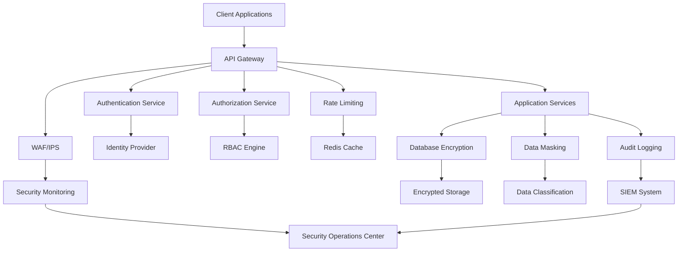

# Security Considerations

This document outlines comprehensive security measures and considerations for deploying the Medical_KG_rev system, including access controls, data protection, authentication, authorization, and compliance requirements.

## Overview

Security is paramount in healthcare applications handling sensitive medical data. This guide covers all aspects of security implementation during deployment, including infrastructure security, application security, data protection, and compliance requirements.

## Security Architecture

### Security Layers



### Security Components

1. **Perimeter Security**: WAF, IPS, DDoS protection
2. **Identity & Access Management**: Authentication, authorization, RBAC
3. **Data Protection**: Encryption, masking, classification
4. **Network Security**: VPC, subnets, security groups
5. **Application Security**: Input validation, secure coding
6. **Monitoring & Compliance**: SIEM, audit logging, compliance reporting

## Infrastructure Security

### Network Security

#### VPC Configuration

```yaml
# terraform/network.tf
resource "aws_vpc" "medical_kg_rev" {
  cidr_block           = "10.0.0.0/16"
  enable_dns_hostnames = true
  enable_dns_support   = true

  tags = {
    Name        = "medical-kg-rev-vpc"
    Environment = "production"
    Purpose     = "Healthcare application"
  }
}

# Public subnets for load balancers
resource "aws_subnet" "public" {
  count             = 2
  vpc_id            = aws_vpc.medical_kg_rev.id
  cidr_block        = "10.0.${count.index + 1}.0/24"
  availability_zone = data.aws_availability_zones.available.names[count.index]

  map_public_ip_on_launch = true

  tags = {
    Name = "medical-kg-rev-public-${count.index + 1}"
    Type = "Public"
  }
}

# Private subnets for application services
resource "aws_subnet" "private" {
  count             = 2
  vpc_id            = aws_vpc.medical_kg_rev.id
  cidr_block        = "10.0.${count.index + 10}.0/24"
  availability_zone = data.aws_availability_zones.available.names[count.index]

  tags = {
    Name = "medical-kg-rev-private-${count.index + 1}"
    Type = "Private"
  }
}

# Database subnets
resource "aws_subnet" "database" {
  count             = 2
  vpc_id            = aws_vpc.medical_kg_rev.id
  cidr_block        = "10.0.${count.index + 20}.0/24"
  availability_zone = data.aws_availability_zones.available.names[count.index]

  tags = {
    Name = "medical-kg-rev-database-${count.index + 1}"
    Type = "Database"
  }
}
```

#### Security Groups

```yaml
# terraform/security_groups.tf
# Application Load Balancer Security Group
resource "aws_security_group" "alb" {
  name_prefix = "medical-kg-rev-alb-"
  vpc_id      = aws_vpc.medical_kg_rev.id

  ingress {
    description = "HTTP"
    from_port   = 80
    to_port     = 80
    protocol    = "tcp"
    cidr_blocks = ["0.0.0.0/0"]
  }

  ingress {
    description = "HTTPS"
    from_port   = 443
    to_port     = 443
    protocol    = "tcp"
    cidr_blocks = ["0.0.0.0/0"]
  }

  egress {
    from_port   = 0
    to_port     = 0
    protocol    = "-1"
    cidr_blocks = ["0.0.0.0/0"]
  }

  tags = {
    Name = "medical-kg-rev-alb-sg"
  }
}

# Application Services Security Group
resource "aws_security_group" "app" {
  name_prefix = "medical-kg-rev-app-"
  vpc_id      = aws_vpc.medical_kg_rev.id

  ingress {
    description     = "HTTP from ALB"
    from_port       = 8000
    to_port         = 8000
    protocol        = "tcp"
    security_groups = [aws_security_group.alb.id]
  }

  ingress {
    description     = "Health checks"
    from_port       = 8080
    to_port         = 8080
    protocol        = "tcp"
    security_groups = [aws_security_group.alb.id]
  }

  egress {
    from_port   = 0
    to_port     = 0
    protocol    = "-1"
    cidr_blocks = ["0.0.0.0/0"]
  }

  tags = {
    Name = "medical-kg-rev-app-sg"
  }
}

# Database Security Group
resource "aws_security_group" "database" {
  name_prefix = "medical-kg-rev-db-"
  vpc_id      = aws_vpc.medical_kg_rev.id

  ingress {
    description     = "PostgreSQL from app"
    from_port       = 5432
    to_port         = 5432
    protocol        = "tcp"
    security_groups = [aws_security_group.app.id]
  }

  ingress {
    description     = "Redis from app"
    from_port       = 6379
    to_port         = 6379
    protocol        = "tcp"
    security_groups = [aws_security_group.app.id]
  }

  ingress {
    description     = "Neo4j from app"
    from_port       = 7474
    to_port         = 7474
    protocol        = "tcp"
    security_groups = [aws_security_group.app.id]
  }

  tags = {
    Name = "medical-kg-rev-db-sg"
  }
}
```

#### Network ACLs

```yaml
# terraform/network_acls.tf
# Private subnet NACL
resource "aws_network_acl" "private" {
  vpc_id = aws_vpc.medical_kg_rev.id

  ingress {
    protocol   = "tcp"
    rule_no    = 100
    action     = "allow"
    cidr_block = "10.0.0.0/16"
    from_port  = 80
    to_port    = 80
  }

  ingress {
    protocol   = "tcp"
    rule_no    = 110
    action     = "allow"
    cidr_block = "10.0.0.0/16"
    from_port  = 443
    to_port    = 443
  }

  ingress {
    protocol   = "tcp"
    rule_no    = 120
    action     = "allow"
    cidr_block = "10.0.0.0/16"
    from_port  = 8000
    to_port    = 8000
  }

  egress {
    protocol   = "tcp"
    rule_no    = 100
    action     = "allow"
    cidr_block = "0.0.0.0/0"
    from_port  = 80
    to_port    = 80
  }

  egress {
    protocol   = "tcp"
    rule_no    = 110
    action     = "allow"
    cidr_block = "0.0.0.0/0"
    from_port  = 443
    to_port    = 443
  }

  egress {
    protocol   = "tcp"
    rule_no    = 120
    action     = "allow"
    cidr_block = "10.0.0.0/16"
    from_port  = 5432
    to_port    = 5432
  }

  tags = {
    Name = "medical-kg-rev-private-nacl"
  }
}
```

### WAF Configuration

#### AWS WAF Rules

```yaml
# terraform/waf.tf
resource "aws_wafv2_web_acl" "medical_kg_rev" {
  name  = "medical-kg-rev-waf"
  scope = "REGIONAL"

  default_action {
    allow {}
  }

  # Rate limiting rule
  rule {
    name     = "RateLimitRule"
    priority = 1

    action {
      block {}
    }

    statement {
      rate_based_statement {
        limit              = 2000
        aggregate_key_type = "IP"
      }
    }

    visibility_config {
      cloudwatch_metrics_enabled = true
      metric_name                = "RateLimitRule"
      sampled_requests_enabled   = true
    }
  }

  # SQL injection protection
  rule {
    name     = "SQLInjectionRule"
    priority = 2

    action {
      block {}
    }

    statement {
      managed_rule_group_statement {
        name        = "AWSManagedRulesSQLiRuleSet"
        vendor_name = "AWS"
      }
    }

    visibility_config {
      cloudwatch_metrics_enabled = true
      metric_name                = "SQLInjectionRule"
      sampled_requests_enabled   = true
    }
  }

  # XSS protection
  rule {
    name     = "XSSRule"
    priority = 3

    action {
      block {}
    }

    statement {
      managed_rule_group_statement {
        name        = "AWSManagedRulesCommonRuleSet"
        vendor_name = "AWS"
      }
    }

    visibility_config {
      cloudwatch_metrics_enabled = true
      metric_name                = "XSSRule"
      sampled_requests_enabled   = true
    }
  }

  # Geographic restrictions
  rule {
    name     = "GeoBlockRule"
    priority = 4

    action {
      block {}
    }

    statement {
      geo_match_statement {
        country_codes = ["CN", "RU", "KP"]
      }
    }

    visibility_config {
      cloudwatch_metrics_enabled = true
      metric_name                = "GeoBlockRule"
      sampled_requests_enabled   = true
    }
  }

  visibility_config {
    cloudwatch_metrics_enabled = true
    metric_name                = "MedicalKGRevWAF"
    sampled_requests_enabled   = true
  }

  tags = {
    Name = "medical-kg-rev-waf"
  }
}
```

## Identity and Access Management

### Authentication Service

#### OAuth 2.0 / OpenID Connect Configuration

```python
# src/Medical_KG_rev/auth/oauth.py
from fastapi import FastAPI, Depends, HTTPException, status
from fastapi.security import OAuth2PasswordBearer, OAuth2PasswordRequestForm
from jose import JWTError, jwt
from passlib.context import CryptContext
from datetime import datetime, timedelta
from typing import Optional, List
from pydantic import BaseModel
import os

# Configuration
SECRET_KEY = os.getenv("SECRET_KEY", "your-secret-key-here")
ALGORITHM = "HS256"
ACCESS_TOKEN_EXPIRE_MINUTES = 30
REFRESH_TOKEN_EXPIRE_DAYS = 7

# Password hashing
pwd_context = CryptContext(schemes=["bcrypt"], deprecated="auto")

# OAuth2 scheme
oauth2_scheme = OAuth2PasswordBearer(tokenUrl="token")

class Token(BaseModel):
    access_token: str
    refresh_token: str
    token_type: str
    expires_in: int

class TokenData(BaseModel):
    username: Optional[str] = None
    scopes: List[str] = []

class User(BaseModel):
    username: str
    email: str
    full_name: str
    disabled: bool = False
    roles: List[str] = []
    tenant_id: str

class UserInDB(User):
    hashed_password: str

def verify_password(plain_password: str, hashed_password: str) -> bool:
    """Verify password against hash."""
    return pwd_context.verify(plain_password, hashed_password)

def get_password_hash(password: str) -> str:
    """Generate password hash."""
    return pwd_context.hash(password)

def get_user(username: str) -> Optional[UserInDB]:
    """Get user by username."""
    # Implementation would query database
    # This is a simplified example
    return None

def authenticate_user(username: str, password: str) -> Optional[UserInDB]:
    """Authenticate user credentials."""
    user = get_user(username)
    if not user:
        return None
    if not verify_password(password, user.hashed_password):
        return None
    return user

def create_access_token(data: dict, expires_delta: Optional[timedelta] = None):
    """Create access token."""
    to_encode = data.copy()
    if expires_delta:
        expire = datetime.utcnow() + expires_delta
    else:
        expire = datetime.utcnow() + timedelta(minutes=15)
    to_encode.update({"exp": expire})
    encoded_jwt = jwt.encode(to_encode, SECRET_KEY, algorithm=ALGORITHM)
    return encoded_jwt

def create_refresh_token(data: dict):
    """Create refresh token."""
    to_encode = data.copy()
    expire = datetime.utcnow() + timedelta(days=REFRESH_TOKEN_EXPIRE_DAYS)
    to_encode.update({"exp": expire, "type": "refresh"})
    encoded_jwt = jwt.encode(to_encode, SECRET_KEY, algorithm=ALGORITHM)
    return encoded_jwt

async def get_current_user(token: str = Depends(oauth2_scheme)) -> User:
    """Get current authenticated user."""
    credentials_exception = HTTPException(
        status_code=status.HTTP_401_UNAUTHORIZED,
        detail="Could not validate credentials",
        headers={"WWW-Authenticate": "Bearer"},
    )
    try:
        payload = jwt.decode(token, SECRET_KEY, algorithms=[ALGORITHM])
        username: str = payload.get("sub")
        if username is None:
            raise credentials_exception
        token_data = TokenData(username=username)
    except JWTError:
        raise credentials_exception

    user = get_user(username=token_data.username)
    if user is None:
        raise credentials_exception
    return user

async def get_current_active_user(current_user: User = Depends(get_current_user)) -> User:
    """Get current active user."""
    if current_user.disabled:
        raise HTTPException(status_code=400, detail="Inactive user")
    return current_user

def require_scope(required_scope: str):
    """Require specific scope for endpoint."""
    def scope_checker(current_user: User = Depends(get_current_active_user)):
        if required_scope not in current_user.roles:
            raise HTTPException(
                status_code=status.HTTP_403_FORBIDDEN,
                detail="Not enough permissions"
            )
        return current_user
    return scope_checker

# FastAPI app
app = FastAPI(title="Authentication Service")

@app.post("/token", response_model=Token)
async def login_for_access_token(form_data: OAuth2PasswordRequestForm = Depends()):
    """Login endpoint."""
    user = authenticate_user(form_data.username, form_data.password)
    if not user:
        raise HTTPException(
            status_code=status.HTTP_401_UNAUTHORIZED,
            detail="Incorrect username or password",
            headers={"WWW-Authenticate": "Bearer"},
        )
    access_token_expires = timedelta(minutes=ACCESS_TOKEN_EXPIRE_MINUTES)
    access_token = create_access_token(
        data={"sub": user.username, "scopes": user.roles},
        expires_delta=access_token_expires
    )
    refresh_token = create_refresh_token(data={"sub": user.username})
    return {
        "access_token": access_token,
        "refresh_token": refresh_token,
        "token_type": "bearer",
        "expires_in": ACCESS_TOKEN_EXPIRE_MINUTES * 60
    }

@app.post("/refresh")
async def refresh_access_token(refresh_token: str):
    """Refresh access token."""
    try:
        payload = jwt.decode(refresh_token, SECRET_KEY, algorithms=[ALGORITHM])
        username: str = payload.get("sub")
        if username is None:
            raise HTTPException(status_code=401, detail="Invalid refresh token")

        user = get_user(username)
        if user is None:
            raise HTTPException(status_code=401, detail="User not found")

        access_token_expires = timedelta(minutes=ACCESS_TOKEN_EXPIRE_MINUTES)
        access_token = create_access_token(
            data={"sub": user.username, "scopes": user.roles},
            expires_delta=access_token_expires
        )

        return {
            "access_token": access_token,
            "token_type": "bearer",
            "expires_in": ACCESS_TOKEN_EXPIRE_MINUTES * 60
        }
    except JWTError:
        raise HTTPException(status_code=401, detail="Invalid refresh token")

@app.get("/users/me", response_model=User)
async def read_users_me(current_user: User = Depends(get_current_active_user)):
    """Get current user information."""
    return current_user
```

### Authorization Service

#### RBAC Implementation

```python
# src/Medical_KG_rev/auth/rbac.py
from enum import Enum
from typing import List, Dict, Set
from dataclasses import dataclass
from abc import ABC, abstractmethod

class Permission(Enum):
    """System permissions."""
    READ_DOCUMENTS = "read:documents"
    WRITE_DOCUMENTS = "write:documents"
    DELETE_DOCUMENTS = "delete:documents"
    READ_EMBEDDINGS = "read:embeddings"
    WRITE_EMBEDDINGS = "write:embeddings"
    READ_SEARCH = "read:search"
    READ_ANALYTICS = "read:analytics"
    WRITE_ANALYTICS = "write:analytics"
    MANAGE_USERS = "manage:users"
    MANAGE_TENANTS = "manage:tenants"
    ADMIN_ACCESS = "admin:access"

class Role(Enum):
    """System roles."""
    ADMIN = "admin"
    PHYSICIAN = "physician"
    NURSE = "nurse"
    RESEARCHER = "researcher"
    ANALYST = "analyst"
    VIEWER = "viewer"

@dataclass
class UserRole:
    """User role assignment."""
    user_id: str
    role: Role
    tenant_id: str
    permissions: Set[Permission]
    expires_at: Optional[datetime] = None

class RBACEngine:
    """Role-Based Access Control engine."""

    def __init__(self):
        self.role_permissions = self._initialize_role_permissions()
        self.user_roles: Dict[str, List[UserRole]] = {}

    def _initialize_role_permissions(self) -> Dict[Role, Set[Permission]]:
        """Initialize role-permission mappings."""
        return {
            Role.ADMIN: {
                Permission.READ_DOCUMENTS,
                Permission.WRITE_DOCUMENTS,
                Permission.DELETE_DOCUMENTS,
                Permission.READ_EMBEDDINGS,
                Permission.WRITE_EMBEDDINGS,
                Permission.READ_SEARCH,
                Permission.READ_ANALYTICS,
                Permission.WRITE_ANALYTICS,
                Permission.MANAGE_USERS,
                Permission.MANAGE_TENANTS,
                Permission.ADMIN_ACCESS
            },
            Role.PHYSICIAN: {
                Permission.READ_DOCUMENTS,
                Permission.WRITE_DOCUMENTS,
                Permission.READ_EMBEDDINGS,
                Permission.READ_SEARCH,
                Permission.READ_ANALYTICS
            },
            Role.NURSE: {
                Permission.READ_DOCUMENTS,
                Permission.WRITE_DOCUMENTS,
                Permission.READ_SEARCH
            },
            Role.RESEARCHER: {
                Permission.READ_DOCUMENTS,
                Permission.READ_EMBEDDINGS,
                Permission.READ_SEARCH,
                Permission.READ_ANALYTICS,
                Permission.WRITE_ANALYTICS
            },
            Role.ANALYST: {
                Permission.READ_DOCUMENTS,
                Permission.READ_EMBEDDINGS,
                Permission.READ_SEARCH,
                Permission.READ_ANALYTICS,
                Permission.WRITE_ANALYTICS
            },
            Role.VIEWER: {
                Permission.READ_DOCUMENTS,
                Permission.READ_SEARCH
            }
        }

    def assign_role(self, user_id: str, role: Role, tenant_id: str,
                   expires_at: Optional[datetime] = None) -> bool:
        """Assign role to user."""
        if user_id not in self.user_roles:
            self.user_roles[user_id] = []

        # Check for existing role assignment
        for user_role in self.user_roles[user_id]:
            if user_role.role == role and user_role.tenant_id == tenant_id:
                return False

        # Assign new role
        permissions = self.role_permissions.get(role, set())
        user_role = UserRole(
            user_id=user_id,
            role=role,
            tenant_id=tenant_id,
            permissions=permissions,
            expires_at=expires_at
        )

        self.user_roles[user_id].append(user_role)
        return True

    def revoke_role(self, user_id: str, role: Role, tenant_id: str) -> bool:
        """Revoke role from user."""
        if user_id not in self.user_roles:
            return False

        # Remove role assignment
        self.user_roles[user_id] = [
            user_role for user_role in self.user_roles[user_id]
            if not (user_role.role == role and user_role.tenant_id == tenant_id)
        ]

        return True

    def has_permission(self, user_id: str, permission: Permission,
                      tenant_id: str) -> bool:
        """Check if user has specific permission."""
        if user_id not in self.user_roles:
            return False

        for user_role in self.user_roles[user_id]:
            if (user_role.tenant_id == tenant_id and
                permission in user_role.permissions and
                (user_role.expires_at is None or user_role.expires_at > datetime.utcnow())):
                return True

        return False

    def get_user_permissions(self, user_id: str, tenant_id: str) -> Set[Permission]:
        """Get all permissions for user in tenant."""
        permissions = set()

        if user_id not in self.user_roles:
            return permissions

        for user_role in self.user_roles[user_id]:
            if (user_role.tenant_id == tenant_id and
                (user_role.expires_at is None or user_role.expires_at > datetime.utcnow())):
                permissions.update(user_role.permissions)

        return permissions

    def get_user_roles(self, user_id: str, tenant_id: str) -> List[Role]:
        """Get all roles for user in tenant."""
        roles = []

        if user_id not in self.user_roles:
            return roles

        for user_role in self.user_roles[user_id]:
            if (user_role.tenant_id == tenant_id and
                (user_role.expires_at is None or user_role.expires_at > datetime.utcnow())):
                roles.append(user_role.role)

        return roles

# Global RBAC engine instance
rbac_engine = RBACEngine()

def require_permission(permission: Permission):
    """Decorator to require specific permission."""
    def permission_checker(current_user: User = Depends(get_current_active_user)):
        tenant_id = getattr(current_user, 'tenant_id', 'default')
        if not rbac_engine.has_permission(current_user.username, permission, tenant_id):
            raise HTTPException(
                status_code=status.HTTP_403_FORBIDDEN,
                detail=f"Permission {permission.value} required"
            )
        return current_user
    return permission_checker

def require_role(role: Role):
    """Decorator to require specific role."""
    def role_checker(current_user: User = Depends(get_current_active_user)):
        tenant_id = getattr(current_user, 'tenant_id', 'default')
        user_roles = rbac_engine.get_user_roles(current_user.username, tenant_id)
        if role not in user_roles:
            raise HTTPException(
                status_code=status.HTTP_403_FORBIDDEN,
                detail=f"Role {role.value} required"
            )
        return current_user
    return role_checker
```

## Data Protection

### Encryption

#### Data Encryption at Rest

```python
# src/Medical_KG_rev/security/encryption.py
from cryptography.fernet import Fernet
from cryptography.hazmat.primitives import hashes
from cryptography.hazmat.primitives.kdf.pbkdf2 import PBKDF2HMAC
import base64
import os
from typing import Union

class DataEncryption:
    """Data encryption utilities."""

    def __init__(self, password: str = None):
        if password is None:
            password = os.getenv("ENCRYPTION_PASSWORD", "default-password")

        # Derive key from password
        kdf = PBKDF2HMAC(
            algorithm=hashes.SHA256(),
            length=32,
            salt=b'medical_kg_rev_salt',
            iterations=100000,
        )
        key = base64.urlsafe_b64encode(kdf.derive(password.encode()))
        self.cipher_suite = Fernet(key)

    def encrypt(self, data: Union[str, bytes]) -> bytes:
        """Encrypt data."""
        if isinstance(data, str):
            data = data.encode()
        return self.cipher_suite.encrypt(data)

    def decrypt(self, encrypted_data: bytes) -> bytes:
        """Decrypt data."""
        return self.cipher_suite.decrypt(encrypted_data)

    def encrypt_string(self, text: str) -> str:
        """Encrypt string and return base64 encoded result."""
        encrypted = self.encrypt(text)
        return base64.b64encode(encrypted).decode()

    def decrypt_string(self, encrypted_text: str) -> str:
        """Decrypt base64 encoded string."""
        encrypted_data = base64.b64decode(encrypted_text.encode())
        decrypted = self.decrypt(encrypted_data)
        return decrypted.decode()

# Global encryption instance
data_encryption = DataEncryption()
```

#### Database Encryption Configuration

```yaml
# kubernetes/postgresql-encrypted.yaml
apiVersion: v1
kind: Secret
metadata:
  name: postgresql-encryption-key
  namespace: production
type: Opaque
data:
  encryption-key: <base64-encoded-key>
---
apiVersion: apps/v1
kind: StatefulSet
metadata:
  name: postgresql-encrypted
  namespace: production
spec:
  serviceName: postgresql-encrypted
  replicas: 1
  selector:
    matchLabels:
      app: postgresql-encrypted
  template:
    metadata:
      labels:
        app: postgresql-encrypted
    spec:
      containers:
      - name: postgresql
        image: postgres:14
        env:
        - name: POSTGRES_DB
          value: "medical_kg_rev"
        - name: POSTGRES_USER
          value: "postgres"
        - name: POSTGRES_PASSWORD
          valueFrom:
            secretKeyRef:
              name: postgresql-secret
              key: password
        - name: POSTGRES_INITDB_ARGS
          value: "--auth-host=scram-sha-256"
        volumeMounts:
        - name: postgresql-storage
          mountPath: /var/lib/postgresql/data
        - name: encryption-key
          mountPath: /etc/encryption
          readOnly: true
        ports:
        - containerPort: 5432
        resources:
          requests:
            memory: "2Gi"
            cpu: "1000m"
          limits:
            memory: "4Gi"
            cpu: "2000m"
      volumes:
      - name: encryption-key
        secret:
          secretName: postgresql-encryption-key
  volumeClaimTemplates:
  - metadata:
      name: postgresql-storage
    spec:
      accessModes: ["ReadWriteOnce"]
      resources:
        requests:
          storage: 100Gi
      storageClassName: encrypted-storage
```

### Data Masking

#### PII Data Masking

```python
# src/Medical_KG_rev/security/data_masking.py
import re
from typing import Any, Dict, List, Union
from dataclasses import dataclass
import hashlib

@dataclass
class MaskingRule:
    """Data masking rule."""
    field_pattern: str
    mask_type: str
    mask_value: str = "***"
    preserve_length: bool = True

class DataMasker:
    """Data masking utilities."""

    def __init__(self):
        self.masking_rules = self._initialize_masking_rules()

    def _initialize_masking_rules(self) -> List[MaskingRule]:
        """Initialize data masking rules."""
        return [
            MaskingRule(
                field_pattern=r".*email.*",
                mask_type="email",
                mask_value="***@***.***"
            ),
            MaskingRule(
                field_pattern=r".*phone.*",
                mask_type="phone",
                mask_value="***-***-****"
            ),
            MaskingRule(
                field_pattern=r".*ssn.*",
                mask_type="ssn",
                mask_value="***-**-****"
            ),
            MaskingRule(
                field_pattern=r".*name.*",
                mask_type="name",
                mask_value="***"
            ),
            MaskingRule(
                field_pattern=r".*address.*",
                mask_type="address",
                mask_value="***"
            ),
            MaskingRule(
                field_pattern=r".*patient.*",
                mask_type="patient_id",
                mask_value="***"
            )
        ]

    def mask_data(self, data: Union[Dict, List, str],
                  context: str = "default") -> Union[Dict, List, str]:
        """Mask sensitive data."""
        if isinstance(data, dict):
            return self._mask_dict(data, context)
        elif isinstance(data, list):
            return self._mask_list(data, context)
        elif isinstance(data, str):
            return self._mask_string(data, context)
        else:
            return data

    def _mask_dict(self, data: Dict, context: str) -> Dict:
        """Mask dictionary data."""
        masked_data = {}

        for key, value in data.items():
            masked_key = self._mask_field_name(key)
            masked_value = self.mask_data(value, context)
            masked_data[masked_key] = masked_value

        return masked_data

    def _mask_list(self, data: List, context: str) -> List:
        """Mask list data."""
        return [self.mask_data(item, context) for item in data]

    def _mask_string(self, data: str, context: str) -> str:
        """Mask string data."""
        # Check if string contains sensitive patterns
        if self._is_sensitive_string(data):
            return self._apply_masking(data)
        return data

    def _mask_field_name(self, field_name: str) -> str:
        """Mask field name if it contains sensitive information."""
        for rule in self.masking_rules:
            if re.match(rule.field_pattern, field_name, re.IGNORECASE):
                return "***"
        return field_name

    def _is_sensitive_string(self, data: str) -> bool:
        """Check if string contains sensitive information."""
        # Email pattern
        email_pattern = r'\b[A-Za-z0-9._%+-]+@[A-Za-z0-9.-]+\.[A-Z|a-z]{2,}\b'
        if re.search(email_pattern, data):
            return True

        # Phone pattern
        phone_pattern = r'\b\d{3}[-.]?\d{3}[-.]?\d{4}\b'
        if re.search(phone_pattern, data):
            return True

        # SSN pattern
        ssn_pattern = r'\b\d{3}[-.]?\d{2}[-.]?\d{4}\b'
        if re.search(ssn_pattern, data):
            return True

        return False

    def _apply_masking(self, data: str) -> str:
        """Apply masking to sensitive string."""
        # Email masking
        email_pattern = r'\b[A-Za-z0-9._%+-]+@[A-Za-z0-9.-]+\.[A-Z|a-z]{2,}\b'
        data = re.sub(email_pattern, '***@***.***', data)

        # Phone masking
        phone_pattern = r'\b\d{3}[-.]?\d{3}[-.]?\d{4}\b'
        data = re.sub(phone_pattern, '***-***-****', data)

        # SSN masking
        ssn_pattern = r'\b\d{3}[-.]?\d{2}[-.]?\d{4}\b'
        data = re.sub(ssn_pattern, '***-**-****', data)

        return data

    def hash_sensitive_data(self, data: str, salt: str = None) -> str:
        """Hash sensitive data for anonymization."""
        if salt is None:
            salt = os.getenv("HASH_SALT", "default-salt")

        combined = data + salt
        return hashlib.sha256(combined.encode()).hexdigest()

# Global data masker instance
data_masker = DataMasker()
```

## Application Security

### Input Validation

#### Request Validation Middleware

```python
# src/Medical_KG_rev/gateway/middleware/validation.py
from fastapi import Request, HTTPException, status
from starlette.middleware.base import BaseHTTPMiddleware
from typing import Dict, Any
import re
import json
from Medical_KG_rev.observability.logging import app_logger

class InputValidationMiddleware(BaseHTTPMiddleware):
    """Input validation middleware."""

    def __init__(self, app, max_request_size: int = 10 * 1024 * 1024):  # 10MB
        super().__init__(app)
        self.max_request_size = max_request_size
        self.suspicious_patterns = self._initialize_suspicious_patterns()

    def _initialize_suspicious_patterns(self) -> Dict[str, str]:
        """Initialize suspicious patterns for validation."""
        return {
            "sql_injection": r"(union|select|insert|update|delete|drop|create|alter|exec|execute)",
            "xss": r"(<script|javascript:|on\w+\s*=)",
            "path_traversal": r"(\.\./|\.\.\\|%2e%2e%2f|%2e%2e%5c)",
            "command_injection": r"(;|\||&|`|\$\(|\$\{)",
            "ldap_injection": r"(\*|\(|\)|\\|/)",
            "no_sql_injection": r"(\$where|\$ne|\$gt|\$lt|\$regex)"
        }

    async def dispatch(self, request: Request, call_next):
        """Process request with validation."""
        # Check request size
        if request.headers.get("content-length"):
            content_length = int(request.headers["content-length"])
            if content_length > self.max_request_size:
                app_logger.log_security_event(
                    "request_too_large",
                    ip_address=request.client.host,
                    size=content_length
                )
                raise HTTPException(
                    status_code=status.HTTP_413_REQUEST_ENTITY_TOO_LARGE,
                    detail="Request too large"
                )

        # Validate request path
        if not self._validate_path(request.url.path):
            app_logger.log_security_event(
                "suspicious_path",
                ip_address=request.client.host,
                path=request.url.path
            )
            raise HTTPException(
                status_code=status.HTTP_400_BAD_REQUEST,
                detail="Invalid request path"
            )

        # Validate query parameters
        if not self._validate_query_params(request.query_params):
            app_logger.log_security_event(
                "suspicious_query_params",
                ip_address=request.client.host,
                params=dict(request.query_params)
            )
            raise HTTPException(
                status_code=status.HTTP_400_BAD_REQUEST,
                detail="Invalid query parameters"
            )

        # Validate request body for POST/PUT requests
        if request.method in ["POST", "PUT", "PATCH"]:
            try:
                body = await request.body()
                if body:
                    if not self._validate_request_body(body):
                        app_logger.log_security_event(
                            "suspicious_request_body",
                            ip_address=request.client.host,
                            method=request.method
                        )
                        raise HTTPException(
                            status_code=status.HTTP_400_BAD_REQUEST,
                            detail="Invalid request body"
                        )
            except Exception as e:
                app_logger.log_error(e, {"context": "request_validation"})
                raise HTTPException(
                    status_code=status.HTTP_400_BAD_REQUEST,
                    detail="Request validation failed"
                )

        # Process request
        response = await call_next(request)

        # Log successful validation
        app_logger.info(
            "request_validated",
            method=request.method,
            path=request.url.path,
            ip_address=request.client.host
        )

        return response

    def _validate_path(self, path: str) -> bool:
        """Validate request path."""
        # Check for path traversal
        if ".." in path or "//" in path:
            return False

        # Check for suspicious patterns
        for pattern_name, pattern in self.suspicious_patterns.items():
            if re.search(pattern, path, re.IGNORECASE):
                return False

        return True

    def _validate_query_params(self, params: Dict[str, Any]) -> bool:
        """Validate query parameters."""
        for key, value in params.items():
            # Check parameter name
            if not self._validate_string(key):
                return False

            # Check parameter value
            if not self._validate_string(str(value)):
                return False

        return True

    def _validate_request_body(self, body: bytes) -> bool:
        """Validate request body."""
        try:
            # Try to parse as JSON
            body_str = body.decode('utf-8')

            # Check for suspicious patterns
            for pattern_name, pattern in self.suspicious_patterns.items():
                if re.search(pattern, body_str, re.IGNORECASE):
                    return False

            # Validate JSON structure
            json.loads(body_str)
            return True

        except (json.JSONDecodeError, UnicodeDecodeError):
            # If not JSON, validate as plain text
            try:
                body_str = body.decode('utf-8')
                return self._validate_string(body_str)
            except UnicodeDecodeError:
                return False

    def _validate_string(self, text: str) -> bool:
        """Validate string content."""
        # Check for suspicious patterns
        for pattern_name, pattern in self.suspicious_patterns.items():
            if re.search(pattern, text, re.IGNORECASE):
                return False

        # Check for null bytes
        if '\x00' in text:
            return False

        # Check for control characters
        if any(ord(c) < 32 and c not in '\t\n\r' for c in text):
            return False

        return True
```

### Security Headers

#### Security Headers Middleware

```python
# src/Medical_KG_rev/gateway/middleware/security_headers.py
from fastapi import Request, Response
from starlette.middleware.base import BaseHTTPMiddleware
from typing import Dict, List

class SecurityHeadersMiddleware(BaseHTTPMiddleware):
    """Security headers middleware."""

    def __init__(self, app):
        super().__init__(app)
        self.security_headers = self._initialize_security_headers()

    def _initialize_security_headers(self) -> Dict[str, str]:
        """Initialize security headers."""
        return {
            "X-Content-Type-Options": "nosniff",
            "X-Frame-Options": "DENY",
            "X-XSS-Protection": "1; mode=block",
            "Strict-Transport-Security": "max-age=31536000; includeSubDomains",
            "Content-Security-Policy": "default-src 'self'; script-src 'self' 'unsafe-inline'; style-src 'self' 'unsafe-inline'; img-src 'self' data: https:; font-src 'self' data:; connect-src 'self'; frame-ancestors 'none';",
            "Referrer-Policy": "strict-origin-when-cross-origin",
            "Permissions-Policy": "geolocation=(), microphone=(), camera=()",
            "Cross-Origin-Embedder-Policy": "require-corp",
            "Cross-Origin-Opener-Policy": "same-origin",
            "Cross-Origin-Resource-Policy": "same-origin"
        }

    async def dispatch(self, request: Request, call_next):
        """Add security headers to response."""
        response = await call_next(request)

        # Add security headers
        for header, value in self.security_headers.items():
            response.headers[header] = value

        # Remove server header
        if "server" in response.headers:
            del response.headers["server"]

        return response
```

## Compliance and Audit

### HIPAA Compliance

#### HIPAA Compliance Checklist

```yaml
# compliance/hipaa-checklist.yaml
hipaa_compliance:
  administrative_safeguards:
    security_officer: "Designated"
    workforce_training: "Completed"
    access_management: "Implemented"
    information_access_management: "Implemented"
    security_awareness_training: "Ongoing"
    security_incident_procedures: "Documented"
    contingency_plan: "Documented"
    evaluation: "Annual"

  physical_safeguards:
    facility_access_controls: "Implemented"
    workstation_use: "Documented"
    workstation_security: "Implemented"
    device_media_controls: "Implemented"

  technical_safeguards:
    access_control: "Implemented"
    audit_controls: "Implemented"
    integrity: "Implemented"
    transmission_security: "Implemented"

  business_associate_agreements:
    cloud_providers: "Signed"
    third_party_vendors: "Signed"
    contractors: "Signed"

  risk_assessment:
    last_assessment: "2024-01-15"
    next_assessment: "2025-01-15"
    risk_level: "Medium"
    mitigation_measures: "Implemented"
```

#### Audit Logging

```python
# src/Medical_KG_rev/security/audit.py
from datetime import datetime
from typing import Dict, Any, Optional
from enum import Enum
import json
from Medical_KG_rev.observability.logging import app_logger

class AuditEventType(Enum):
    """Audit event types."""
    USER_LOGIN = "user_login"
    USER_LOGOUT = "user_logout"
    DATA_ACCESS = "data_access"
    DATA_MODIFICATION = "data_modification"
    DATA_DELETION = "data_deletion"
    PERMISSION_CHANGE = "permission_change"
    CONFIGURATION_CHANGE = "configuration_change"
    SECURITY_EVENT = "security_event"
    SYSTEM_EVENT = "system_event"

class AuditLogger:
    """Audit logging utilities."""

    def __init__(self):
        self.audit_logger = app_logger

    def log_audit_event(self, event_type: AuditEventType, user_id: str,
                       resource: str, action: str, result: str,
                       details: Optional[Dict[str, Any]] = None,
                       ip_address: Optional[str] = None,
                       user_agent: Optional[str] = None):
        """Log audit event."""
        audit_data = {
            "timestamp": datetime.utcnow().isoformat(),
            "event_type": event_type.value,
            "user_id": user_id,
            "resource": resource,
            "action": action,
            "result": result,
            "ip_address": ip_address,
            "user_agent": user_agent,
            "details": details or {}
        }

        self.audit_logger.info(
            "audit_event",
            **audit_data
        )

    def log_user_access(self, user_id: str, resource: str, action: str,
                       result: str, ip_address: str = None):
        """Log user access event."""
        self.log_audit_event(
            event_type=AuditEventType.DATA_ACCESS,
            user_id=user_id,
            resource=resource,
            action=action,
            result=result,
            ip_address=ip_address
        )

    def log_data_modification(self, user_id: str, resource: str, action: str,
                            result: str, changes: Dict[str, Any] = None):
        """Log data modification event."""
        self.log_audit_event(
            event_type=AuditEventType.DATA_MODIFICATION,
            user_id=user_id,
            resource=resource,
            action=action,
            result=result,
            details={"changes": changes or {}}
        )

    def log_security_event(self, user_id: str, event_type: str,
                          details: Dict[str, Any] = None):
        """Log security event."""
        self.log_audit_event(
            event_type=AuditEventType.SECURITY_EVENT,
            user_id=user_id,
            resource="security",
            action=event_type,
            result="detected",
            details=details
        )

# Global audit logger instance
audit_logger = AuditLogger()
```

## Security Monitoring

### SIEM Integration

#### Security Event Collection

```python
# src/Medical_KG_rev/security/siem.py
from typing import Dict, Any, List
import requests
import json
from datetime import datetime
from Medical_KG_rev.security.audit import audit_logger

class SIEMConnector:
    """SIEM system connector."""

    def __init__(self, siem_url: str, api_key: str):
        self.siem_url = siem_url
        self.api_key = api_key
        self.headers = {
            "Authorization": f"Bearer {api_key}",
            "Content-Type": "application/json"
        }

    def send_security_event(self, event: Dict[str, Any]) -> bool:
        """Send security event to SIEM."""
        try:
            response = requests.post(
                f"{self.siem_url}/api/events",
                headers=self.headers,
                json=event,
                timeout=10
            )
            response.raise_for_status()
            return True
        except requests.RequestException as e:
            audit_logger.log_security_event(
                "siem_connection_failed",
                details={"error": str(e), "event": event}
            )
            return False

    def send_audit_log(self, log_entry: Dict[str, Any]) -> bool:
        """Send audit log to SIEM."""
        siem_event = {
            "timestamp": log_entry.get("timestamp"),
            "event_type": "audit_log",
            "user_id": log_entry.get("user_id"),
            "resource": log_entry.get("resource"),
            "action": log_entry.get("action"),
            "result": log_entry.get("result"),
            "ip_address": log_entry.get("ip_address"),
            "details": log_entry.get("details", {})
        }

        return self.send_security_event(siem_event)

    def send_threat_intelligence(self, threat_data: Dict[str, Any]) -> bool:
        """Send threat intelligence to SIEM."""
        siem_event = {
            "timestamp": datetime.utcnow().isoformat(),
            "event_type": "threat_intelligence",
            "threat_type": threat_data.get("threat_type"),
            "severity": threat_data.get("severity"),
            "indicators": threat_data.get("indicators", []),
            "details": threat_data.get("details", {})
        }

        return self.send_security_event(siem_event)

# Global SIEM connector instance
siem_connector = SIEMConnector(
    siem_url=os.getenv("SIEM_URL", "http://siem:8080"),
    api_key=os.getenv("SIEM_API_KEY", "default-key")
)
```

## Security Testing

### Security Test Suite

#### OWASP ZAP Integration

```python
# tests/security/test_security.py
import pytest
import requests
from zapv2 import ZAPv2
import time
import os

class SecurityTester:
    """Security testing utilities."""

    def __init__(self):
        self.zap_url = os.getenv("ZAP_URL", "http://localhost:8080")
        self.zap_api_key = os.getenv("ZAP_API_KEY", "default-key")
        self.zap = ZAPv2(proxies={'http': self.zap_url, 'https': self.zap_url})

    def run_security_scan(self, target_url: str) -> Dict[str, Any]:
        """Run security scan on target URL."""
        # Start spider scan
        scan_id = self.zap.spider.scan(target_url)

        # Wait for spider to complete
        while int(self.zap.spider.status(scan_id)) < 100:
            time.sleep(2)

        # Start active scan
        scan_id = self.zap.ascan.scan(target_url)

        # Wait for active scan to complete
        while int(self.zap.ascan.status(scan_id)) < 100:
            time.sleep(2)

        # Get scan results
        alerts = self.zap.core.alerts()

        return {
            "scan_id": scan_id,
            "alerts": alerts,
            "high_risk": len([a for a in alerts if a["risk"] == "High"]),
            "medium_risk": len([a for a in alerts if a["risk"] == "Medium"]),
            "low_risk": len([a for a in alerts if a["risk"] == "Low"]),
            "informational": len([a for a in alerts if a["risk"] == "Informational"])
        }

@pytest.fixture
def security_tester():
    """Security tester fixture."""
    return SecurityTester()

def test_owasp_top_10(security_tester):
    """Test for OWASP Top 10 vulnerabilities."""
    target_url = "http://localhost:8000"
    results = security_tester.run_security_scan(target_url)

    # Assert no high-risk vulnerabilities
    assert results["high_risk"] == 0, f"Found {results['high_risk']} high-risk vulnerabilities"

    # Assert no medium-risk vulnerabilities
    assert results["medium_risk"] == 0, f"Found {results['medium_risk']} medium-risk vulnerabilities"

def test_sql_injection_protection():
    """Test SQL injection protection."""
    test_payloads = [
        "'; DROP TABLE users; --",
        "1' OR '1'='1",
        "admin'--",
        "1' UNION SELECT * FROM users--"
    ]

    for payload in test_payloads:
        response = requests.get(
            "http://localhost:8000/api/search",
            params={"query": payload}
        )

        # Should not return 500 error or sensitive data
        assert response.status_code != 500
        assert "error" not in response.text.lower()
        assert "sql" not in response.text.lower()

def test_xss_protection():
    """Test XSS protection."""
    test_payloads = [
        "<script>alert('XSS')</script>",
        "javascript:alert('XSS')",
        "",
        "<svg onload=alert('XSS')>"
    ]

    for payload in test_payloads:
        response = requests.post(
            "http://localhost:8000/api/documents",
            json={"content": payload}
        )

        # Should not execute script
        assert "<script>" not in response.text
        assert "javascript:" not in response.text

def test_authentication_bypass():
    """Test authentication bypass."""
    # Test without authentication
    response = requests.get("http://localhost:8000/api/documents")
    assert response.status_code == 401

    # Test with invalid token
    response = requests.get(
        "http://localhost:8000/api/documents",
        headers={"Authorization": "Bearer invalid-token"}
    )
    assert response.status_code == 401

    # Test with expired token
    response = requests.get(
        "http://localhost:8000/api/documents",
        headers={"Authorization": "Bearer expired-token"}
    )
    assert response.status_code == 401

def test_authorization_bypass():
    """Test authorization bypass."""
    # Test accessing admin endpoint with user role
    response = requests.get(
        "http://localhost:8000/api/admin/users",
        headers={"Authorization": "Bearer user-token"}
    )
    assert response.status_code == 403

    # Test accessing user endpoint with admin role
    response = requests.get(
        "http://localhost:8000/api/user/profile",
        headers={"Authorization": "Bearer admin-token"}
    )
    assert response.status_code == 200

def test_rate_limiting():
    """Test rate limiting."""
    # Send multiple requests quickly
    for i in range(100):
        response = requests.get("http://localhost:8000/api/search")

        if i > 50:  # After rate limit
            assert response.status_code == 429

def test_input_validation():
    """Test input validation."""
    # Test with malicious input
    malicious_inputs = [
        "../../etc/passwd",
        "file:///etc/passwd",
        "http://evil.com/malware",
        "data:text/html,<script>alert('XSS')</script>"
    ]

    for malicious_input in malicious_inputs:
        response = requests.post(
            "http://localhost:8000/api/documents",
            json={"content": malicious_input}
        )

        # Should reject malicious input
        assert response.status_code == 400
```

## Deployment Security Checklist

### Pre-Deployment Security Checklist

```yaml
# security/deployment-checklist.yaml
pre_deployment_security:
  infrastructure:
    - "VPC configured with private subnets"
    - "Security groups restrict access"
    - "WAF rules configured"
    - "SSL/TLS certificates installed"
    - "Network ACLs configured"
    - "DDoS protection enabled"

  application:
    - "Authentication implemented"
    - "Authorization configured"
    - "Input validation enabled"
    - "Security headers configured"
    - "Encryption at rest enabled"
    - "Encryption in transit enabled"
    - "Audit logging enabled"
    - "Error handling secure"

  data_protection:
    - "PII data identified"
    - "Data masking implemented"
    - "Data classification applied"
    - "Backup encryption enabled"
    - "Data retention policies set"

  monitoring:
    - "Security monitoring enabled"
    - "SIEM integration configured"
    - "Alert rules defined"
    - "Incident response plan ready"
    - "Security dashboards created"

  compliance:
    - "HIPAA requirements met"
    - "GDPR requirements met"
    - "SOC 2 requirements met"
    - "Audit trail complete"
    - "Risk assessment updated"

post_deployment_security:
  validation:
    - "Security tests passed"
    - "Penetration testing completed"
    - "Vulnerability scan clean"
    - "Security review completed"
    - "Compliance audit passed"

  monitoring:
    - "Security alerts configured"
    - "Log aggregation working"
    - "SIEM events flowing"
    - "Dashboard accessible"
    - "Incident response tested"

  documentation:
    - "Security procedures documented"
    - "Incident response plan updated"
    - "Security contacts updated"
    - "Compliance documentation current"
    - "Security training completed"
```

## Related Documentation

- [Deployment Overview](deployment_overview.md)
- [Infrastructure Requirements](infrastructure_requirements.md)
- [Deployment Procedures](deployment_procedures.md)
- [Rollback Procedures](rollback_procedures.md)
- [Monitoring and Logging](monitoring_logging.md)
- [Disaster Recovery Plan](disaster_recovery_plan.md)
