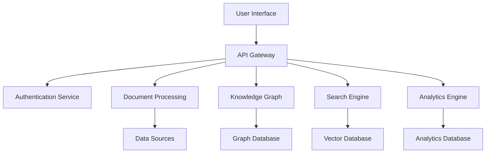

# User Guide

This comprehensive user guide provides step-by-step instructions for using the Medical_KG_rev system effectively. Whether you're a researcher, clinician, or data analyst, this guide will help you navigate the system and leverage its powerful biomedical knowledge integration capabilities.

## Table of Contents

1. [Getting Started](#getting-started)
2. [System Overview](#system-overview)
3. [Authentication and Access](#authentication-and-access)
4. [Data Ingestion](#data-ingestion)
5. [Document Processing](#document-processing)
6. [Knowledge Graph Exploration](#knowledge-graph-exploration)
7. [Search and Retrieval](#search-and-retrieval)
8. [Analytics and Insights](#analytics-and-insights)
9. [API Usage](#api-usage)
10. [Troubleshooting](#troubleshooting)
11. [Best Practices](#best-practices)

## Getting Started

### System Requirements

Before using the Medical_KG_rev system, ensure you have:

- **Web Browser**: Chrome 90+, Firefox 88+, Safari 14+, or Edge 90+
- **Internet Connection**: Stable broadband connection
- **Account**: Valid user account with appropriate permissions
- **API Access**: API key for programmatic access (optional)

### First-Time Setup

1. **Account Creation**
   - Contact your system administrator to create an account
   - Provide your email address and role (researcher, clinician, analyst)
   - Receive login credentials via secure email

2. **Initial Login**
   - Navigate to the system URL provided by your administrator
   - Enter your username and password
   - Complete any required security verification

3. **Profile Setup**
   - Update your profile information
   - Set your preferred timezone and language
   - Configure notification preferences

### Dashboard Overview

The main dashboard provides:

- **Quick Actions**: Common tasks and shortcuts
- **Recent Activity**: Your recent searches and uploads
- **System Status**: Current system health and performance
- **Notifications**: Important updates and alerts

## System Overview

### Architecture Overview

The Medical_KG_rev system is built on a multi-protocol API gateway that integrates biomedical knowledge from various sources:



### Key Components

1. **API Gateway**: Single entry point supporting REST, GraphQL, gRPC, and WebSocket protocols
2. **Document Processing**: Automated extraction and processing of biomedical documents
3. **Knowledge Graph**: Structured representation of biomedical relationships
4. **Search Engine**: Multi-strategy search (full-text, semantic, hybrid)
5. **Analytics Engine**: Data analysis and insight generation

### Data Flow

1. **Ingestion**: Documents and data are ingested from various sources
2. **Processing**: Automated extraction and structuring of information
3. **Storage**: Data is stored in appropriate databases (graph, vector, relational)
4. **Indexing**: Search indices are created and maintained
5. **Retrieval**: Users can search and retrieve relevant information

## Authentication and Access

### User Roles and Permissions

The system supports multiple user roles with different levels of access:

#### Researcher Role

- **Permissions**: Read access to all data, write access to research data
- **Features**: Document upload, search, analytics, export
- **Limitations**: Cannot modify system configuration

#### Clinician Role

- **Permissions**: Read access to clinical data, write access to patient data
- **Features**: Patient search, clinical decision support, reporting
- **Limitations**: Limited access to research data

#### Analyst Role

- **Permissions**: Read access to analytics data, write access to reports
- **Features**: Data analysis, report generation, dashboard creation
- **Limitations**: Cannot access raw patient data

#### Administrator Role

- **Permissions**: Full system access
- **Features**: User management, system configuration, monitoring
- **Limitations**: None

### Authentication Methods

#### Username/Password Authentication

1. Enter your username and password
2. Complete any required multi-factor authentication
3. Access the system dashboard

#### API Key Authentication

1. Generate an API key from your profile settings
2. Use the key in API requests: `Authorization: Bearer YOUR_API_KEY`
3. Key expires after 90 days (configurable)

#### OAuth Integration

1. Configure OAuth provider (Google, Microsoft, etc.)
2. Use OAuth flow for authentication
3. System maintains session state

### Session Management

- **Session Timeout**: 8 hours of inactivity
- **Concurrent Sessions**: Up to 3 simultaneous sessions
- **Session Renewal**: Automatic renewal with activity
- **Logout**: Manual logout or automatic timeout

## Data Ingestion

### Supported Data Sources

The system supports ingestion from various biomedical data sources:

#### Clinical Trial Data

- **ClinicalTrials.gov**: NCT IDs and trial information
- **WHO ICTRP**: International trial registries
- **EU Clinical Trials Database**: European trial data

#### Scientific Literature

- **PubMed**: Medical literature abstracts
- **PMC**: Full-text articles
- **OpenAlex**: Academic metadata
- **Unpaywall**: Open access information

#### Drug and Disease Data

- **RxNorm**: Drug terminology
- **ICD-11**: Disease classification
- **UMLS**: Unified medical language system
- **SNOMED CT**: Clinical terminology

#### Regulatory Data

- **FDA**: Drug approvals and safety data
- **EMA**: European Medicines Agency data
- **WHO**: World Health Organization data

### Data Ingestion Methods

#### Web Interface Upload

1. Navigate to the "Upload" section
2. Select your data source type
3. Upload files or enter identifiers
4. Configure processing options
5. Submit for processing

#### API Upload

```bash
# Example: Upload clinical trial data
curl -X POST https://api.medical-kg-rev.com/v1/ingest/clinicaltrials \
  -H "Authorization: Bearer YOUR_API_KEY" \
  -H "Content-Type: application/json" \
  -d '{
    "data": {
      "type": "ingestion",
      "attributes": {
        "nct_ids": ["NCT04267848", "NCT04345678"],
        "include_full_text": true,
        "extraction_types": ["pico", "effects", "adverse_events"]
      }
    }
  }'
```

#### Batch Upload

1. Prepare data in supported formats (JSON, CSV, XML)
2. Use the batch upload interface
3. Monitor processing progress
4. Review results and errors

### Data Processing Pipeline

#### Automatic Pipeline (Fast Sources)

1. **Metadata Extraction**: Extract basic document information
2. **Chunking**: Split documents into manageable chunks
3. **Embedding**: Generate vector embeddings
4. **Indexing**: Create search indices

#### Manual Pipeline (GPU-Intensive)

1. **PDF Fetching**: Download full-text documents
2. **MinerU Processing**: Extract structured content
3. **Post-Processing**: Clean and structure data
4. **Chunking**: Split into semantic chunks
5. **Embedding**: Generate high-quality embeddings
6. **Indexing**: Create comprehensive search indices

### Processing Status Monitoring

Track your data processing through:

- **Processing Queue**: See pending items
- **Progress Indicators**: Real-time processing status
- **Error Reports**: Detailed error information
- **Completion Notifications**: Email alerts when complete

## Document Processing

### Document Types

The system processes various document types:

#### Research Papers

- **PDF Articles**: Full-text scientific papers
- **Abstracts**: PubMed abstracts
- **Preprints**: Pre-publication research

#### Clinical Documents

- **Clinical Trial Protocols**: Study design documents
- **Case Reports**: Individual patient cases
- **Clinical Guidelines**: Evidence-based recommendations

#### Regulatory Documents

- **Drug Labels**: FDA-approved drug information
- **Safety Reports**: Adverse event reports
- **Regulatory Submissions**: Drug approval applications

### Extraction Types

#### PICO Extraction

Extract Population, Intervention, Comparison, and Outcome information:

```json
{
  "population": "Adults with type 2 diabetes",
  "intervention": "Metformin 1000mg twice daily",
  "comparison": "Placebo",
  "outcome": "HbA1c reduction"
}
```

#### Effect Measures

Extract quantitative effect measures:

```json
{
  "effect_type": "risk_ratio",
  "value": 0.85,
  "confidence_interval": [0.72, 0.98],
  "p_value": 0.03
}
```

#### Adverse Events

Extract safety information:

```json
{
  "event": "nausea",
  "frequency": "15%",
  "severity": "mild",
  "related_to_treatment": true
}
```

#### Dose Regimens

Extract dosing information:

```json
{
  "drug": "metformin",
  "dose": "1000mg",
  "frequency": "twice daily",
  "duration": "12 weeks"
}
```

#### Eligibility Criteria

Extract inclusion/exclusion criteria:

```json
{
  "inclusion": [
    "Age 18-75 years",
    "Type 2 diabetes diagnosis",
    "HbA1c > 7%"
  ],
  "exclusion": [
    "Pregnancy",
    "Severe renal impairment",
    "Contraindications to metformin"
  ]
}
```

### Quality Control

#### Validation Checks

- **Span Grounding**: Verify extracted text spans
- **Ontology Mapping**: Validate against medical ontologies
- **Consistency Checks**: Ensure logical consistency
- **Completeness**: Verify required fields

#### Error Handling

- **Validation Errors**: Fix data quality issues
- **Processing Errors**: Retry failed operations
- **System Errors**: Contact support for assistance

## Knowledge Graph Exploration

### Graph Structure

The knowledge graph represents biomedical relationships:

#### Core Entities

- **Documents**: Source documents and publications
- **Entities**: Drugs, diseases, genes, proteins
- **Claims**: Extracted factual statements
- **Organizations**: Institutions and companies

#### Relationships

- **Document-Entity**: Documents mention entities
- **Entity-Entity**: Biological relationships
- **Claim-Document**: Claims originate from documents
- **Claim-Entity**: Claims involve entities

### Graph Navigation

#### Entity Explorer

1. Search for specific entities (drugs, diseases, etc.)
2. View entity details and properties
3. Explore connected entities
4. Follow relationship paths

#### Relationship Visualization

1. Select entities of interest
2. View relationship networks
3. Filter by relationship types
4. Export visualization data

#### Graph Queries

Use Cypher queries to explore the graph:

```cypher
// Find drugs related to diabetes
MATCH (d:Drug)-[r:TREATS]->(diabetes:Disease {name: "diabetes"})
RETURN d.name, r.evidence_strength
ORDER BY r.evidence_strength DESC
```

### Graph Analytics

#### Centrality Analysis

- **Degree Centrality**: Most connected entities
- **Betweenness Centrality**: Entities bridging different clusters
- **PageRank**: Most influential entities

#### Community Detection

- **Clustering**: Identify related entity groups
- **Topic Modeling**: Discover research themes
- **Network Analysis**: Understand relationship patterns

## Search and Retrieval

### Search Strategies

The system employs multiple search strategies:

#### Full-Text Search (BM25)

- **Best for**: Exact phrase matching
- **Use case**: Finding specific terms or concepts
- **Example**: "metformin diabetes treatment"

#### Semantic Search (Dense Vectors)

- **Best for**: Conceptual similarity
- **Use case**: Finding conceptually related content
- **Example**: "glucose lowering medication" → finds metformin

#### Sparse Search (SPLADE)

- **Best for**: Keyword-based retrieval
- **Use case**: Finding documents with specific keywords
- **Example**: "adverse events safety profile"

#### Hybrid Search (RRF Fusion)

- **Best for**: Comprehensive results
- **Use case**: Combining multiple search strategies
- **Example**: Combines all three strategies above

### Search Interface

#### Basic Search

1. Enter search terms in the search box
2. Select search strategy
3. Apply filters (date, source, type)
4. View results

#### Advanced Search

1. Use advanced search interface
2. Specify multiple criteria
3. Set relevance thresholds
4. Configure result ranking

#### Search Filters

- **Date Range**: Filter by publication date
- **Source Type**: Filter by data source
- **Document Type**: Filter by document category
- **Entity Type**: Filter by entity categories
- **Evidence Strength**: Filter by evidence quality

### Search Results

#### Result Display

- **Relevance Score**: How well results match query
- **Snippet**: Relevant text excerpt
- **Metadata**: Document information
- **Entities**: Extracted entities
- **Claims**: Relevant claims

#### Result Actions

- **View Full Text**: Access complete document
- **Download**: Download document or data
- **Share**: Share results with colleagues
- **Export**: Export results in various formats

### Search Performance

#### Response Times

- **P95 Latency**: < 500ms for most queries
- **Complex Queries**: < 2 seconds
- **Large Result Sets**: < 5 seconds

#### Optimization Tips

- Use specific search terms
- Apply appropriate filters
- Limit result set size
- Use pagination for large results

## Analytics and Insights

### Dashboard Overview

The analytics dashboard provides:

#### Key Metrics

- **Document Count**: Total processed documents
- **Entity Count**: Unique entities in knowledge graph
- **Search Volume**: User search activity
- **Processing Status**: System performance metrics

#### Trend Analysis

- **Document Growth**: New documents over time
- **Entity Relationships**: Relationship growth
- **Search Patterns**: Popular search terms
- **User Activity**: User engagement metrics

### Custom Analytics

#### Report Builder

1. Select data sources
2. Choose metrics and dimensions
3. Apply filters and groupings
4. Generate reports

#### Visualization Tools

- **Charts**: Bar, line, pie charts
- **Graphs**: Network visualizations
- **Maps**: Geographic distributions
- **Tables**: Detailed data tables

#### Export Options

- **PDF Reports**: Formatted reports
- **Excel Files**: Data exports
- **CSV Files**: Raw data exports
- **JSON Files**: Structured data exports

### Research Insights

#### Literature Trends

- **Topic Evolution**: Research topic changes over time
- **Author Networks**: Collaboration patterns
- **Institution Analysis**: Research institution performance
- **Geographic Distribution**: Global research patterns

#### Clinical Insights

- **Treatment Patterns**: Common treatment approaches
- **Outcome Analysis**: Treatment effectiveness
- **Safety Profiles**: Adverse event patterns
- **Efficacy Trends**: Treatment success rates

## API Usage

### API Overview

The system provides a comprehensive API supporting multiple protocols:

#### REST API

- **OpenAPI 3.0**: Standard REST interface
- **JSON:API**: Structured JSON responses
- **OData**: Query capabilities
- **Rate Limiting**: 1000 requests/hour per user

#### GraphQL API

- **Schema**: Comprehensive GraphQL schema
- **Queries**: Flexible data queries
- **Mutations**: Data modification operations
- **Subscriptions**: Real-time updates

#### gRPC API

- **Protocol Buffers**: Efficient binary protocol
- **Streaming**: Real-time data streaming
- **Authentication**: Secure authentication
- **Performance**: High-performance communication

### Authentication

#### API Key Authentication

```bash
# Set API key in header
curl -H "Authorization: Bearer YOUR_API_KEY" \
     https://api.medical-kg-rev.com/v1/documents
```

#### OAuth 2.0 Authentication

```bash
# Get access token
curl -X POST https://api.medical-kg-rev.com/oauth/token \
  -d "grant_type=client_credentials" \
  -d "client_id=YOUR_CLIENT_ID" \
  -d "client_secret=YOUR_CLIENT_SECRET"

# Use access token
curl -H "Authorization: Bearer ACCESS_TOKEN" \
     https://api.medical-kg-rev.com/v1/documents
```

### Common API Operations

#### Document Search

```bash
# Search documents
curl -X GET "https://api.medical-kg-rev.com/v1/search/documents?q=diabetes&limit=10" \
  -H "Authorization: Bearer YOUR_API_KEY"
```

#### Entity Retrieval

```bash
# Get entity details
curl -X GET "https://api.medical-kg-rev.com/v1/entities/drugs/metformin" \
  -H "Authorization: Bearer YOUR_API_KEY"
```

#### Knowledge Graph Query

```bash
# Query knowledge graph
curl -X POST "https://api.medical-kg-rev.com/v1/kg/query" \
  -H "Authorization: Bearer YOUR_API_KEY" \
  -H "Content-Type: application/json" \
  -d '{
    "query": "MATCH (d:Drug)-[r:TREATS]->(diabetes:Disease) RETURN d.name, r.evidence_strength",
    "limit": 100
  }'
```

### Rate Limiting

#### Limits

- **Per User**: 1000 requests/hour
- **Per IP**: 5000 requests/hour
- **Burst**: 100 requests/minute

#### Headers

```
X-RateLimit-Limit: 1000
X-RateLimit-Remaining: 999
X-RateLimit-Reset: 1640995200
```

#### Error Handling

```json
{
  "error": "rate_limit_exceeded",
  "message": "Rate limit exceeded. Try again in 3600 seconds.",
  "retry_after": 3600
}
```

## Troubleshooting

### Common Issues

#### Authentication Problems

**Issue**: Login fails with "Invalid credentials"
**Solution**:

1. Verify username and password
2. Check for caps lock
3. Contact administrator if password reset needed

**Issue**: API key authentication fails
**Solution**:

1. Verify API key is correct
2. Check key expiration date
3. Regenerate key if necessary

#### Search Issues

**Issue**: Search returns no results
**Solution**:

1. Check search terms spelling
2. Try broader search terms
3. Remove filters that might be too restrictive
4. Check if data has been processed

**Issue**: Search results are irrelevant
**Solution**:

1. Use more specific search terms
2. Apply appropriate filters
3. Try different search strategies
4. Use advanced search options

#### Performance Issues

**Issue**: Slow search response times
**Solution**:

1. Check internet connection
2. Reduce result set size
3. Use more specific queries
4. Contact support if persistent

**Issue**: System timeout errors
**Solution**:

1. Break large requests into smaller ones
2. Use pagination for large result sets
3. Optimize query parameters
4. Contact support for complex queries

### Error Messages

#### Common Error Codes

- **400 Bad Request**: Invalid request parameters
- **401 Unauthorized**: Authentication required
- **403 Forbidden**: Insufficient permissions
- **404 Not Found**: Resource not found
- **429 Too Many Requests**: Rate limit exceeded
- **500 Internal Server Error**: System error

#### Error Response Format

```json
{
  "error": {
    "code": "validation_error",
    "message": "Invalid request parameters",
    "details": {
      "field": "query",
      "issue": "Query cannot be empty"
    }
  }
}
```

### Getting Help

#### Support Channels

- **Email**: <support@medical-kg-rev.com>
- **Documentation**: Online user guide and API docs
- **Community Forum**: User community support
- **Phone**: Emergency support hotline

#### Information to Provide

When contacting support, provide:

1. **User ID**: Your system username
2. **Error Message**: Exact error text
3. **Steps to Reproduce**: What you were doing
4. **Browser/Client**: What you're using
5. **Timestamp**: When the issue occurred

## Best Practices

### Data Management

#### Data Quality

- **Validate Data**: Ensure data accuracy before upload
- **Use Standards**: Follow medical data standards
- **Document Sources**: Keep track of data origins
- **Regular Updates**: Keep data current

#### Data Security

- **Access Control**: Use appropriate permissions
- **Data Encryption**: Encrypt sensitive data
- **Audit Trails**: Monitor data access
- **Backup Strategy**: Regular data backups

### Search Optimization

#### Query Construction

- **Specific Terms**: Use precise search terms
- **Boolean Operators**: Use AND, OR, NOT effectively
- **Wildcards**: Use * for partial matches
- **Phrases**: Use quotes for exact phrases

#### Result Management

- **Filtering**: Apply relevant filters
- **Sorting**: Sort by relevance or date
- **Pagination**: Use pagination for large results
- **Export**: Export results for analysis

### Performance Tips

#### System Usage

- **Peak Hours**: Avoid system peak usage times
- **Batch Operations**: Group related operations
- **Caching**: Use client-side caching
- **Connection Pooling**: Reuse connections

#### Resource Management

- **Memory Usage**: Monitor memory consumption
- **CPU Usage**: Avoid CPU-intensive operations
- **Network Usage**: Optimize network requests
- **Storage Usage**: Manage local storage

### Collaboration

#### Team Workflows

- **Shared Workspaces**: Use shared project spaces
- **Version Control**: Track changes and versions
- **Communication**: Use built-in messaging
- **Documentation**: Document team processes

#### Knowledge Sharing

- **Annotations**: Add notes to documents
- **Tags**: Use consistent tagging
- **Collections**: Organize related content
- **Reports**: Share analysis results

### Compliance

#### Data Privacy

- **HIPAA Compliance**: Follow HIPAA guidelines
- **GDPR Compliance**: Respect data privacy rights
- **Data Retention**: Follow retention policies
- **Consent Management**: Manage user consent

#### Regulatory Requirements

- **FDA Guidelines**: Follow FDA requirements
- **Clinical Standards**: Use clinical data standards
- **Research Ethics**: Follow research ethics
- **Quality Assurance**: Maintain quality standards

## Conclusion

The Medical_KG_rev system provides powerful tools for biomedical knowledge integration and analysis. By following this user guide, you can effectively leverage the system's capabilities to advance your research, clinical practice, or data analysis work.

For additional support and resources, please refer to:

- **API Documentation**: Detailed API reference
- **Developer Guide**: Technical implementation guide
- **Training Materials**: Video tutorials and workshops
- **Community Forum**: User community discussions

Remember to always follow best practices for data security, compliance, and collaboration to ensure successful use of the system.
