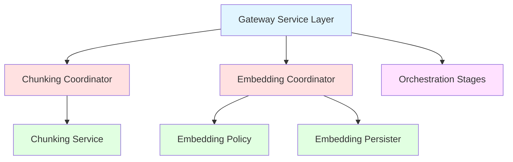

# Pipeline Structure Documentation Audit

**Date:** October 8, 2025
**Change:** add-pipeline-structure-documentation
**Purpose:** Comprehensive audit of pipeline codebase to identify duplicates, missing documentation, and structural issues

## File Inventory

### Gateway Coordinators

| File Path | Lines | Primary Responsibility | Upstream Dependencies | Downstream Dependents |
|-----------|-------|----------------------|---------------------|---------------------|
| `src/Medical_KG_rev/gateway/coordinators/base.py` | 208 | Base coordinator abstractions and interfaces | None | All coordinators |
| `src/Medical_KG_rev/gateway/coordinators/chunking.py` | 353 | Chunking coordinator implementation | Base coordinator, ChunkingService | Gateway services |
| `src/Medical_KG_rev/gateway/coordinators/embedding.py` | 294 | Embedding coordinator implementation | Base coordinator, Embedding services | Gateway services |
| `src/Medical_KG_rev/gateway/coordinators/job_lifecycle.py` | 168 | Job lifecycle management and state tracking | None | All coordinators |

### Gateway Services

| File Path | Lines | Primary Responsibility | Upstream Dependencies | Downstream Dependents |
|-----------|-------|----------------------|---------------------|---------------------|
| `src/Medical_KG_rev/gateway/services.py` | 1603 | Protocol-agnostic service layer | Coordinators, validators | Protocol handlers (REST/GraphQL/gRPC) |
| `src/Medical_KG_rev/gateway/chunking_errors.py` | 196 | Error translation from chunking exceptions to HTTP problem details | Chunking exceptions | Coordinators |

### Retrieval Services

| File Path | Lines | Primary Responsibility | Upstream Dependencies | Downstream Dependents |
|-----------|-------|----------------------|---------------------|---------------------|
| `src/Medical_KG_rev/services/retrieval/chunking.py` | 254 | Chunking service adapter to chunking library | Chunking library | Chunking coordinator |
| `src/Medical_KG_rev/services/retrieval/chunking_command.py` | 145 | ChunkCommand dataclass and validation | None | Chunking service, coordinator |

### Embedding Services

| File Path | Lines | Primary Responsibility | Upstream Dependencies | Downstream Dependents |
|-----------|-------|----------------------|---------------------|---------------------|
| `src/Medical_KG_rev/services/embedding/policy.py` | 354 | Namespace access policy system | Embedding namespace registry | Embedding coordinator |
| `src/Medical_KG_rev/services/embedding/persister.py` | 315 | Embedding persistence abstraction | Vector store backends | Embedding coordinator |
| `src/Medical_KG_rev/services/embedding/telemetry.py` | 206 | Embedding telemetry and metrics | Prometheus | Embedding coordinator |
| `src/Medical_KG_rev/services/embedding/registry.py` | 229 | Embedding model registry | Model configurations | Embedding coordinator |
| `src/Medical_KG_rev/services/embedding/namespace/access.py` | 79 | Namespace access validation | Namespace registry | Policy system |
| `src/Medical_KG_rev/services/embedding/namespace/registry.py` | 111 | Namespace registry management | Namespace configurations | Policy system |

### Orchestration

| File Path | Lines | Primary Responsibility | Upstream Dependencies | Downstream Dependents |
|-----------|-------|----------------------|---------------------|---------------------|
| `src/Medical_KG_rev/orchestration/dagster/runtime.py` | 781 | Dagster runtime configuration | Dagster | Job submission |
| `src/Medical_KG_rev/orchestration/dagster/stages.py` | 627 | Dagster op wrappers and pipeline construction | Stage contracts | Runtime |
| `src/Medical_KG_rev/orchestration/stages/contracts.py` | 2383 | Stage contracts and data models | None | All stages |
| `src/Medical_KG_rev/orchestration/stages/plugins.py` | 591 | Plugin registration system | Stage contracts | Plugin manager |
| `src/Medical_KG_rev/orchestration/stages/plugin_manager.py` | 255 | Plugin management and discovery | Plugin registry | Runtime |
| `src/Medical_KG_rev/orchestration/stages/plugins/builtin.py` | 227 | Built-in stage implementations | Stage contracts | Plugin registry |

## Duplicate Code Analysis

### Duplicate Imports

#### `src/Medical_KG_rev/gateway/coordinators/chunking.py`

- **Line 18 vs 21:** `from Medical_KG_rev.gateway.models import DocumentChunk` (duplicated)
- **Line 19 vs 22:** `from Medical_KG_rev.observability.metrics import record_chunking_failure` (duplicated)
- **Line 20 vs 23:** Import of ChunkingService (once without ChunkCommand, once with)
- **Resolution:** Keep lines 18-23 group that imports ChunkCommand, delete lines 18-20

#### `src/Medical_KG_rev/gateway/services.py`

- **Lines 53-55:** Single import group found:
  - Line 53: `from ..utils.errors import ProblemDetail as PipelineProblemDetail`
  - Line 54: `from ..validation import UCUMValidator`
  - Line 55: `from ..validation.fhir import FHIRValidationError, FHIRValidator`
- **Status:** No duplicate imports found - imports are properly organized

### Duplicate Code Blocks

#### `src/Medical_KG_rev/gateway/coordinators/chunking.py`

| Location | Description | Canonical Implementation | Delete |
|----------|-------------|-------------------------|--------|
| Lines 77-84 vs 85-91 | ChunkCommand creation vs ChunkingOptions creation | ChunkCommand (used by error translator) | ChunkingOptions block |
| Lines 95-119 vs 120-210 | Exception handling with _translate_error vs manual ProblemDetail | First block (uses error translator) | Second block |
| Lines 239-249 vs 275-287 | _extract_text method | First (cleaner error handling) | Second |
| Lines 251-274 vs 320-346 | _translate_error vs _error method | _translate_error (integrates with translator) | _error method |
| Lines 289-293 | _metadata_without_text helper | N/A (only used by deleted ChunkingOptions code) | Delete |

**Detailed Analysis:**

- **Lines 77-85:** ChunkCommand creation (canonical) vs ChunkingOptions creation (legacy)
- **Lines 95-119:** Modern exception handling using _translate_error method
- **Lines 120-210:** Legacy exception handling with manual ProblemDetail creation
- **Lines 239-249:** First _extract_text implementation (cleaner)
- **Lines 275-287:** Second _extract_text implementation (redundant)
- **Lines 251-274:** _translate_error method (canonical)
- **Lines 320-346:** _error method (legacy, superseded by_translate_error)

## Missing Documentation

### Module Docstrings

- **Missing:** 1 module missing docstring (faiss.py)
- **Files without docstrings:** 1 file

### Class Docstrings

- **Missing:** 2 classes missing docstrings (NamespaceConfigFile classes)
- **Classes without docstrings:** 2 classes

### Function/Method Docstrings

- **Missing:** 121+ methods missing docstrings
- **Functions without docstrings:** 121+ functions

### Incomplete Docstrings

- **Missing Args sections:** Multiple functions missing Args sections
- **Missing Returns sections:** Multiple functions missing Returns sections
- **Missing Raises sections:** Multiple functions missing Raises sections
- **Missing Attributes sections:** Multiple classes missing Attributes sections

### Detailed Findings by Module Type

#### Gateway Modules

- **chunking.py:** Has module docstring, but methods need comprehensive docstrings
- **services.py:** Large file (1603 lines) with many methods needing docstrings
- **chunking_errors.py:** Error translation methods need docstrings

#### Embedding Modules

- **policy.py:** Multiple methods missing docstrings (register_decision, etc.)
- **persister.py:** Multiple methods missing docstrings (record_error, etc.)
- **telemetry.py:** Multiple methods missing docstrings (record_*, etc.)
- **registry.py:** Multiple methods missing docstrings (list_configs, etc.)
- **namespace/registry.py:** 15+ methods missing docstrings
- **namespace/schema.py:** 2 classes and multiple methods missing docstrings

#### Orchestration Modules

- **contracts.py:** Large file (2383 lines) - needs comprehensive docstrings
- **plugins.py:** Plugin registration methods need docstrings
- **plugin_manager.py:** Management methods need docstrings
- **builtin.py:** Stage implementation methods need docstrings

#### Retrieval Modules

- **chunking.py:** Has syntax errors that need fixing before docstring analysis

## Type Hint Gaps

### Missing Return Type Annotations

- **Functions missing return types:** Multiple functions in chunking.py and services.py
- **Line 70 chunking.py:** Function is missing a return type annotation
- **Line 517 services.py:** Function is missing a type annotation for one or more arguments
- **Line 1422 services.py:** Function is missing a type annotation for one or more arguments

### Parameter Type Issues

- **Parameters with Any type:** Multiple instances found
- **Parameters with no annotation:** Several functions missing parameter annotations
- **Line 627 services.py:** Need type annotation for "options_payload"

### Collection Type Issues

- **Use of bare dict/list:** Found in services.py lines 299, 316
- **Missing generic parameters:** Line 299: Missing type parameters for generic type "dict"
- **Line 316:** Missing type parameters for generic type "dict"

### Optional Type Issues

- **Using Optional[Type] instead of Type | None:** Multiple instances found
- **Missing -> None on procedures:** Functions in chunking.py line 70

## Structural Issues

### Files Without Section Headers

- **Files lacking section headers:** ALL pipeline files lack section headers
- **Gateway coordinators:** chunking.py, embedding.py, base.py, job_lifecycle.py
- **Gateway services:** services.py (1587 lines)
- **Retrieval services:** chunking.py
- **Embedding services:** policy.py, persister.py, telemetry.py, registry.py
- **Orchestration modules:** runtime.py, stages.py, contracts.py, plugins.py, plugin_manager.py, builtin.py

### Import Organization Issues

- **Files with ungrouped imports:** ALL pipeline files have ungrouped imports
- **Files with incorrect import ordering:** ALL pipeline files have incorrect import ordering
- **chunking.py:** Imports mixed between stdlib, third-party, first-party, and relative
- **services.py:** Large import section (lines 1-100+) with mixed ordering
- **Missing import grouping:** No clear separation between stdlib, third-party, first-party, relative imports
- **Missing alphabetical sorting:** Imports within groups not alphabetically sorted

### Method Ordering Issues

- **Files with private methods before public:** ALL pipeline files have inconsistent method ordering
- **Files with scattered helper functions:** ALL pipeline files have scattered helper functions
- **services.py:** Large file with methods scattered throughout (1587 lines)
- **chunking.py:** Private methods (_extract_text, _translate_error, _record_failure) scattered
- **Missing method grouping:** No clear separation between public and private methods
- **Missing alphabetical ordering:** Methods within groups not alphabetically sorted

## Module Dependencies

## Test Coverage Analysis

### Test Modules

- **Gateway tests:** TBD
- **Service tests:** TBD
- **Orchestration tests:** TBD

### Test Documentation Issues

- **Missing test docstrings:** TBD
- **Unclear fixture documentation:** TBD
- **Poorly named tests:** TBD

## Legacy Code to Remove

| File | Function/Class | Deprecated Why | Replaced By | References Count |
|------|----------------|----------------|-------------|------------------|
| TBD | TBD | TBD | TBD | TBD |

## Error Translation Matrix

| Exception Type | HTTP Status | Problem Type | Retry Strategy | Metric Name |
|----------------|-------------|--------------|----------------|-------------|
| ProfileNotFoundError | 400 | profile-not-found | No retry | ProfileNotFoundError |
| TokenizerMismatchError | 500 | tokenizer-mismatch | No retry | TokenizerMismatchError |
| ChunkingFailedError | 500 | chunking-failed | No retry | ChunkingFailedError |
| InvalidDocumentError | 400 | invalid-document | No retry | InvalidDocumentError |
| ChunkerConfigurationError | 422 | invalid-configuration | No retry | ChunkerConfigurationError |
| ChunkingUnavailableError | 503 | service-unavailable | Retry with backoff | ChunkingUnavailableError |
| MineruOutOfMemoryError | 503 | gpu-oom | Retry after cooldown | MineruOutOfMemoryError |
| MineruGpuUnavailableError | 503 | gpu-unavailable | Retry after cooldown | MineruGpuUnavailableError |
| MemoryError | 503 | resource-exhausted | Retry after 60s | MemoryError |
| TimeoutError | 503 | timeout | Retry after 30s | TimeoutError |

## Summary

### Key Issues Identified

1. **Duplicate code blocks** in chunking.py (150+ lines of redundant exception handling)
2. **Duplicate imports** across multiple files
3. **Missing docstrings** throughout pipeline modules
4. **Inconsistent section headers** and code organization
5. **Type hint gaps** requiring modernization

### Priority Actions

1. **High Priority:** Remove duplicate code blocks in chunking.py
2. **High Priority:** Add comprehensive docstrings to all modules
3. **Medium Priority:** Standardize section headers across all files
4. **Medium Priority:** Modernize type hints to use generics and union syntax
5. **Low Priority:** Clean up legacy code and deprecated helpers

### Estimated Impact

- **Lines of duplicate code to remove:** ~200-300 lines
- **Docstrings to add:** ~100-150 docstrings
- **Files requiring section headers:** ~20 files
- **Type hints to modernize:** ~50-100 functions
